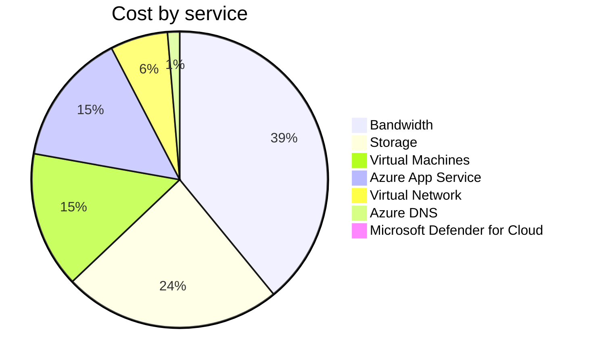
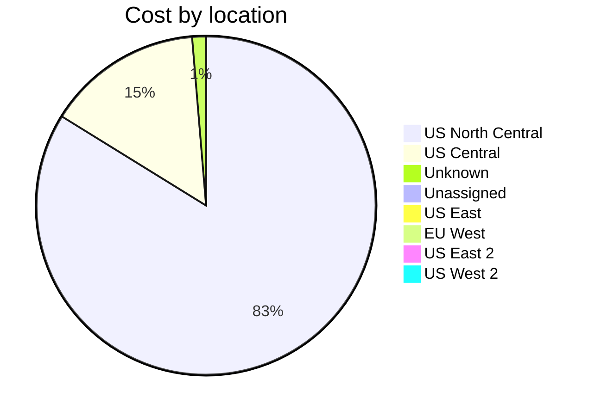

Fetching subscription details...
Fetching cost data...
Fetching forecasted cost data...
Fetching cost data by service name...
Fetching cost data by location...
Fetching cost data by resource group...
# Azure Cost Overview

> Accumulated cost for subscription id `JPF Pay-As-You-Go` from **03/01/2024** to **03/02/2024**

## Totals

|Period|Amount|
|---|---:|
|Today|0.10 USD|
|Yesterday|2.94 USD|
|Last 7 days|3.04 USD|
|Last 30 days|3.04 USD|

## By Service Name

|Service|Amount|
|---|---:|
|Bandwidth|1.18 USD|
|Storage|0.72 USD|
|Virtual Machines|0.45 USD|
|Azure App Service|0.44 USD|
|Virtual Network|0.19 USD|
|Azure DNS|0.04 USD|
|Microsoft Defender for Cloud|0.01 USD|

## By Location

|Location|Amount|
|---|---:|
|US North Central|2.54 USD|
|US Central|0.45 USD|
|Unknown|0.04 USD|
|Unassigned|0.01 USD|
|US East|0.01 USD|
|EU West|0.00 USD|
|US East 2|0.00 USD|
|US West 2|0.00 USD|

## By Resource Group

|Resource Group|Amount|
|---|---:|
|personal-network|2.55 USD|
|personal-site|0.45 USD|
|personal-dns|0.03 USD|
||0.01 USD|
|cloud-shell-storage-eastus|0.01 USD|

Generated at 2024-03-02 11:32:58 for subscription with id `4913be3f-a345-4652-9bba-767418dd25e3`
