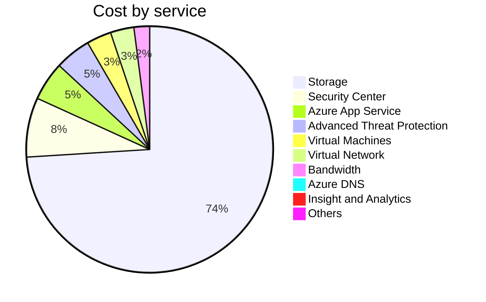
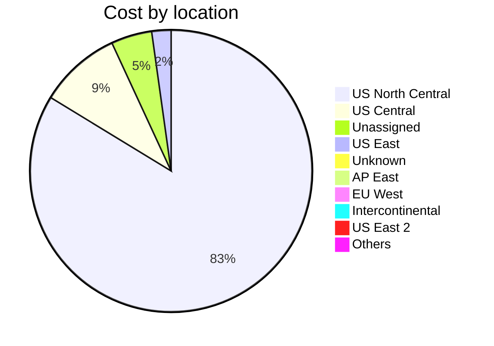

Fetching subscription details...
Fetching cost data...
Fetching forecasted cost data...
Fetching cost data by service name...
Fetching cost data by location...
Fetching cost data by resource group...
# Azure Cost Overview

> Accumulated cost for subscription id `JPF Pay-As-You-Go` from **09/01/2023** to **09/23/2023**

## Totals

|Period|Amount|
|---|---:|
|Today|0.10 USD|
|Yesterday|3.91 USD|
|Last 7 days|84.98 USD|
|Last 30 days|254.91 USD|

```mermaid
gantt
   title Accumulated cost
   dateFormat  X
   axisFormat %s
   section 01 Sep
   USD 6.35 :0, 635
   section 02 Sep
   USD 12.48 :0, 1248
   section 03 Sep
   USD 18.76 :0, 1876
   section 04 Sep
   USD 24.93 :0, 2493
   section 05 Sep
   USD 31.24 :0, 3124
   section 06 Sep
   USD 37.37 :0, 3737
   section 07 Sep
   USD 43.61 :0, 4361
   section 08 Sep
   USD 49.87 :0, 4987
   section 09 Sep
   USD 56.01 :0, 5601
   section 10 Sep
   USD 62.01 :0, 6201
   section 11 Sep
   USD 68.08 :0, 6808
   section 12 Sep
   USD 81.42 :0, 8142
   section 13 Sep
   USD 128.36 :0, 12836
   section 14 Sep
   USD 163.58 :0, 16358
   section 15 Sep
   USD 169.93 :0, 16993
   section 16 Sep
   USD 183.81 :0, 18381
   section 17 Sep
   USD 212.09 :0, 21209
   section 18 Sep
   USD 227.59 :0, 22759
   section 19 Sep
   USD 243.40 :0, 24340
   section 20 Sep
   USD 247.10 :0, 24710
   section 21 Sep
   USD 250.90 :0, 25090
   section 22 Sep
   USD 254.81 :0, 25481
   section 23 Sep
   USD 254.91 :0, 25491
   section 24 Sep
   USD 272.30 : done, 0, 27230
   section 25 Sep
   USD 290.05 : done, 0, 29005
   section 26 Sep
   USD 311.90 : done, 0, 31190
   section 27 Sep
   USD 330.50 : done, 0, 33050
   section 28 Sep
   USD 349.66 : done, 0, 34966
   section 29 Sep
   USD 369.37 : done, 0, 36937
   section 30 Sep
   USD 389.58 : done, 0, 38958
```

## By Service Name

|Service|Amount|
|---|---:|
|Storage|187.86 USD|
|Security Center|19.78 USD|
|Azure App Service|12.97 USD|
|Advanced Threat Protection|11.97 USD|
|Virtual Machines|8.23 USD|
|Virtual Network|7.82 USD|
|Bandwidth|5.21 USD|
|Azure DNS|1.07 USD|
|Insight and Analytics|0.00 USD|
|Others|0.00 USD|

## By Location

|Location|Amount|
|---|---:|
|US North Central|212.52 USD|
|US Central|23.83 USD|
|Unassigned|11.88 USD|
|US East|5.61 USD|
|Unknown|1.07 USD|
|AP East|0.00 USD|
|EU West|0.00 USD|
|Intercontinental|0.00 USD|
|US East 2|0.00 USD|
|Others|0.00 USD|

## By Resource Group

|Resource Group|Amount|
|---|---:|
|personal-network|212.88 USD|
|personal-site|23.83 USD|
||11.88 USD|
|cloud-shell-storage-eastus|5.61 USD|
|personal-dns|0.72 USD|
|defaultresourcegroup-ncus|0.00 USD|
|azureapp-auto-alerts-873533-jpatrick_fulton_gmail_com|0.00 USD|

Generated at 2023-09-23 11:31:38 for subscription with id `4913be3f-a345-4652-9bba-767418dd25e3`
