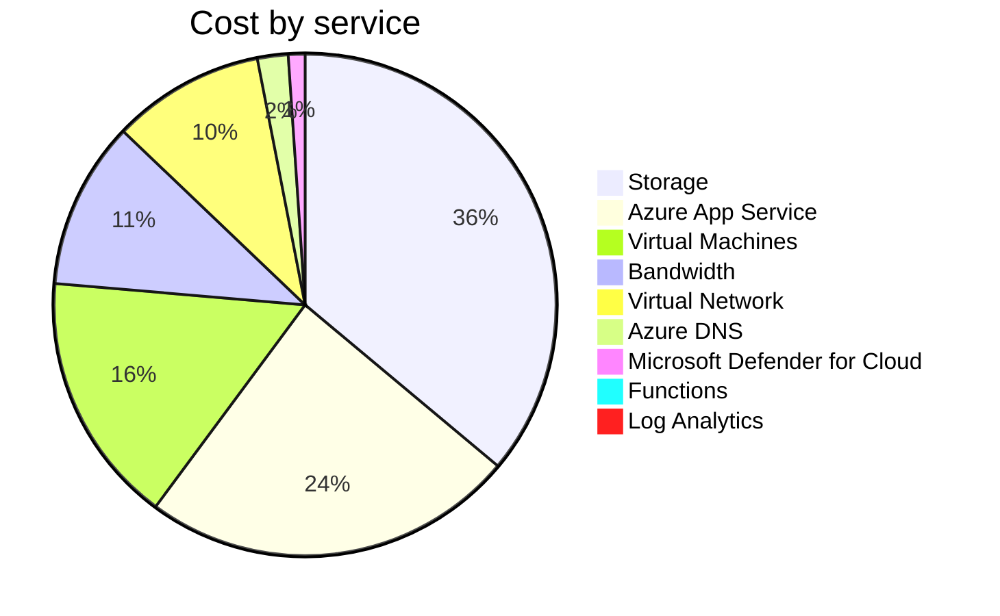

Fetching subscription details...
Fetching cost data...
Fetching forecasted cost data...
Fetching cost data by service name...
Fetching cost data by location...
Fetching cost data by resource group...
# Azure Cost Overview

> Accumulated cost for subscription id `JPF Pay-As-You-Go` from **11/01/2023** to **11/08/2023**

## Totals

|Period|Amount|
|---|---:|
|Today|0.09 USD|
|Yesterday|1.95 USD|
|Last 7 days|16.71 USD|
|Last 30 days|16.71 USD|

## By Service Name

|Service|Amount|
|---|---:|
|Storage|6.03 USD|
|Azure App Service|4.02 USD|
|Virtual Machines|2.71 USD|
|Bandwidth|1.80 USD|
|Virtual Network|1.64 USD|
|Azure DNS|0.33 USD|
|Microsoft Defender for Cloud|0.18 USD|
|Functions|0.00 USD|
|Log Analytics|0.00 USD|

## By Location

|Location|Amount|
|---|---:|
|US North Central|12.10 USD|
|US Central|4.04 USD|
|Unknown|0.33 USD|
|Unassigned|0.18 USD|
|US East|0.07 USD|
|AP East|0.00 USD|
|EU West|0.00 USD|
|US East 2|0.00 USD|
|US West 2|0.00 USD|

## By Resource Group

|Resource Group|Amount|
|---|---:|
|personal-network|12.21 USD|
|personal-site|4.04 USD|
|personal-dns|0.22 USD|
||0.18 USD|
|cloud-shell-storage-eastus|0.07 USD|

Generated at 2023-11-08 11:35:11 for subscription with id `4913be3f-a345-4652-9bba-767418dd25e3`
