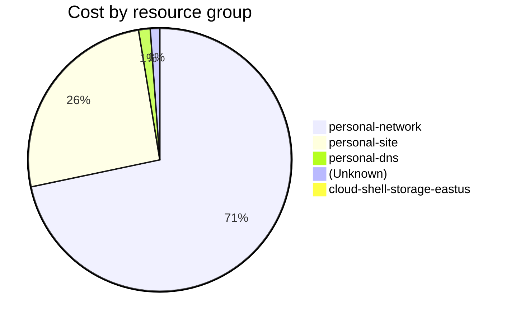

Fetching subscription details...
Fetching cost data...
Fetching forecasted cost data...
Fetching cost data by service name...
Fetching cost data by location...
Fetching cost data by resource group...
# Azure Cost Overview

> Accumulated cost for subscription id `JPF Pay-As-You-Go` from **11/01/2023** to **11/26/2023**

## Totals

|Period|Amount|
|---|---:|
|Today|0.09 USD|
|Yesterday|2.07 USD|
|Last 7 days|15.64 USD|
|Last 30 days|57.73 USD|

```mermaid
gantt
   title Accumulated cost
   dateFormat  X
   axisFormat %s
   section 01 Nov
   USD 2.50 :0, 250
   section 02 Nov
   USD 4.87 :0, 487
   section 03 Nov
   USD 7.51 :0, 751
   section 04 Nov
   USD 9.95 :0, 995
   section 05 Nov
   USD 12.34 :0, 1234
   section 06 Nov
   USD 14.80 :0, 1480
   section 07 Nov
   USD 17.20 :0, 1720
   section 08 Nov
   USD 19.70 :0, 1970
   section 09 Nov
   USD 22.16 :0, 2216
   section 10 Nov
   USD 24.39 :0, 2439
   section 11 Nov
   USD 26.60 :0, 2660
   section 12 Nov
   USD 28.85 :0, 2885
   section 13 Nov
   USD 31.10 :0, 3110
   section 14 Nov
   USD 33.25 :0, 3325
   section 15 Nov
   USD 35.47 :0, 3547
   section 16 Nov
   USD 37.67 :0, 3767
   section 17 Nov
   USD 39.89 :0, 3989
   section 18 Nov
   USD 42.09 :0, 4209
   section 19 Nov
   USD 44.30 :0, 4430
   section 20 Nov
   USD 46.54 :0, 4654
   section 21 Nov
   USD 48.86 :0, 4886
   section 22 Nov
   USD 51.08 :0, 5108
   section 23 Nov
   USD 53.35 :0, 5335
   section 24 Nov
   USD 55.57 :0, 5557
   section 25 Nov
   USD 57.64 :0, 5764
   section 26 Nov
   USD 57.73 :0, 5773
   section 27 Nov
   USD 59.90 : done, 0, 5990
   section 28 Nov
   USD 62.15 : done, 0, 6215
   section 29 Nov
   USD 64.38 : done, 0, 6438
   section 30 Nov
   USD 66.57 : done, 0, 6657
```

## By Service Name

|Service|Amount|
|---|---:|
|Storage|22.06 USD|
|Azure App Service|14.72 USD|
|Virtual Machines|9.45 USD|
|Virtual Network|5.98 USD|
|Bandwidth|3.63 USD|
|Azure DNS|1.22 USD|
|Microsoft Defender for Cloud|0.67 USD|
|Functions|0.00 USD|
|Log Analytics|0.00 USD|

## By Location

|Location|Amount|
|---|---:|
|US North Central|40.82 USD|
|US Central|14.78 USD|
|Unknown|1.22 USD|
|Unassigned|0.67 USD|
|US East|0.25 USD|
|AP East|0.00 USD|
|EU West|0.00 USD|
|US East 2|0.00 USD|
|US West 2|0.00 USD|

## By Resource Group

|Resource Group|Amount|
|---|---:|
|personal-network|41.22 USD|
|personal-site|14.78 USD|
|personal-dns|0.82 USD|
||0.67 USD|
|cloud-shell-storage-eastus|0.25 USD|

Generated at 2023-11-26 11:34:55 for subscription with id `4913be3f-a345-4652-9bba-767418dd25e3`
