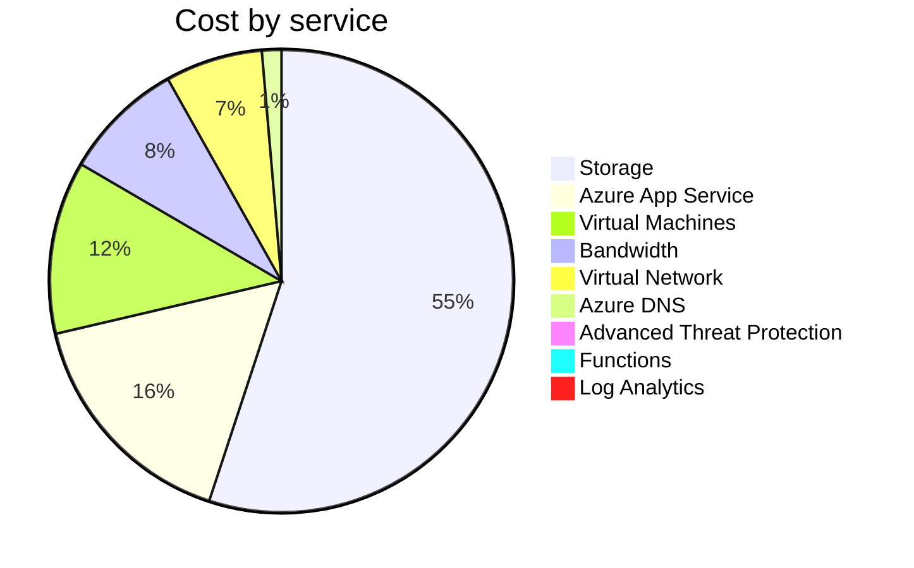
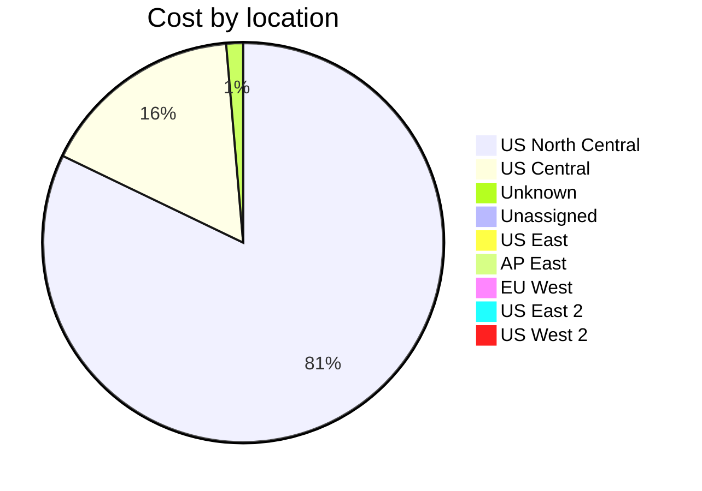

Fetching subscription details...
Fetching cost data...
Fetching forecasted cost data...
Fetching cost data by service name...
Fetching cost data by location...
Fetching cost data by resource group...
# Azure Cost Overview

> Accumulated cost for subscription id `JPF Pay-As-You-Go` from **10/01/2023** to **10/03/2023**

## Totals

|Period|Amount|
|---|---:|
|Today|0.09 USD|
|Yesterday|2.84 USD|
|Last 7 days|6.69 USD|
|Last 30 days|6.69 USD|

```mermaid
gantt
   title Accumulated cost
   dateFormat  X
   axisFormat %s
   section 01 Oct
   USD 3.76 :0, 376
   section 02 Oct
   USD 6.60 :0, 660
   section 03 Oct
   USD 6.69 :0, 669
   section 04 Oct
   USD 11.86 : done, 0, 1186
   section 05 Oct
   USD 17.04 : done, 0, 1704
   section 06 Oct
   USD 23.14 : done, 0, 2314
   section 07 Oct
   USD 28.96 : done, 0, 2896
   section 08 Oct
   USD 34.59 : done, 0, 3459
   section 09 Oct
   USD 40.14 : done, 0, 4014
   section 10 Oct
   USD 49.20 : done, 0, 4920
   section 11 Oct
   USD 53.26 : done, 0, 5326
   section 12 Oct
   USD 57.32 : done, 0, 5732
   section 13 Oct
   USD 62.30 : done, 0, 6230
   section 14 Oct
   USD 67.00 : done, 0, 6700
   section 15 Oct
   USD 71.51 : done, 0, 7151
   section 16 Oct
   USD 75.95 : done, 0, 7595
   section 17 Oct
   USD 83.89 : done, 0, 8389
   section 18 Oct
   USD 86.83 : done, 0, 8683
   section 19 Oct
   USD 89.78 : done, 0, 8978
   section 20 Oct
   USD 93.64 : done, 0, 9364
   section 21 Oct
   USD 97.22 : done, 0, 9722
   section 22 Oct
   USD 100.61 : done, 0, 10061
   section 23 Oct
   USD 103.93 : done, 0, 10393
   section 24 Oct
   USD 110.76 : done, 0, 11076
   section 25 Oct
   USD 112.58 : done, 0, 11258
   section 26 Oct
   USD 114.41 : done, 0, 11441
   section 27 Oct
   USD 117.15 : done, 0, 11715
   section 28 Oct
   USD 119.62 : done, 0, 11962
   section 29 Oct
   USD 121.89 : done, 0, 12189
   section 30 Oct
   USD 124.10 : done, 0, 12410
   section 31 Oct
   USD 129.81 : done, 0, 12981
```

## By Service Name

|Service|Amount|
|---|---:|
|Storage|3.65 USD|
|Azure App Service|1.08 USD|
|Virtual Machines|0.80 USD|
|Bandwidth|0.56 USD|
|Virtual Network|0.45 USD|
|Azure DNS|0.09 USD|
|Advanced Threat Protection|0.06 USD|
|Functions|0.00 USD|
|Log Analytics|0.00 USD|

## By Location

|Location|Amount|
|---|---:|
|US North Central|5.43 USD|
|US Central|1.09 USD|
|Unknown|0.09 USD|
|Unassigned|0.06 USD|
|US East|0.02 USD|
|AP East|0.00 USD|
|EU West|0.00 USD|
|US East 2|0.00 USD|
|US West 2|0.00 USD|

## By Resource Group

|Resource Group|Amount|
|---|---:|
|personal-network|5.47 USD|
|personal-site|1.09 USD|
|personal-dns|0.06 USD|
||0.06 USD|
|cloud-shell-storage-eastus|0.02 USD|

Generated at 2023-10-03 11:32:13 for subscription with id `4913be3f-a345-4652-9bba-767418dd25e3`
