Fetching subscription details...
Fetching cost data...
Fetching forecasted cost data...
Fetching cost data by service name...
Fetching cost data by location...
Fetching cost data by resource group...
# Azure Cost Overview

> Accumulated cost for subscription id `JPF Pay-As-You-Go` from **02/01/2024** to **02/13/2024**

## Totals

|Period|Amount|
|---|---:|
|Today|0.09 USD|
|Yesterday|2.04 USD|
|Last 7 days|18.40 USD|
|Last 30 days|34.29 USD|

```mermaid
gantt
   title Accumulated cost
   dateFormat  X
   axisFormat %s
   section 01 Feb
   USD 2.99 :0, 299
   section 02 Feb
   USD 6.68 :0, 668
   section 03 Feb
   USD 9.81 :0, 981
   section 04 Feb
   USD 12.83 :0, 1283
   section 05 Feb
   USD 15.90 :0, 1590
   section 06 Feb
   USD 18.73 :0, 1873
   section 07 Feb
   USD 21.64 :0, 2164
   section 08 Feb
   USD 25.07 :0, 2507
   section 09 Feb
   USD 27.83 :0, 2783
   section 10 Feb
   USD 30.01 :0, 3001
   section 11 Feb
   USD 32.16 :0, 3216
   section 12 Feb
   USD 34.21 :0, 3421
   section 13 Feb
   USD 34.29 :0, 3429
   section 14 Feb
   USD 36.88 : done, 0, 3688
   section 15 Feb
   USD 39.66 : done, 0, 3966
   section 16 Feb
   USD 42.54 : done, 0, 4254
   section 17 Feb
   USD 45.71 : done, 0, 4571
   section 18 Feb
   USD 48.37 : done, 0, 4837
   section 19 Feb
   USD 50.83 : done, 0, 5083
   section 20 Feb
   USD 53.47 : done, 0, 5347
   section 21 Feb
   USD 56.00 : done, 0, 5600
   section 22 Feb
   USD 58.71 : done, 0, 5871
   section 23 Feb
   USD 61.54 : done, 0, 6154
   section 24 Feb
   USD 64.64 : done, 0, 6464
   section 25 Feb
   USD 67.24 : done, 0, 6724
   section 26 Feb
   USD 69.64 : done, 0, 6964
   section 27 Feb
   USD 72.22 : done, 0, 7222
   section 28 Feb
   USD 74.69 : done, 0, 7469
   section 29 Feb
   USD 77.34 : done, 0, 7734
```

## By Service Name

|Service|Amount|
|---|---:|
|Storage|11.05 USD|
|Bandwidth|8.16 USD|
|Azure App Service|7.05 USD|
|Virtual Machines|4.29 USD|
|Virtual Network|2.87 USD|
|Azure DNS|0.59 USD|
|Microsoft Defender for Cloud|0.29 USD|
|Azure Monitor|0.00 USD|
|Functions|0.00 USD|
|Log Analytics|0.00 USD|

## By Location

|Location|Amount|
|---|---:|
|US North Central|26.21 USD|
|US Central|7.08 USD|
|Unknown|0.59 USD|
|Unassigned|0.29 USD|
|US East|0.12 USD|
|AP East|0.00 USD|
|EU West|0.00 USD|
|US East 2|0.00 USD|
|US West 2|0.00 USD|

## By Resource Group

|Resource Group|Amount|
|---|---:|
|personal-network|26.41 USD|
|personal-site|7.08 USD|
|personal-dns|0.39 USD|
||0.29 USD|
|cloud-shell-storage-eastus|0.12 USD|
|azureapp-auto-alerts-873533-jpatrick_fulton_gmail_com|0.00 USD|

Generated at 2024-02-13 11:35:16 for subscription with id `4913be3f-a345-4652-9bba-767418dd25e3`
