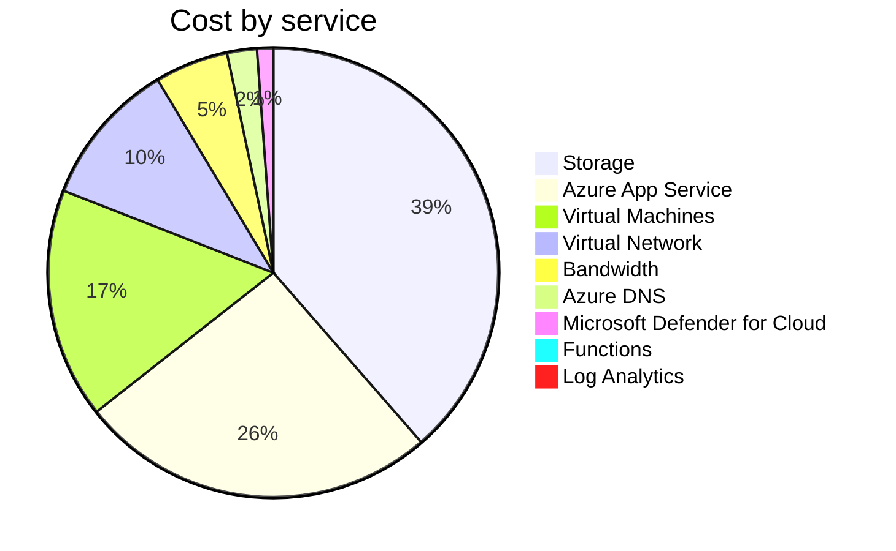

Fetching subscription details...
Fetching cost data...
Fetching forecasted cost data...
Fetching cost data by service name...
Fetching cost data by location...
Fetching cost data by resource group...
# Azure Cost Overview

> Accumulated cost for subscription id `JPF Pay-As-You-Go` from **11/01/2023** to **11/25/2023**

## Totals

|Period|Amount|
|---|---:|
|Today|0.09 USD|
|Yesterday|1.92 USD|
|Last 7 days|15.15 USD|
|Last 30 days|54.74 USD|

```mermaid
gantt
   title Accumulated cost
   dateFormat  X
   axisFormat %s
   section 01 Nov
   USD 2.50 :0, 250
   section 02 Nov
   USD 4.87 :0, 487
   section 03 Nov
   USD 7.51 :0, 751
   section 04 Nov
   USD 9.95 :0, 995
   section 05 Nov
   USD 12.34 :0, 1234
   section 06 Nov
   USD 14.80 :0, 1480
   section 07 Nov
   USD 17.20 :0, 1720
   section 08 Nov
   USD 19.70 :0, 1970
   section 09 Nov
   USD 22.16 :0, 2216
   section 10 Nov
   USD 24.35 :0, 2435
   section 11 Nov
   USD 26.53 :0, 2653
   section 12 Nov
   USD 28.72 :0, 2872
   section 13 Nov
   USD 30.91 :0, 3091
   section 14 Nov
   USD 33.06 :0, 3306
   section 15 Nov
   USD 35.24 :0, 3524
   section 16 Nov
   USD 37.41 :0, 3741
   section 17 Nov
   USD 39.59 :0, 3959
   section 18 Nov
   USD 41.76 :0, 4176
   section 19 Nov
   USD 43.93 :0, 4393
   section 20 Nov
   USD 46.12 :0, 4612
   section 21 Nov
   USD 48.35 :0, 4835
   section 22 Nov
   USD 50.52 :0, 5052
   section 23 Nov
   USD 52.73 :0, 5273
   section 24 Nov
   USD 54.65 :0, 5465
   section 25 Nov
   USD 54.74 :0, 5474
   section 26 Nov
   USD 56.79 : done, 0, 5679
   section 27 Nov
   USD 58.89 : done, 0, 5889
   section 28 Nov
   USD 61.05 : done, 0, 6105
   section 29 Nov
   USD 63.22 : done, 0, 6322
   section 30 Nov
   USD 65.35 : done, 0, 6535
```

## By Service Name

|Service|Amount|
|---|---:|
|Storage|21.13 USD|
|Azure App Service|14.11 USD|
|Virtual Machines|9.07 USD|
|Virtual Network|5.73 USD|
|Bandwidth|2.89 USD|
|Azure DNS|1.17 USD|
|Microsoft Defender for Cloud|0.64 USD|
|Functions|0.00 USD|
|Log Analytics|0.00 USD|

## By Location

|Location|Amount|
|---|---:|
|US North Central|38.53 USD|
|US Central|14.16 USD|
|Unknown|1.17 USD|
|Unassigned|0.64 USD|
|US East|0.24 USD|
|AP East|0.00 USD|
|EU West|0.00 USD|
|US East 2|0.00 USD|
|US West 2|0.00 USD|

## By Resource Group

|Resource Group|Amount|
|---|---:|
|personal-network|38.92 USD|
|personal-site|14.16 USD|
|personal-dns|0.78 USD|
||0.64 USD|
|cloud-shell-storage-eastus|0.24 USD|

Generated at 2023-11-25 11:34:17 for subscription with id `4913be3f-a345-4652-9bba-767418dd25e3`
