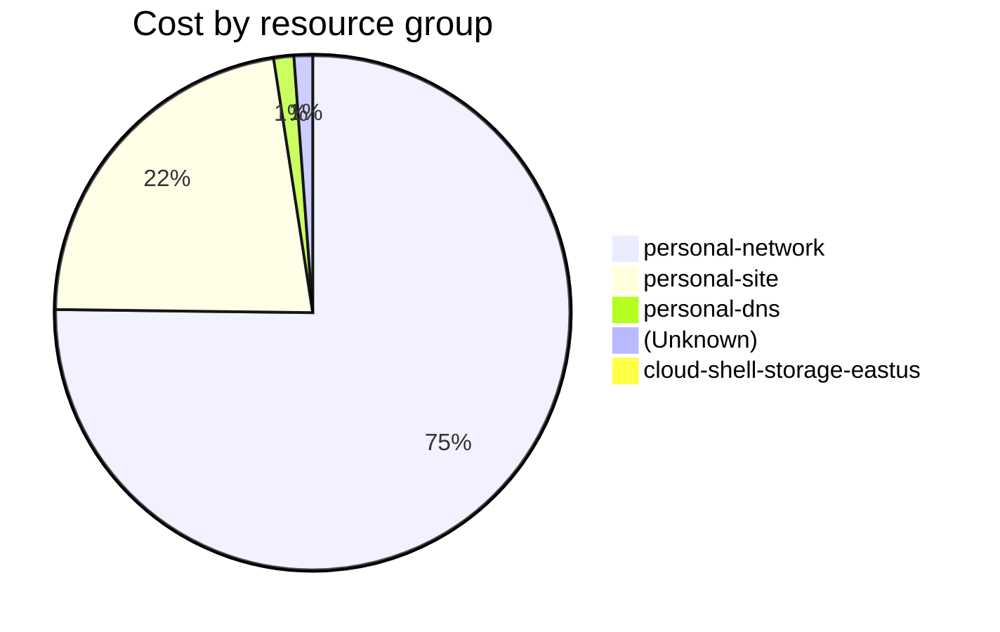

Fetching subscription details...
Fetching cost data...
Fetching forecasted cost data...
Fetching cost data by service name...
Fetching cost data by location...
Fetching cost data by resource group...
# Azure Cost Overview

> Accumulated cost for subscription id `JPF Pay-As-You-Go` from **01/01/2024** to **01/05/2024**

## Totals

|Period|Amount|
|---|---:|
|Today|0.10 USD|
|Yesterday|2.28 USD|
|Last 7 days|10.32 USD|
|Last 30 days|10.32 USD|

```mermaid
gantt
   title Accumulated cost
   dateFormat  X
   axisFormat %s
   section 01 Jan
   USD 2.58 :0, 258
   section 02 Jan
   USD 5.52 :0, 552
   section 03 Jan
   USD 7.94 :0, 794
   section 04 Jan
   USD 10.22 :0, 1022
   section 05 Jan
   USD 10.32 :0, 1032
   section 06 Jan
   USD 12.61 : done, 0, 1261
   section 07 Jan
   USD 14.95 : done, 0, 1495
   section 08 Jan
   USD 17.43 : done, 0, 1743
   section 09 Jan
   USD 19.90 : done, 0, 1990
   section 10 Jan
   USD 22.19 : done, 0, 2219
   section 11 Jan
   USD 24.39 : done, 0, 2439
   section 12 Jan
   USD 26.45 : done, 0, 2645
   section 13 Jan
   USD 28.69 : done, 0, 2869
   section 14 Jan
   USD 30.97 : done, 0, 3097
   section 15 Jan
   USD 33.40 : done, 0, 3340
   section 16 Jan
   USD 35.82 : done, 0, 3582
   section 17 Jan
   USD 38.06 : done, 0, 3806
   section 18 Jan
   USD 40.20 : done, 0, 4020
   section 19 Jan
   USD 42.21 : done, 0, 4221
   section 20 Jan
   USD 44.39 : done, 0, 4439
   section 21 Jan
   USD 46.62 : done, 0, 4662
   section 22 Jan
   USD 48.99 : done, 0, 4899
   section 23 Jan
   USD 51.36 : done, 0, 5136
   section 24 Jan
   USD 53.54 : done, 0, 5354
   section 25 Jan
   USD 55.63 : done, 0, 5563
   section 26 Jan
   USD 57.59 : done, 0, 5759
   section 27 Jan
   USD 59.71 : done, 0, 5971
   section 28 Jan
   USD 61.89 : done, 0, 6189
   section 29 Jan
   USD 64.21 : done, 0, 6421
   section 30 Jan
   USD 66.53 : done, 0, 6653
   section 31 Jan
   USD 68.66 : done, 0, 6866
```

## By Service Name

|Service|Amount|
|---|---:|
|Storage|3.39 USD|
|Azure App Service|2.29 USD|
|Virtual Machines|1.75 USD|
|Bandwidth|1.63 USD|
|Virtual Network|0.94 USD|
|Azure DNS|0.19 USD|
|Microsoft Defender for Cloud|0.12 USD|
|Functions|0.00 USD|
|Log Analytics|0.00 USD|

## By Location

|Location|Amount|
|---|---:|
|US North Central|7.67 USD|
|US Central|2.30 USD|
|Unknown|0.19 USD|
|Unassigned|0.12 USD|
|US East|0.04 USD|
|AP East|0.00 USD|
|EU West|0.00 USD|
|US East 2|0.00 USD|
|US West 2|0.00 USD|

## By Resource Group

|Resource Group|Amount|
|---|---:|
|personal-network|7.73 USD|
|personal-site|2.30 USD|
|personal-dns|0.13 USD|
||0.12 USD|
|cloud-shell-storage-eastus|0.04 USD|

Generated at 2024-01-05 11:35:12 for subscription with id `4913be3f-a345-4652-9bba-767418dd25e3`
