Fetching subscription details...
Fetching cost data...
Fetching forecasted cost data...
Fetching cost data by service name...
Fetching cost data by location...
Fetching cost data by resource group...
# Azure Cost Overview

> Accumulated cost for subscription id `JPF Pay-As-You-Go` from **10/01/2023** to **10/24/2023**

## Totals

|Period|Amount|
|---|---:|
|Today|0.09 USD|
|Yesterday|1.94 USD|
|Last 7 days|15.61 USD|
|Last 30 days|54.76 USD|

```mermaid
gantt
   title Accumulated cost
   dateFormat  X
   axisFormat %s
   section 01 Oct
   USD 3.83 :0, 383
   section 02 Oct
   USD 7.06 :0, 706
   section 03 Oct
   USD 9.56 :0, 956
   section 04 Oct
   USD 12.08 :0, 1208
   section 05 Oct
   USD 14.49 :0, 1449
   section 06 Oct
   USD 17.05 :0, 1705
   section 07 Oct
   USD 19.51 :0, 1951
   section 08 Oct
   USD 21.67 :0, 2167
   section 09 Oct
   USD 23.93 :0, 2393
   section 10 Oct
   USD 26.11 :0, 2611
   section 11 Oct
   USD 28.29 :0, 2829
   section 12 Oct
   USD 30.50 :0, 3050
   section 13 Oct
   USD 32.70 :0, 3270
   section 14 Oct
   USD 34.80 :0, 3480
   section 15 Oct
   USD 36.91 :0, 3691
   section 16 Oct
   USD 39.15 :0, 3915
   section 17 Oct
   USD 41.43 :0, 4143
   section 18 Oct
   USD 43.73 :0, 4373
   section 19 Oct
   USD 46.01 :0, 4601
   section 20 Oct
   USD 48.33 :0, 4833
   section 21 Oct
   USD 50.58 :0, 5058
   section 22 Oct
   USD 52.72 :0, 5272
   section 23 Oct
   USD 54.67 :0, 5467
   section 24 Oct
   USD 54.76 :0, 5476
   section 25 Oct
   USD 56.34 : done, 0, 5634
   section 26 Oct
   USD 57.79 : done, 0, 5779
   section 27 Oct
   USD 59.27 : done, 0, 5927
   section 28 Oct
   USD 60.59 : done, 0, 6059
   section 29 Oct
   USD 61.65 : done, 0, 6165
   section 30 Oct
   USD 63.23 : done, 0, 6323
   section 31 Oct
   USD 64.38 : done, 0, 6438
```

## By Service Name

|Service|Amount|
|---|---:|
|Storage|21.61 USD|
|Azure App Service|13.54 USD|
|Virtual Machines|8.29 USD|
|Virtual Network|5.49 USD|
|Bandwidth|4.10 USD|
|Azure DNS|1.12 USD|
|Advanced Threat Protection|0.61 USD|
|Azure Active Directory for External Identities|0.00 USD|
|Azure Monitor|0.00 USD|
|Others|0.00 USD|

## By Location

|Location|Amount|
|---|---:|
|US North Central|39.21 USD|
|US Central|13.59 USD|
|Unknown|1.12 USD|
|Unassigned|0.61 USD|
|US East|0.22 USD|
|AP East|0.00 USD|
|EU West|0.00 USD|
|US East 2|0.00 USD|
|US West 2|0.00 USD|

## By Resource Group

|Resource Group|Amount|
|---|---:|
|personal-network|39.58 USD|
|personal-site|13.59 USD|
|personal-dns|0.75 USD|
||0.61 USD|
|cloud-shell-storage-eastus|0.22 USD|
|azureapp-auto-alerts-873533-jpatrick_fulton_gmail_com|0.00 USD|

Generated at 2023-10-24 11:32:26 for subscription with id `4913be3f-a345-4652-9bba-767418dd25e3`
