Fetching subscription details...
Fetching cost data...
Fetching forecasted cost data...
Fetching cost data by service name...
Fetching cost data by location...
Fetching cost data by resource group...
# Azure Cost Overview

> Accumulated cost for subscription id `JPF Pay-As-You-Go` from **01/01/2024** to **01/31/2024**

## Totals

|Period|Amount|
|---|---:|
|Today|0.09 USD|
|Yesterday|1.08 USD|
|Last 7 days|17.82 USD|
|Last 30 days|80.60 USD|

```mermaid
gantt
   title Accumulated cost
   dateFormat  X
   axisFormat %s
   section 01 Jan
   USD 2.68 :0, 268
   section 02 Jan
   USD 5.81 :0, 581
   section 03 Jan
   USD 8.29 :0, 829
   section 04 Jan
   USD 10.88 :0, 1088
   section 05 Jan
   USD 13.49 :0, 1349
   section 06 Jan
   USD 16.41 :0, 1641
   section 07 Jan
   USD 18.82 :0, 1882
   section 08 Jan
   USD 21.90 :0, 2190
   section 09 Jan
   USD 24.54 :0, 2454
   section 10 Jan
   USD 26.87 :0, 2687
   section 11 Jan
   USD 29.48 :0, 2948
   section 12 Jan
   USD 32.11 :0, 3211
   section 13 Jan
   USD 35.26 :0, 3526
   section 14 Jan
   USD 37.46 :0, 3746
   section 15 Jan
   USD 39.77 :0, 3977
   section 16 Jan
   USD 43.26 :0, 4326
   section 17 Jan
   USD 46.06 :0, 4606
   section 18 Jan
   USD 48.74 :0, 4874
   section 19 Jan
   USD 51.47 :0, 5147
   section 20 Jan
   USD 54.67 :0, 5467
   section 21 Jan
   USD 57.38 :0, 5738
   section 22 Jan
   USD 60.12 :0, 6012
   section 23 Jan
   USD 62.79 :0, 6279
   section 24 Jan
   USD 65.23 :0, 6523
   section 25 Jan
   USD 67.72 :0, 6772
   section 26 Jan
   USD 70.67 :0, 7067
   section 27 Jan
   USD 74.56 :0, 7456
   section 28 Jan
   USD 77.24 :0, 7724
   section 29 Jan
   USD 79.43 :0, 7943
   section 30 Jan
   USD 80.52 :0, 8052
   section 31 Jan
   USD 80.60 :0, 8060
```

## By Service Name

|Service|Amount|
|---|---:|
|Storage|25.56 USD|
|Azure App Service|17.36 USD|
|Bandwidth|15.86 USD|
|Virtual Machines|12.46 USD|
|Virtual Network|7.05 USD|
|Azure DNS|1.44 USD|
|Microsoft Defender for Cloud|0.88 USD|
|Azure Monitor|0.00 USD|
|Functions|0.00 USD|
|Log Analytics|0.00 USD|

## By Location

|Location|Amount|
|---|---:|
|US North Central|60.58 USD|
|US Central|17.43 USD|
|Unknown|1.44 USD|
|Unassigned|0.88 USD|
|US East|0.28 USD|
|AP East|0.00 USD|
|EU West|0.00 USD|
|US East 2|0.00 USD|
|US West|0.00 USD|
|US West 2|0.00 USD|

## By Resource Group

|Resource Group|Amount|
|---|---:|
|personal-network|61.05 USD|
|personal-site|17.43 USD|
|personal-dns|0.96 USD|
||0.88 USD|
|cloud-shell-storage-eastus|0.28 USD|
|azureapp-auto-alerts-873533-jpatrick_fulton_gmail_com|0.00 USD|

Generated at 2024-01-31 11:36:24 for subscription with id `4913be3f-a345-4652-9bba-767418dd25e3`
