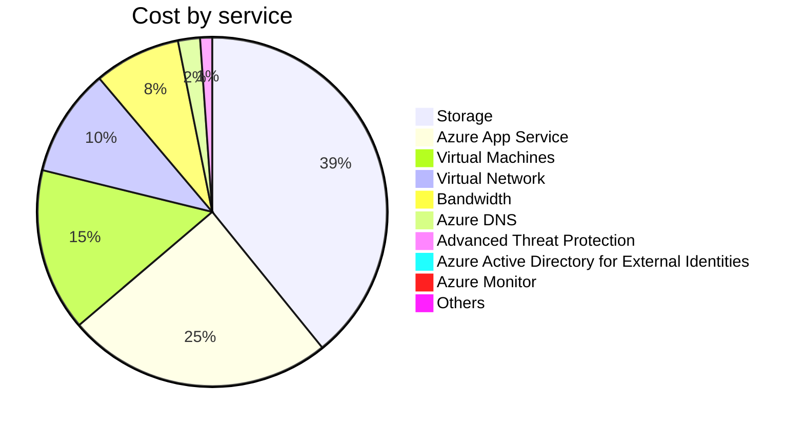

Fetching subscription details...
Fetching cost data...
Fetching forecasted cost data...
Fetching cost data by service name...
Fetching cost data by location...
Fetching cost data by resource group...
# Azure Cost Overview

> Accumulated cost for subscription id `JPF Pay-As-You-Go` from **10/01/2023** to **10/25/2023**

## Totals

|Period|Amount|
|---|---:|
|Today|0.10 USD|
|Yesterday|2.03 USD|
|Last 7 days|15.82 USD|
|Last 30 days|57.44 USD|

```mermaid
gantt
   title Accumulated cost
   dateFormat  X
   axisFormat %s
   section 01 Oct
   USD 3.83 :0, 383
   section 02 Oct
   USD 7.06 :0, 706
   section 03 Oct
   USD 9.56 :0, 956
   section 04 Oct
   USD 12.08 :0, 1208
   section 05 Oct
   USD 14.49 :0, 1449
   section 06 Oct
   USD 17.05 :0, 1705
   section 07 Oct
   USD 19.51 :0, 1951
   section 08 Oct
   USD 21.67 :0, 2167
   section 09 Oct
   USD 23.94 :0, 2394
   section 10 Oct
   USD 26.13 :0, 2613
   section 11 Oct
   USD 28.33 :0, 2833
   section 12 Oct
   USD 30.57 :0, 3057
   section 13 Oct
   USD 32.79 :0, 3279
   section 14 Oct
   USD 34.89 :0, 3489
   section 15 Oct
   USD 37.01 :0, 3701
   section 16 Oct
   USD 39.29 :0, 3929
   section 17 Oct
   USD 41.62 :0, 4162
   section 18 Oct
   USD 43.97 :0, 4397
   section 19 Oct
   USD 46.30 :0, 4630
   section 20 Oct
   USD 48.68 :0, 4868
   section 21 Oct
   USD 50.97 :0, 5097
   section 22 Oct
   USD 53.12 :0, 5312
   section 23 Oct
   USD 55.30 :0, 5530
   section 24 Oct
   USD 57.33 :0, 5733
   section 25 Oct
   USD 57.44 :0, 5744
   section 26 Oct
   USD 59.06 : done, 0, 5906
   section 27 Oct
   USD 60.72 : done, 0, 6072
   section 28 Oct
   USD 62.22 : done, 0, 6222
   section 29 Oct
   USD 63.44 : done, 0, 6344
   section 30 Oct
   USD 64.72 : done, 0, 6472
   section 31 Oct
   USD 66.07 : done, 0, 6607
```

## By Service Name

|Service|Amount|
|---|---:|
|Storage|22.50 USD|
|Azure App Service|14.13 USD|
|Virtual Machines|8.66 USD|
|Virtual Network|5.74 USD|
|Bandwidth|4.60 USD|
|Azure DNS|1.17 USD|
|Advanced Threat Protection|0.64 USD|
|Azure Active Directory for External Identities|0.00 USD|
|Azure Monitor|0.00 USD|
|Others|0.00 USD|

## By Location

|Location|Amount|
|---|---:|
|US North Central|41.21 USD|
|US Central|14.19 USD|
|Unknown|1.17 USD|
|Unassigned|0.64 USD|
|US East|0.23 USD|
|AP East|0.00 USD|
|EU West|0.00 USD|
|US East 2|0.00 USD|
|US West 2|0.00 USD|

## By Resource Group

|Resource Group|Amount|
|---|---:|
|personal-network|41.59 USD|
|personal-site|14.19 USD|
|personal-dns|0.78 USD|
||0.64 USD|
|cloud-shell-storage-eastus|0.23 USD|
|azureapp-auto-alerts-873533-jpatrick_fulton_gmail_com|0.00 USD|

Generated at 2023-10-25 11:33:26 for subscription with id `4913be3f-a345-4652-9bba-767418dd25e3`
