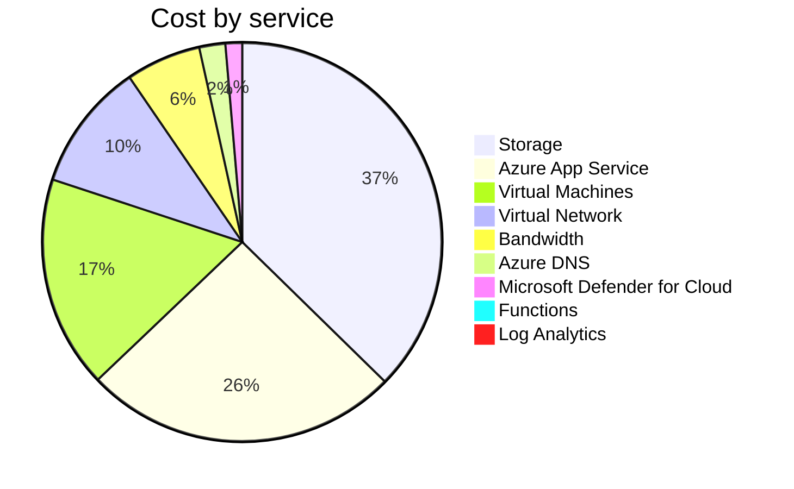

Fetching subscription details...
Fetching cost data...
Fetching forecasted cost data...
Fetching cost data by service name...
Fetching cost data by location...
Fetching cost data by resource group...
# Azure Cost Overview

> Accumulated cost for subscription id `JPF Pay-As-You-Go` from **12/01/2023** to **12/24/2023**

## Totals

|Period|Amount|
|---|---:|
|Today|0.10 USD|
|Yesterday|2.03 USD|
|Last 7 days|15.31 USD|
|Last 30 days|53.09 USD|

```mermaid
gantt
   title Accumulated cost
   dateFormat  X
   axisFormat %s
   section 01 Dec
   USD 2.41 :0, 241
   section 02 Dec
   USD 4.93 :0, 493
   section 03 Dec
   USD 7.79 :0, 779
   section 04 Dec
   USD 10.04 :0, 1004
   section 05 Dec
   USD 12.27 :0, 1227
   section 06 Dec
   USD 15.11 :0, 1511
   section 07 Dec
   USD 17.58 :0, 1758
   section 08 Dec
   USD 19.73 :0, 1973
   section 09 Dec
   USD 22.15 :0, 2215
   section 10 Dec
   USD 24.48 :0, 2448
   section 11 Dec
   USD 26.80 :0, 2680
   section 12 Dec
   USD 29.02 :0, 2902
   section 13 Dec
   USD 31.23 :0, 3123
   section 14 Dec
   USD 33.45 :0, 3345
   section 15 Dec
   USD 35.60 :0, 3560
   section 16 Dec
   USD 37.79 :0, 3779
   section 17 Dec
   USD 39.97 :0, 3997
   section 18 Dec
   USD 42.24 :0, 4224
   section 19 Dec
   USD 44.49 :0, 4449
   section 20 Dec
   USD 46.65 :0, 4665
   section 21 Dec
   USD 48.80 :0, 4880
   section 22 Dec
   USD 50.96 :0, 5096
   section 23 Dec
   USD 53.00 :0, 5300
   section 24 Dec
   USD 53.09 :0, 5309
   section 25 Dec
   USD 55.22 : done, 0, 5522
   section 26 Dec
   USD 57.32 : done, 0, 5732
   section 27 Dec
   USD 59.38 : done, 0, 5938
   section 28 Dec
   USD 61.48 : done, 0, 6148
   section 29 Dec
   USD 63.46 : done, 0, 6346
   section 30 Dec
   USD 65.73 : done, 0, 6573
   section 31 Dec
   USD 67.85 : done, 0, 6785
```

## By Service Name

|Service|Amount|
|---|---:|
|Storage|19.82 USD|
|Azure App Service|13.56 USD|
|Virtual Machines|9.13 USD|
|Virtual Network|5.51 USD|
|Bandwidth|3.23 USD|
|Azure DNS|1.12 USD|
|Microsoft Defender for Cloud|0.72 USD|
|Functions|0.00 USD|
|Log Analytics|0.00 USD|

## By Location

|Location|Amount|
|---|---:|
|US North Central|37.42 USD|
|US Central|13.61 USD|
|Unknown|1.12 USD|
|Unassigned|0.72 USD|
|US East|0.22 USD|
|AP East|0.00 USD|
|EU West|0.00 USD|
|US East 2|0.00 USD|
|US West 2|0.00 USD|

## By Resource Group

|Resource Group|Amount|
|---|---:|
|personal-network|37.79 USD|
|personal-site|13.61 USD|
|personal-dns|0.75 USD|
||0.72 USD|
|cloud-shell-storage-eastus|0.22 USD|

Generated at 2023-12-24 11:35:16 for subscription with id `4913be3f-a345-4652-9bba-767418dd25e3`
