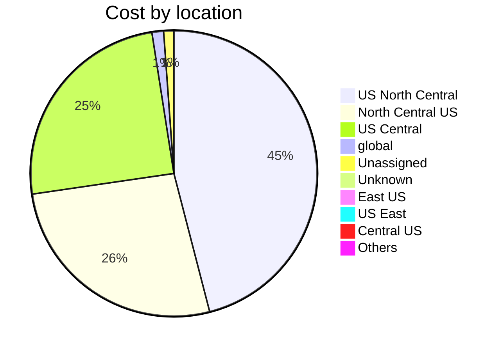

Fetching subscription details...
Fetching cost data...
Fetching forecasted cost data...
Fetching cost data by service name...
Fetching cost data by location...
Fetching cost data by resource group...
# Azure Cost Overview

> Accumulated cost for subscription id `JPF Pay-As-You-Go` from **10/01/2023** to **10/26/2023**

## Totals

|Period|Amount|
|---|---:|
|Today|0.10 USD|
|Yesterday|2.00 USD|
|Last 7 days|15.82 USD|
|Last 30 days|60.03 USD|

```mermaid
gantt
   title Accumulated cost
   dateFormat  X
   axisFormat %s
   section 01 Oct
   USD 3.83 :0, 383
   section 02 Oct
   USD 7.06 :0, 706
   section 03 Oct
   USD 9.56 :0, 956
   section 04 Oct
   USD 12.08 :0, 1208
   section 05 Oct
   USD 14.49 :0, 1449
   section 06 Oct
   USD 17.05 :0, 1705
   section 07 Oct
   USD 19.51 :0, 1951
   section 08 Oct
   USD 21.67 :0, 2167
   section 09 Oct
   USD 23.94 :0, 2394
   section 10 Oct
   USD 26.15 :0, 2615
   section 11 Oct
   USD 28.37 :0, 2837
   section 12 Oct
   USD 30.64 :0, 3064
   section 13 Oct
   USD 32.88 :0, 3288
   section 14 Oct
   USD 34.98 :0, 3498
   section 15 Oct
   USD 37.10 :0, 3710
   section 16 Oct
   USD 39.42 :0, 3942
   section 17 Oct
   USD 41.80 :0, 4180
   section 18 Oct
   USD 44.20 :0, 4420
   section 19 Oct
   USD 46.58 :0, 4658
   section 20 Oct
   USD 49.01 :0, 4901
   section 21 Oct
   USD 51.34 :0, 5134
   section 22 Oct
   USD 53.50 :0, 5350
   section 23 Oct
   USD 55.69 :0, 5569
   section 24 Oct
   USD 57.93 :0, 5793
   section 25 Oct
   USD 59.93 :0, 5993
   section 26 Oct
   USD 60.03 :0, 6003
   section 27 Oct
   USD 61.84 : done, 0, 6184
   section 28 Oct
   USD 63.49 : done, 0, 6349
   section 29 Oct
   USD 64.85 : done, 0, 6485
   section 30 Oct
   USD 66.29 : done, 0, 6629
   section 31 Oct
   USD 67.75 : done, 0, 6775
```

## By Service Name

|Service|Amount|
|---|---:|
|Storage|23.32 USD|
|Azure App Service|14.72 USD|
|Virtual Machines|9.01 USD|
|Virtual Network|5.97 USD|
|Bandwidth|5.12 USD|
|Azure DNS|1.22 USD|
|Advanced Threat Protection|0.68 USD|
|Azure Active Directory for External Identities|0.00 USD|
|Azure Monitor|0.00 USD|
|Others|0.00 USD|

## By Location

|Location|Amount|
|---|---:|
|US North Central|27.27 USD|
|North Central US|15.84 USD|
|US Central|14.74 USD|
|global|0.78 USD|
|Unassigned|0.68 USD|
|Unknown|0.43 USD|
|East US|0.15 USD|
|US East|0.09 USD|
|Central US|0.04 USD|
|Others|0.00 USD|

## By Resource Group

|Resource Group|Amount|
|---|---:|
|personal-network|43.51 USD|
|personal-site|14.78 USD|
|personal-dns|0.82 USD|
||0.68 USD|
|cloud-shell-storage-eastus|0.24 USD|
|azureapp-auto-alerts-873533-jpatrick_fulton_gmail_com|0.00 USD|

Generated at 2023-10-26 11:35:02 for subscription with id `4913be3f-a345-4652-9bba-767418dd25e3`
