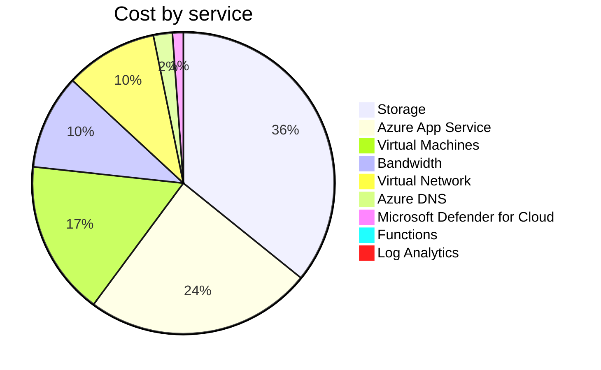
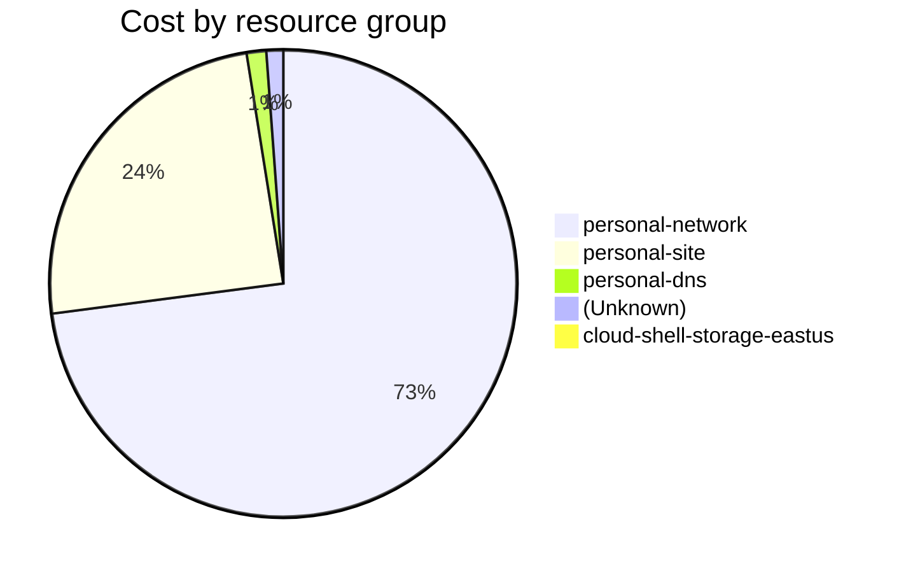

Fetching subscription details...
Fetching cost data...
Fetching forecasted cost data...
Fetching cost data by service name...
Fetching cost data by location...
Fetching cost data by resource group...
# Azure Cost Overview

> Accumulated cost for subscription id `JPF Pay-As-You-Go` from **12/01/2023** to **12/12/2023**

## Totals

|Period|Amount|
|---|---:|
|Today|0.10 USD|
|Yesterday|2.18 USD|
|Last 7 days|16.59 USD|
|Last 30 days|26.63 USD|

```mermaid
gantt
   title Accumulated cost
   dateFormat  X
   axisFormat %s
   section 01 Dec
   USD 2.41 :0, 241
   section 02 Dec
   USD 4.93 :0, 493
   section 03 Dec
   USD 7.79 :0, 779
   section 04 Dec
   USD 10.04 :0, 1004
   section 05 Dec
   USD 12.27 :0, 1227
   section 06 Dec
   USD 15.11 :0, 1511
   section 07 Dec
   USD 17.58 :0, 1758
   section 08 Dec
   USD 19.73 :0, 1973
   section 09 Dec
   USD 22.14 :0, 2214
   section 10 Dec
   USD 24.36 :0, 2436
   section 11 Dec
   USD 26.54 :0, 2654
   section 12 Dec
   USD 26.63 :0, 2663
   section 13 Dec
   USD 29.06 : done, 0, 2906
   section 14 Dec
   USD 31.46 : done, 0, 3146
   section 15 Dec
   USD 33.86 : done, 0, 3386
   section 16 Dec
   USD 36.30 : done, 0, 3630
   section 17 Dec
   USD 38.66 : done, 0, 3866
   section 18 Dec
   USD 41.02 : done, 0, 4102
   section 19 Dec
   USD 43.55 : done, 0, 4355
   section 20 Dec
   USD 45.96 : done, 0, 4596
   section 21 Dec
   USD 48.34 : done, 0, 4834
   section 22 Dec
   USD 50.74 : done, 0, 5074
   section 23 Dec
   USD 53.16 : done, 0, 5316
   section 24 Dec
   USD 55.50 : done, 0, 5550
   section 25 Dec
   USD 57.85 : done, 0, 5785
   section 26 Dec
   USD 60.36 : done, 0, 6036
   section 27 Dec
   USD 62.76 : done, 0, 6276
   section 28 Dec
   USD 65.13 : done, 0, 6513
   section 29 Dec
   USD 67.51 : done, 0, 6751
   section 30 Dec
   USD 69.92 : done, 0, 6992
   section 31 Dec
   USD 72.25 : done, 0, 7225
```

## By Service Name

|Service|Amount|
|---|---:|
|Storage|9.54 USD|
|Azure App Service|6.48 USD|
|Virtual Machines|4.42 USD|
|Bandwidth|2.71 USD|
|Virtual Network|2.64 USD|
|Azure DNS|0.54 USD|
|Microsoft Defender for Cloud|0.31 USD|
|Functions|0.00 USD|
|Log Analytics|0.00 USD|

## By Location

|Location|Amount|
|---|---:|
|US North Central|19.17 USD|
|US Central|6.51 USD|
|Unknown|0.54 USD|
|Unassigned|0.31 USD|
|US East|0.11 USD|
|AP East|0.00 USD|
|EU West|0.00 USD|
|US East 2|0.00 USD|
|US West 2|0.00 USD|

## By Resource Group

|Resource Group|Amount|
|---|---:|
|personal-network|19.35 USD|
|personal-site|6.51 USD|
|personal-dns|0.36 USD|
||0.31 USD|
|cloud-shell-storage-eastus|0.11 USD|

Generated at 2023-12-12 11:34:15 for subscription with id `4913be3f-a345-4652-9bba-767418dd25e3`
