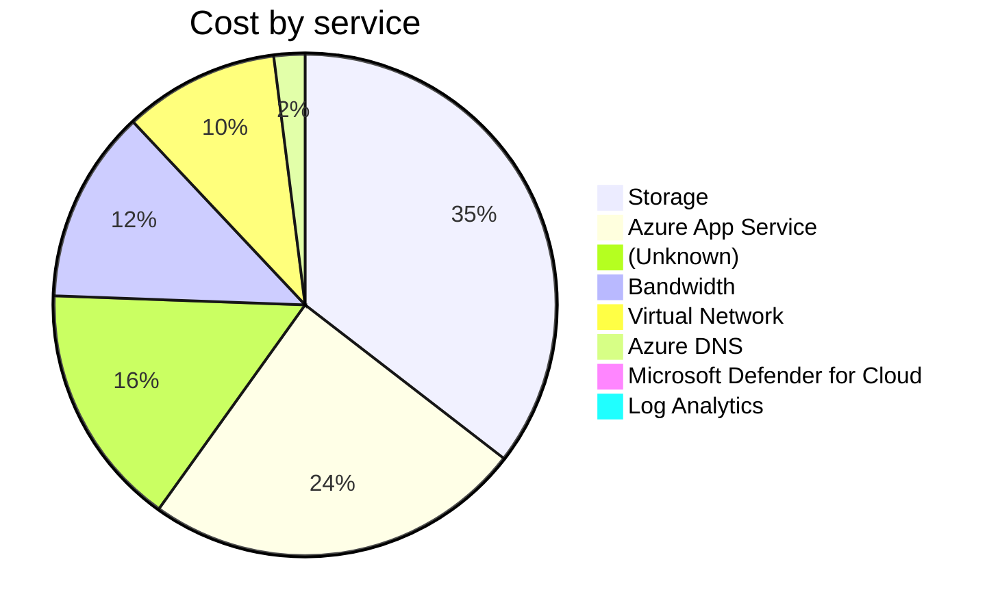
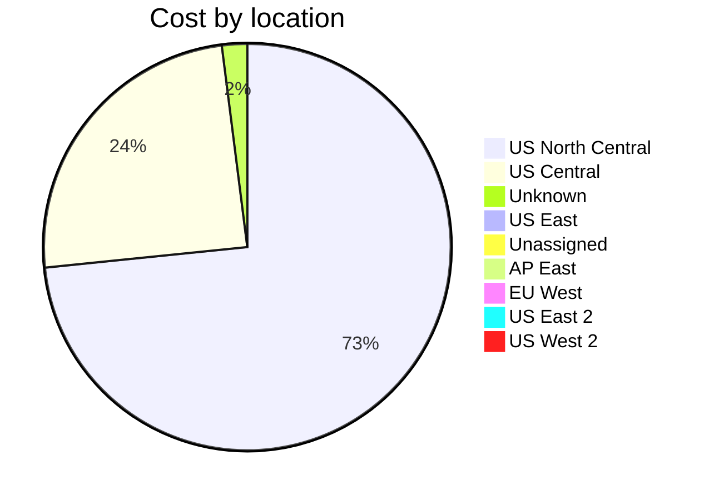
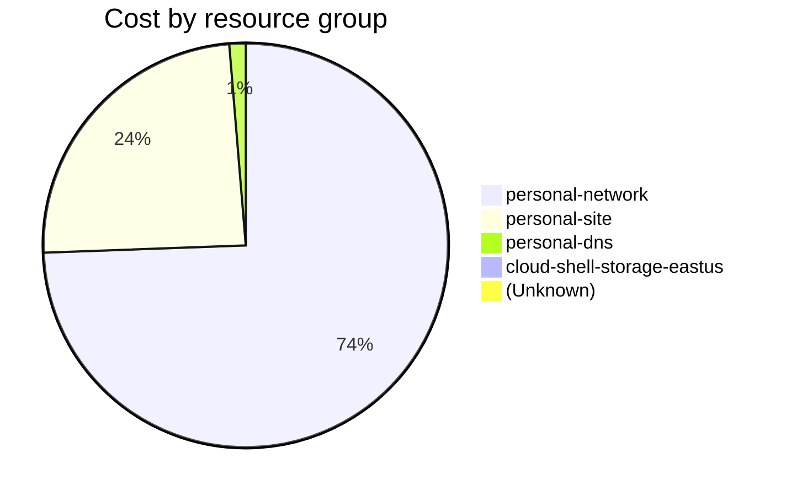

Fetching subscription details...
Fetching cost data...
Fetching forecasted cost data...
Fetching cost data by service name...
Fetching cost data by location...
Fetching cost data by resource group...
# Azure Cost Overview

> Accumulated cost for subscription id `JPF Pay-As-You-Go` from **03/01/2024** to **03/05/2024**

## Totals

|Period|Amount|
|---|---:|
|Today|0.09 USD|
|Yesterday|1.98 USD|
|Last 7 days|9.54 USD|
|Last 30 days|9.54 USD|

```mermaid
gantt
   title Accumulated cost
   dateFormat  X
   axisFormat %s
   section 01 Mar
   USD 3.32 :0, 332
   section 02 Mar
   USD 5.40 :0, 540
   section 03 Mar
   USD 7.47 :0, 747
   section 04 Mar
   USD 9.45 :0, 945
   section 05 Mar
   USD 9.54 :0, 954
   section 06 Mar
   USD 11.73 : done, 0, 1173
   section 07 Mar
   USD 13.68 : done, 0, 1368
   section 08 Mar
   USD 16.04 : done, 0, 1604
   section 09 Mar
   USD 17.97 : done, 0, 1797
   section 10 Mar
   USD 19.99 : done, 0, 1999
   section 11 Mar
   USD 21.81 : done, 0, 2181
   section 12 Mar
   USD 24.01 : done, 0, 2401
   section 13 Mar
   USD 26.03 : done, 0, 2603
   section 14 Mar
   USD 27.81 : done, 0, 2781
   section 15 Mar
   USD 29.99 : done, 0, 2999
   section 16 Mar
   USD 31.74 : done, 0, 3174
   section 17 Mar
   USD 33.59 : done, 0, 3359
   section 18 Mar
   USD 35.24 : done, 0, 3524
   section 19 Mar
   USD 37.27 : done, 0, 3727
   section 20 Mar
   USD 39.10 : done, 0, 3910
   section 21 Mar
   USD 40.71 : done, 0, 4071
   section 22 Mar
   USD 42.72 : done, 0, 4272
   section 23 Mar
   USD 44.30 : done, 0, 4430
   section 24 Mar
   USD 45.97 : done, 0, 4597
   section 25 Mar
   USD 47.44 : done, 0, 4744
   section 26 Mar
   USD 49.29 : done, 0, 4929
   section 27 Mar
   USD 50.96 : done, 0, 5096
   section 28 Mar
   USD 52.39 : done, 0, 5239
   section 29 Mar
   USD 54.22 : done, 0, 5422
   section 30 Mar
   USD 55.62 : done, 0, 5562
   section 31 Mar
   USD 57.12 : done, 0, 5712
```

## By Service Name

|Service|Amount|
|---|---:|
|Storage|3.37 USD|
|Azure App Service|2.32 USD|
||1.49 USD|
|Bandwidth|1.18 USD|
|Virtual Network|0.95 USD|
|Azure DNS|0.19 USD|
|Microsoft Defender for Cloud|0.03 USD|
|Log Analytics|0.00 USD|

## By Location

|Location|Amount|
|---|---:|
|US North Central|6.95 USD|
|US Central|2.33 USD|
|Unknown|0.19 USD|
|US East|0.04 USD|
|Unassigned|0.03 USD|
|AP East|0.00 USD|
|EU West|0.00 USD|
|US East 2|0.00 USD|
|US West 2|0.00 USD|

## By Resource Group

|Resource Group|Amount|
|---|---:|
|personal-network|6.84 USD|
|personal-site|2.23 USD|
|personal-dns|0.12 USD|
|cloud-shell-storage-eastus|0.04 USD|
||0.03 USD|

Generated at 2024-03-05 11:34:16 for subscription with id `4913be3f-a345-4652-9bba-767418dd25e3`
