Fetching subscription details...
Fetching cost data...
Fetching forecasted cost data...
Fetching cost data by service name...
Fetching cost data by location...
Fetching cost data by resource group...
# Azure Cost Overview

> Accumulated cost for subscription id `JPF Pay-As-You-Go` from **02/01/2024** to **02/04/2024**

## Totals

|Period|Amount|
|---|---:|
|Today|0.07 USD|
|Yesterday|2.70 USD|
|Last 7 days|9.21 USD|
|Last 30 days|9.21 USD|

```mermaid
gantt
   title Accumulated cost
   dateFormat  X
   axisFormat %s
   section 01 Feb
   USD 2.91 :0, 291
   section 02 Feb
   USD 6.44 :0, 644
   section 03 Feb
   USD 9.14 :0, 914
   section 04 Feb
   USD 9.21 :0, 921
   section 05 Feb
   USD 12.09 : done, 0, 1209
   section 06 Feb
   USD 15.14 : done, 0, 1514
   section 07 Feb
   USD 17.94 : done, 0, 1794
   section 08 Feb
   USD 20.99 : done, 0, 2099
   section 09 Feb
   USD 24.16 : done, 0, 2416
   section 10 Feb
   USD 27.85 : done, 0, 2785
   section 11 Feb
   USD 30.81 : done, 0, 3081
   section 12 Feb
   USD 33.77 : done, 0, 3377
   section 13 Feb
   USD 36.92 : done, 0, 3692
   section 14 Feb
   USD 39.80 : done, 0, 3980
   section 15 Feb
   USD 42.95 : done, 0, 4295
   section 16 Feb
   USD 46.20 : done, 0, 4620
   section 17 Feb
   USD 49.99 : done, 0, 4999
   section 18 Feb
   USD 53.03 : done, 0, 5303
   section 19 Feb
   USD 56.09 : done, 0, 5609
   section 20 Feb
   USD 59.32 : done, 0, 5932
   section 21 Feb
   USD 62.30 : done, 0, 6230
   section 22 Feb
   USD 65.53 : done, 0, 6553
   section 23 Feb
   USD 68.88 : done, 0, 6888
   section 24 Feb
   USD 72.75 : done, 0, 7275
   section 25 Feb
   USD 75.89 : done, 0, 7589
   section 26 Feb
   USD 79.03 : done, 0, 7903
   section 27 Feb
   USD 82.36 : done, 0, 8236
   section 28 Feb
   USD 85.42 : done, 0, 8542
   section 29 Feb
   USD 88.75 : done, 0, 8875
```

## By Service Name

|Service|Amount|
|---|---:|
|Bandwidth|2.75 USD|
|Storage|2.72 USD|
|Azure App Service|1.70 USD|
|Virtual Machines|1.12 USD|
|Virtual Network|0.70 USD|
|Azure DNS|0.14 USD|
|Microsoft Defender for Cloud|0.07 USD|
|Azure Monitor|0.00 USD|
|Log Analytics|0.00 USD|

## By Location

|Location|Amount|
|---|---:|
|US North Central|7.26 USD|
|US Central|1.71 USD|
|Unknown|0.14 USD|
|Unassigned|0.07 USD|
|US East|0.03 USD|
|AP East|0.00 USD|
|EU West|0.00 USD|
|US East 2|0.00 USD|
|US West 2|0.00 USD|

## By Resource Group

|Resource Group|Amount|
|---|---:|
|personal-network|7.31 USD|
|personal-site|1.71 USD|
|personal-dns|0.10 USD|
||0.07 USD|
|cloud-shell-storage-eastus|0.03 USD|
|azureapp-auto-alerts-873533-jpatrick_fulton_gmail_com|0.00 USD|

Generated at 2024-02-04 11:36:49 for subscription with id `4913be3f-a345-4652-9bba-767418dd25e3`
