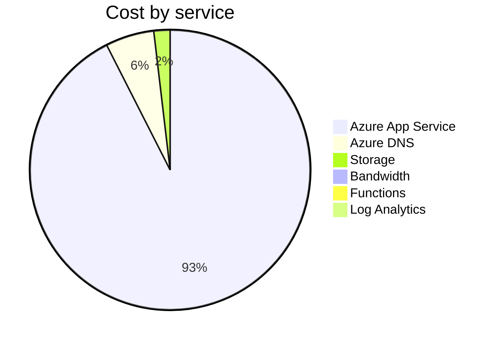

Fetching subscription details...
Fetching cost data...
Fetching forecasted cost data...
Fetching cost data by service name...
Fetching cost data by location...
Fetching cost data by resource group...
# Azure Cost Overview

> Accumulated cost for subscription id `JPF Pay-As-You-Go` from **08/01/2024** to **08/02/2024**

## Totals

|Period|Amount|
|---|---:|
|Today|0.00 USD|
|Yesterday|0.43 USD|
|Last 7 days|1.06 USD|
|Last 30 days|1.06 USD|

```mermaid
gantt
   title Accumulated cost
   dateFormat  X
   axisFormat %s
   section 01 Aug
   USD 0.64 :0, 64
   section 02 Aug
   USD 1.06 :0, 106
   section 03 Aug
   USD 1.71 : done, 0, 171
   section 04 Aug
   USD 2.36 : done, 0, 236
   section 05 Aug
   USD 3.00 : done, 0, 300
   section 06 Aug
   USD 3.65 : done, 0, 365
   section 07 Aug
   USD 4.30 : done, 0, 430
   section 08 Aug
   USD 4.94 : done, 0, 494
   section 09 Aug
   USD 5.59 : done, 0, 559
   section 10 Aug
   USD 6.24 : done, 0, 624
   section 11 Aug
   USD 6.89 : done, 0, 689
   section 12 Aug
   USD 7.53 : done, 0, 753
   section 13 Aug
   USD 8.18 : done, 0, 818
   section 14 Aug
   USD 8.83 : done, 0, 883
   section 15 Aug
   USD 9.48 : done, 0, 948
   section 16 Aug
   USD 10.13 : done, 0, 1013
   section 17 Aug
   USD 10.77 : done, 0, 1077
   section 18 Aug
   USD 11.42 : done, 0, 1142
   section 19 Aug
   USD 12.07 : done, 0, 1207
   section 20 Aug
   USD 12.72 : done, 0, 1272
   section 21 Aug
   USD 13.37 : done, 0, 1337
   section 22 Aug
   USD 14.02 : done, 0, 1402
   section 23 Aug
   USD 14.67 : done, 0, 1467
   section 24 Aug
   USD 15.32 : done, 0, 1532
   section 25 Aug
   USD 15.97 : done, 0, 1597
   section 26 Aug
   USD 16.62 : done, 0, 1662
   section 27 Aug
   USD 17.27 : done, 0, 1727
   section 28 Aug
   USD 17.91 : done, 0, 1791
   section 29 Aug
   USD 18.57 : done, 0, 1857
   section 30 Aug
   USD 19.22 : done, 0, 1922
   section 31 Aug
   USD 19.87 : done, 0, 1987
```

## By Service Name

|Service|Amount|
|---|---:|
|Azure App Service|0.99 USD|
|Azure DNS|0.06 USD|
|Storage|0.02 USD|
|Bandwidth|0.00 USD|
|Functions|0.00 USD|
|Log Analytics|0.00 USD|

## By Location

|Location|Amount|
|---|---:|
|US Central|0.99 USD|
|Unknown|0.06 USD|
|US East|0.02 USD|
|AP East|0.00 USD|
|EU West|0.00 USD|
|US East 2|0.00 USD|
|US West 2|0.00 USD|

## By Resource Group

|Resource Group|Amount|
|---|---:|
|personal-site|0.99 USD|
|personal-dns|0.06 USD|
|cloud-shell-storage-eastus|0.02 USD|

Generated at 2024-08-03 11:22:21 for subscription with id `4913be3f-a345-4652-9bba-767418dd25e3`
