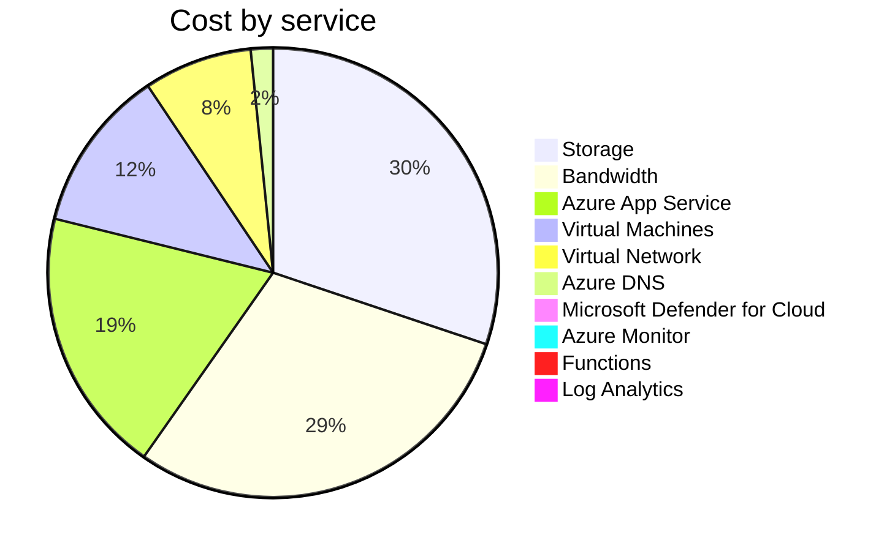
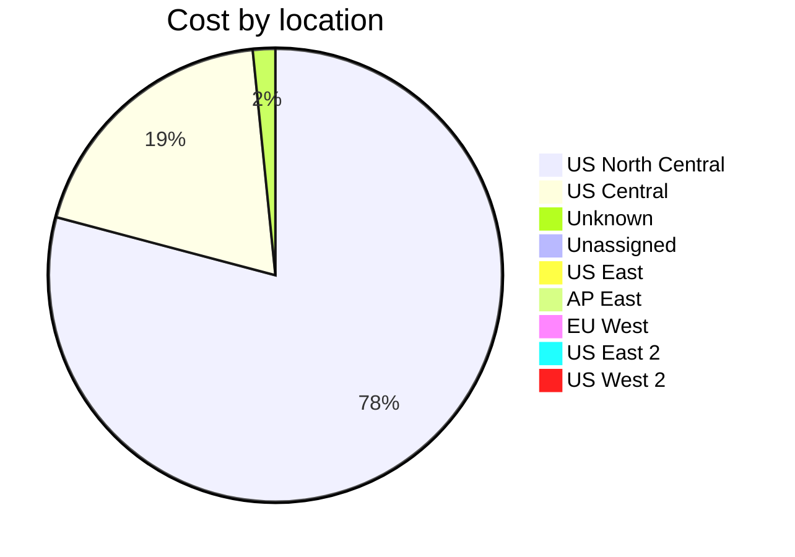

Fetching subscription details...
Fetching cost data...
Fetching forecasted cost data...
Fetching cost data by service name...
Fetching cost data by location...
Fetching cost data by resource group...
# Azure Cost Overview

> Accumulated cost for subscription id `JPF Pay-As-You-Go` from **02/01/2024** to **02/10/2024**

## Totals

|Period|Amount|
|---|---:|
|Today|0.09 USD|
|Yesterday|2.66 USD|
|Last 7 days|21.13 USD|
|Last 30 days|27.81 USD|

## By Service Name

|Service|Amount|
|---|---:|
|Storage|8.32 USD|
|Bandwidth|8.16 USD|
|Azure App Service|5.28 USD|
|Virtual Machines|3.24 USD|
|Virtual Network|2.15 USD|
|Azure DNS|0.44 USD|
|Microsoft Defender for Cloud|0.22 USD|
|Azure Monitor|0.00 USD|
|Functions|0.00 USD|
|Log Analytics|0.00 USD|

## By Location

|Location|Amount|
|---|---:|
|US North Central|21.76 USD|
|US Central|5.30 USD|
|Unknown|0.44 USD|
|Unassigned|0.22 USD|
|US East|0.09 USD|
|AP East|0.00 USD|
|EU West|0.00 USD|
|US East 2|0.00 USD|
|US West 2|0.00 USD|

## By Resource Group

|Resource Group|Amount|
|---|---:|
|personal-network|21.90 USD|
|personal-site|5.30 USD|
|personal-dns|0.29 USD|
||0.22 USD|
|cloud-shell-storage-eastus|0.09 USD|
|azureapp-auto-alerts-873533-jpatrick_fulton_gmail_com|0.00 USD|

Generated at 2024-02-10 11:35:17 for subscription with id `4913be3f-a345-4652-9bba-767418dd25e3`
