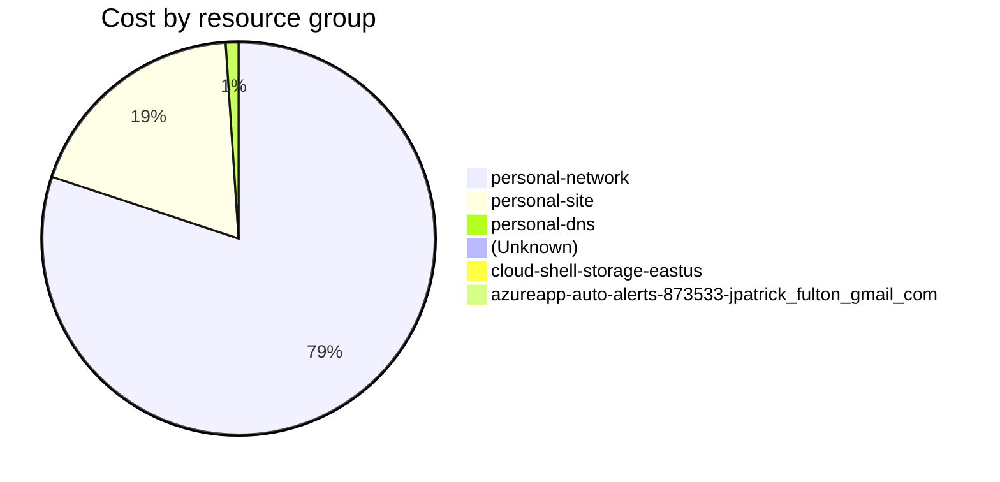

Fetching subscription details...
Fetching cost data...
Fetching forecasted cost data...
Fetching cost data by service name...
Fetching cost data by location...
Fetching cost data by resource group...
# Azure Cost Overview

> Accumulated cost for subscription id `JPF Pay-As-You-Go` from **02/01/2024** to **02/05/2024**

## Totals

|Period|Amount|
|---|---:|
|Today|0.10 USD|
|Yesterday|2.83 USD|
|Last 7 days|12.49 USD|
|Last 30 days|12.49 USD|

```mermaid
gantt
   title Accumulated cost
   dateFormat  X
   axisFormat %s
   section 01 Feb
   USD 2.93 :0, 293
   section 02 Feb
   USD 6.50 :0, 650
   section 03 Feb
   USD 9.56 :0, 956
   section 04 Feb
   USD 12.39 :0, 1239
   section 05 Feb
   USD 12.49 :0, 1249
   section 06 Feb
   USD 15.45 : done, 0, 1545
   section 07 Feb
   USD 18.14 : done, 0, 1814
   section 08 Feb
   USD 21.09 : done, 0, 2109
   section 09 Feb
   USD 24.28 : done, 0, 2428
   section 10 Feb
   USD 27.84 : done, 0, 2784
   section 11 Feb
   USD 30.67 : done, 0, 3067
   section 12 Feb
   USD 33.51 : done, 0, 3351
   section 13 Feb
   USD 36.53 : done, 0, 3653
   section 14 Feb
   USD 39.28 : done, 0, 3928
   section 15 Feb
   USD 42.28 : done, 0, 4228
   section 16 Feb
   USD 45.53 : done, 0, 4553
   section 17 Feb
   USD 49.15 : done, 0, 4915
   section 18 Feb
   USD 52.04 : done, 0, 5204
   section 19 Feb
   USD 54.94 : done, 0, 5494
   section 20 Feb
   USD 58.01 : done, 0, 5801
   section 21 Feb
   USD 60.81 : done, 0, 6081
   section 22 Feb
   USD 63.88 : done, 0, 6388
   section 23 Feb
   USD 67.18 : done, 0, 6718
   section 24 Feb
   USD 70.86 : done, 0, 7086
   section 25 Feb
   USD 73.81 : done, 0, 7381
   section 26 Feb
   USD 76.76 : done, 0, 7676
   section 27 Feb
   USD 79.89 : done, 0, 7989
   section 28 Feb
   USD 82.75 : done, 0, 8275
   section 29 Feb
   USD 85.87 : done, 0, 8587
```

## By Service Name

|Service|Amount|
|---|---:|
|Bandwidth|3.74 USD|
|Storage|3.69 USD|
|Azure App Service|2.32 USD|
|Virtual Machines|1.50 USD|
|Virtual Network|0.95 USD|
|Azure DNS|0.19 USD|
|Microsoft Defender for Cloud|0.10 USD|
|Azure Monitor|0.00 USD|
|Log Analytics|0.00 USD|

## By Location

|Location|Amount|
|---|---:|
|US North Central|9.83 USD|
|US Central|2.33 USD|
|Unknown|0.19 USD|
|Unassigned|0.10 USD|
|US East|0.04 USD|
|AP East|0.00 USD|
|EU West|0.00 USD|
|US East 2|0.00 USD|
|US West 2|0.00 USD|

## By Resource Group

|Resource Group|Amount|
|---|---:|
|personal-network|9.89 USD|
|personal-site|2.33 USD|
|personal-dns|0.13 USD|
||0.10 USD|
|cloud-shell-storage-eastus|0.04 USD|
|azureapp-auto-alerts-873533-jpatrick_fulton_gmail_com|0.00 USD|

Generated at 2024-02-05 11:38:06 for subscription with id `4913be3f-a345-4652-9bba-767418dd25e3`
