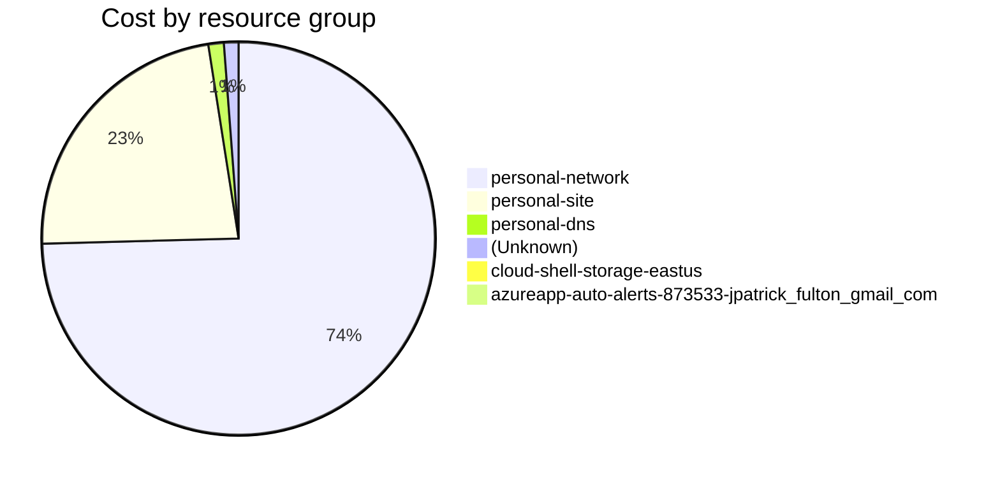

Fetching subscription details...
Fetching cost data...
Fetching forecasted cost data...
Fetching cost data by service name...
Fetching cost data by location...
Fetching cost data by resource group...
# Azure Cost Overview

> Accumulated cost for subscription id `JPF Pay-As-You-Go` from **01/01/2024** to **01/23/2024**

## Totals

|Period|Amount|
|---|---:|
|Today|0.10 USD|
|Yesterday|2.38 USD|
|Last 7 days|18.15 USD|
|Last 30 days|56.93 USD|

```mermaid
gantt
   title Accumulated cost
   dateFormat  X
   axisFormat %s
   section 01 Jan
   USD 2.68 :0, 268
   section 02 Jan
   USD 5.81 :0, 581
   section 03 Jan
   USD 8.29 :0, 829
   section 04 Jan
   USD 10.88 :0, 1088
   section 05 Jan
   USD 13.49 :0, 1349
   section 06 Jan
   USD 16.41 :0, 1641
   section 07 Jan
   USD 18.82 :0, 1882
   section 08 Jan
   USD 21.90 :0, 2190
   section 09 Jan
   USD 24.51 :0, 2451
   section 10 Jan
   USD 26.78 :0, 2678
   section 11 Jan
   USD 29.20 :0, 2920
   section 12 Jan
   USD 31.63 :0, 3163
   section 13 Jan
   USD 34.35 :0, 3435
   section 14 Jan
   USD 36.54 :0, 3654
   section 15 Jan
   USD 38.79 :0, 3879
   section 16 Jan
   USD 41.71 :0, 4171
   section 17 Jan
   USD 44.24 :0, 4424
   section 18 Jan
   USD 46.71 :0, 4671
   section 19 Jan
   USD 49.20 :0, 4920
   section 20 Jan
   USD 51.97 :0, 5197
   section 21 Jan
   USD 54.45 :0, 5445
   section 22 Jan
   USD 56.83 :0, 5683
   section 23 Jan
   USD 56.93 :0, 5693
   section 24 Jan
   USD 59.38 : done, 0, 5938
   section 25 Jan
   USD 61.90 : done, 0, 6190
   section 26 Jan
   USD 64.52 : done, 0, 6452
   section 27 Jan
   USD 67.44 : done, 0, 6744
   section 28 Jan
   USD 69.94 : done, 0, 6994
   section 29 Jan
   USD 72.50 : done, 0, 7250
   section 30 Jan
   USD 75.37 : done, 0, 7537
   section 31 Jan
   USD 77.84 : done, 0, 7784
```

## By Service Name

|Service|Amount|
|---|---:|
|Storage|19.13 USD|
|Azure App Service|12.97 USD|
|Virtual Machines|9.18 USD|
|Bandwidth|8.63 USD|
|Virtual Network|5.27 USD|
|Azure DNS|1.08 USD|
|Microsoft Defender for Cloud|0.68 USD|
|Azure Monitor|0.00 USD|
|Functions|0.00 USD|
|Log Analytics|0.00 USD|

## By Location

|Location|Amount|
|---|---:|
|US North Central|41.94 USD|
|US Central|13.02 USD|
|Unknown|1.08 USD|
|Unassigned|0.68 USD|
|US East|0.21 USD|
|AP East|0.00 USD|
|EU West|0.00 USD|
|US East 2|0.00 USD|
|US West|0.00 USD|
|US West 2|0.00 USD|

## By Resource Group

|Resource Group|Amount|
|---|---:|
|personal-network|42.30 USD|
|personal-site|13.02 USD|
|personal-dns|0.72 USD|
||0.68 USD|
|cloud-shell-storage-eastus|0.21 USD|
|azureapp-auto-alerts-873533-jpatrick_fulton_gmail_com|0.00 USD|

Generated at 2024-01-23 11:35:16 for subscription with id `4913be3f-a345-4652-9bba-767418dd25e3`
