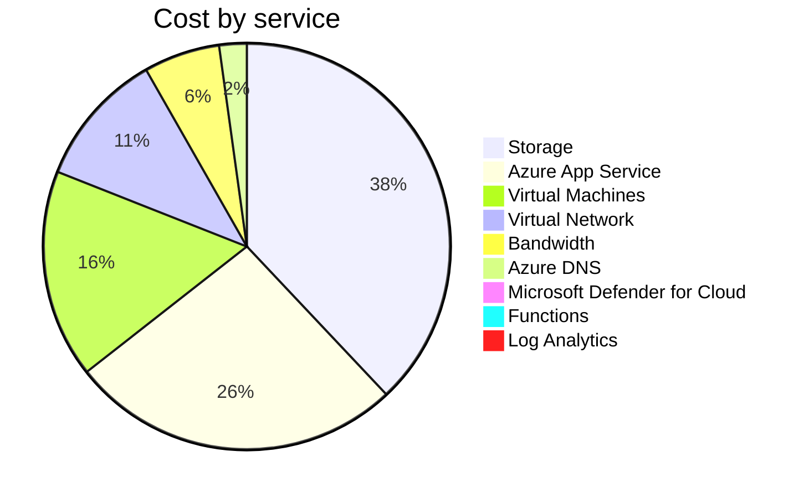
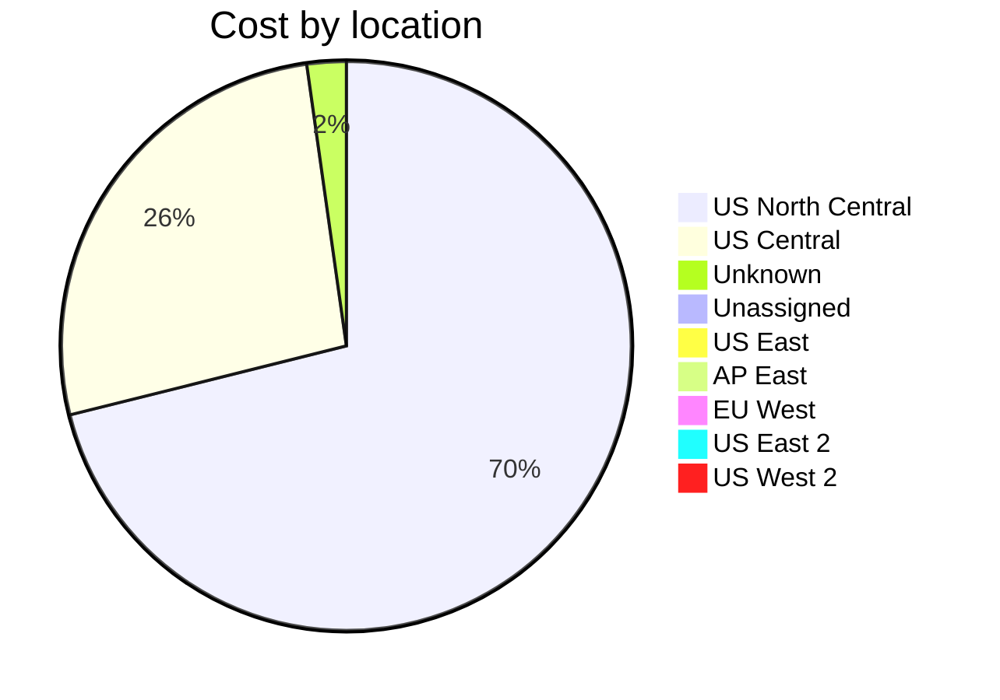
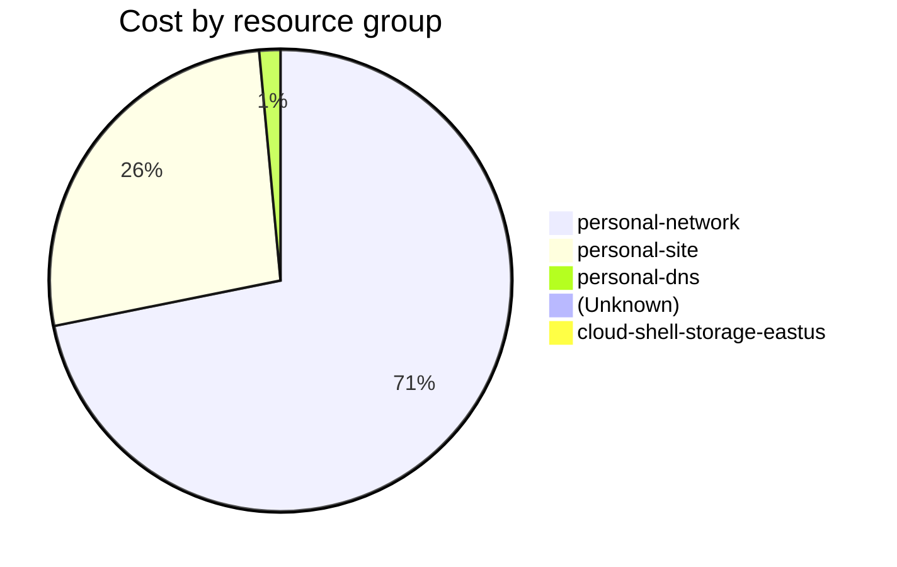

Fetching subscription details...
Fetching cost data...
Fetching forecasted cost data...
Fetching cost data by service name...
Fetching cost data by location...
Fetching cost data by resource group...
# Azure Cost Overview

> Accumulated cost for subscription id `JPF Pay-As-You-Go` from **03/01/2024** to **03/10/2024**

## Totals

|Period|Amount|
|---|---:|
|Today|0.10 USD|
|Yesterday|1.96 USD|
|Last 7 days|14.54 USD|
|Last 30 days|19.94 USD|

```mermaid
gantt
   title Accumulated cost
   dateFormat  X
   axisFormat %s
   section 01 Mar
   USD 3.32 :0, 332
   section 02 Mar
   USD 5.40 :0, 540
   section 03 Mar
   USD 7.47 :0, 747
   section 04 Mar
   USD 9.55 :0, 955
   section 05 Mar
   USD 11.63 :0, 1163
   section 06 Mar
   USD 13.71 :0, 1371
   section 07 Mar
   USD 15.80 :0, 1580
   section 08 Mar
   USD 17.87 :0, 1787
   section 09 Mar
   USD 19.84 :0, 1984
   section 10 Mar
   USD 19.94 :0, 1994
   section 11 Mar
   USD 21.78 : done, 0, 2178
   section 12 Mar
   USD 23.86 : done, 0, 2386
   section 13 Mar
   USD 25.83 : done, 0, 2583
   section 14 Mar
   USD 27.70 : done, 0, 2770
   section 15 Mar
   USD 30.11 : done, 0, 3011
   section 16 Mar
   USD 32.11 : done, 0, 3211
   section 17 Mar
   USD 34.05 : done, 0, 3405
   section 18 Mar
   USD 35.76 : done, 0, 3576
   section 19 Mar
   USD 37.71 : done, 0, 3771
   section 20 Mar
   USD 39.55 : done, 0, 3955
   section 21 Mar
   USD 41.29 : done, 0, 4129
   section 22 Mar
   USD 43.57 : done, 0, 4357
   section 23 Mar
   USD 45.44 : done, 0, 4544
   section 24 Mar
   USD 47.25 : done, 0, 4725
   section 25 Mar
   USD 48.83 : done, 0, 4883
   section 26 Mar
   USD 50.65 : done, 0, 5065
   section 27 Mar
   USD 52.36 : done, 0, 5236
   section 28 Mar
   USD 53.97 : done, 0, 5397
   section 29 Mar
   USD 56.12 : done, 0, 5612
   section 30 Mar
   USD 57.86 : done, 0, 5786
   section 31 Mar
   USD 59.54 : done, 0, 5954
```

## By Service Name

|Service|Amount|
|---|---:|
|Storage|7.47 USD|
|Azure App Service|5.20 USD|
|Virtual Machines|3.26 USD|
|Virtual Network|2.12 USD|
|Bandwidth|1.19 USD|
|Azure DNS|0.43 USD|
|Microsoft Defender for Cloud|0.09 USD|
|Functions|0.00 USD|
|Log Analytics|0.00 USD|

## By Location

|Location|Amount|
|---|---:|
|US North Central|14.05 USD|
|US Central|5.27 USD|
|Unknown|0.44 USD|
|Unassigned|0.09 USD|
|US East|0.09 USD|
|AP East|0.00 USD|
|EU West|0.00 USD|
|US East 2|0.00 USD|
|US West 2|0.00 USD|

## By Resource Group

|Resource Group|Amount|
|---|---:|
|personal-network|14.06 USD|
|personal-site|5.22 USD|
|personal-dns|0.29 USD|
||0.09 USD|
|cloud-shell-storage-eastus|0.09 USD|

Generated at 2024-03-10 11:34:11 for subscription with id `4913be3f-a345-4652-9bba-767418dd25e3`
