Fetching subscription details...
Fetching cost data...
Fetching forecasted cost data...
Fetching cost data by service name...
Fetching cost data by location...
Fetching cost data by resource group...
# Azure Cost Overview

> Accumulated cost for subscription id `JPF Pay-As-You-Go` from **11/01/2023** to **11/05/2023**

## Totals

|Period|Amount|
|---|---:|
|Today|0.05 USD|
|Yesterday|1.87 USD|
|Last 7 days|9.25 USD|
|Last 30 days|9.25 USD|

```mermaid
gantt
   title Accumulated cost
   dateFormat  X
   axisFormat %s
   section 01 Nov
   USD 2.44 :0, 244
   section 02 Nov
   USD 4.78 :0, 478
   section 03 Nov
   USD 7.33 :0, 733
   section 04 Nov
   USD 9.20 :0, 920
   section 05 Nov
   USD 9.25 :0, 925
   section 06 Nov
   USD 11.52 : done, 0, 1152
   section 07 Nov
   USD 13.88 : done, 0, 1388
   section 08 Nov
   USD 16.26 : done, 0, 1626
   section 09 Nov
   USD 18.61 : done, 0, 1861
   section 10 Nov
   USD 21.15 : done, 0, 2115
   section 11 Nov
   USD 23.45 : done, 0, 2345
   section 12 Nov
   USD 25.57 : done, 0, 2557
   section 13 Nov
   USD 27.84 : done, 0, 2784
   section 14 Nov
   USD 30.18 : done, 0, 3018
   section 15 Nov
   USD 32.54 : done, 0, 3254
   section 16 Nov
   USD 34.88 : done, 0, 3488
   section 17 Nov
   USD 37.40 : done, 0, 3740
   section 18 Nov
   USD 39.69 : done, 0, 3969
   section 19 Nov
   USD 41.80 : done, 0, 4180
   section 20 Nov
   USD 44.04 : done, 0, 4404
   section 21 Nov
   USD 46.37 : done, 0, 4637
   section 22 Nov
   USD 48.72 : done, 0, 4872
   section 23 Nov
   USD 51.04 : done, 0, 5104
   section 24 Nov
   USD 53.55 : done, 0, 5355
   section 25 Nov
   USD 55.82 : done, 0, 5582
   section 26 Nov
   USD 57.91 : done, 0, 5791
   section 27 Nov
   USD 60.14 : done, 0, 6014
   section 28 Nov
   USD 62.46 : done, 0, 6246
   section 29 Nov
   USD 64.79 : done, 0, 6479
   section 30 Nov
   USD 67.10 : done, 0, 6710
```

## By Service Name

|Service|Amount|
|---|---:|
|Storage|3.35 USD|
|Azure App Service|2.22 USD|
|Virtual Machines|1.54 USD|
|Bandwidth|0.94 USD|
|Virtual Network|0.91 USD|
|Azure DNS|0.19 USD|
|Microsoft Defender for Cloud|0.10 USD|
|Functions|0.00 USD|
|Log Analytics|0.00 USD|

## By Location

|Location|Amount|
|---|---:|
|US North Central|6.69 USD|
|US Central|2.23 USD|
|Unknown|0.19 USD|
|Unassigned|0.10 USD|
|US East|0.04 USD|
|AP East|0.00 USD|
|EU West|0.00 USD|
|US East 2|0.00 USD|
|US West 2|0.00 USD|

## By Resource Group

|Resource Group|Amount|
|---|---:|
|personal-network|6.76 USD|
|personal-site|2.23 USD|
|personal-dns|0.12 USD|
||0.10 USD|
|cloud-shell-storage-eastus|0.04 USD|

Generated at 2023-11-05 11:34:12 for subscription with id `4913be3f-a345-4652-9bba-767418dd25e3`
