Fetching subscription details...
Fetching cost data...
Fetching forecasted cost data...
Fetching cost data by service name...
Fetching cost data by location...
Fetching cost data by resource group...
# Azure Cost Overview

> Accumulated cost for subscription id `JPF Pay-As-You-Go` from **05/01/2024** to **05/15/2024**

## Totals

|Period|Amount|
|---|---:|
|Today|0.00 USD|
|Yesterday|0.59 USD|
|Last 7 days|4.42 USD|
|Last 30 days|9.52 USD|

```mermaid
gantt
   title Accumulated cost
   dateFormat  X
   axisFormat %s
   section 01 May
   USD 0.64 :0, 64
   section 02 May
   USD 1.27 :0, 127
   section 03 May
   USD 1.91 :0, 191
   section 04 May
   USD 2.55 :0, 255
   section 05 May
   USD 3.19 :0, 319
   section 06 May
   USD 3.82 :0, 382
   section 07 May
   USD 4.46 :0, 446
   section 08 May
   USD 5.09 :0, 509
   section 09 May
   USD 5.75 :0, 575
   section 10 May
   USD 6.39 :0, 639
   section 11 May
   USD 7.03 :0, 703
   section 12 May
   USD 7.66 :0, 766
   section 13 May
   USD 8.30 :0, 830
   section 14 May
   USD 8.93 :0, 893
   section 15 May
   USD 9.52 :0, 952
   section 16 May
   USD 10.16 : done, 0, 1016
   section 17 May
   USD 10.79 : done, 0, 1079
   section 18 May
   USD 11.43 : done, 0, 1143
   section 19 May
   USD 12.07 : done, 0, 1207
   section 20 May
   USD 12.71 : done, 0, 1271
   section 21 May
   USD 13.35 : done, 0, 1335
   section 22 May
   USD 13.99 : done, 0, 1399
   section 23 May
   USD 14.63 : done, 0, 1463
   section 24 May
   USD 15.26 : done, 0, 1526
   section 25 May
   USD 15.90 : done, 0, 1590
   section 26 May
   USD 16.54 : done, 0, 1654
   section 27 May
   USD 17.18 : done, 0, 1718
   section 28 May
   USD 17.82 : done, 0, 1782
   section 29 May
   USD 18.46 : done, 0, 1846
   section 30 May
   USD 19.10 : done, 0, 1910
   section 31 May
   USD 19.74 : done, 0, 1974
```

## By Service Name

|Service|Amount|
|---|---:|
|Azure App Service|8.85 USD|
|Azure DNS|0.49 USD|
|Storage|0.17 USD|
|Bandwidth|0.00 USD|
|Functions|0.00 USD|
|Log Analytics|0.00 USD|

## By Location

|Location|Amount|
|---|---:|
|US Central|8.88 USD|
|Unknown|0.49 USD|
|US East|0.15 USD|
|AP East|0.00 USD|
|EU West|0.00 USD|
|US East 2|0.00 USD|
|US West 2|0.00 USD|

## By Resource Group

|Resource Group|Amount|
|---|---:|
|personal-site|8.88 USD|
|personal-dns|0.49 USD|
|cloud-shell-storage-eastus|0.15 USD|

Generated at 2024-05-16 11:23:09 for subscription with id `4913be3f-a345-4652-9bba-767418dd25e3`
