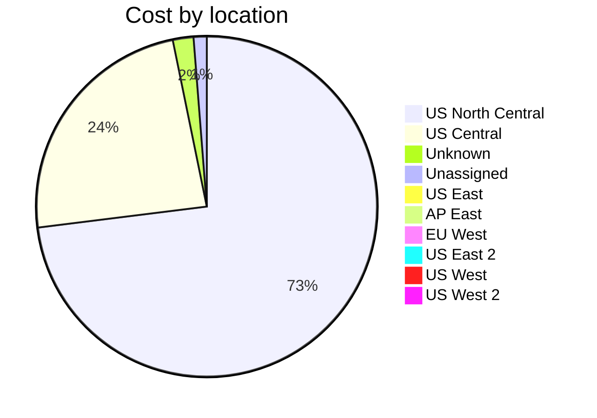

Fetching subscription details...
Fetching cost data...
Fetching forecasted cost data...
Fetching cost data by service name...
Fetching cost data by location...
Fetching cost data by resource group...
# Azure Cost Overview

> Accumulated cost for subscription id `JPF Pay-As-You-Go` from **01/01/2024** to **01/21/2024**

## Totals

|Period|Amount|
|---|---:|
|Today|0.02 USD|
|Yesterday|1.62 USD|
|Last 7 days|15.46 USD|
|Last 30 days|49.13 USD|

```mermaid
gantt
   title Accumulated cost
   dateFormat  X
   axisFormat %s
   section 01 Jan
   USD 2.68 :0, 268
   section 02 Jan
   USD 5.81 :0, 581
   section 03 Jan
   USD 8.29 :0, 829
   section 04 Jan
   USD 10.88 :0, 1088
   section 05 Jan
   USD 13.49 :0, 1349
   section 06 Jan
   USD 16.41 :0, 1641
   section 07 Jan
   USD 18.82 :0, 1882
   section 08 Jan
   USD 21.90 :0, 2190
   section 09 Jan
   USD 24.49 :0, 2449
   section 10 Jan
   USD 26.71 :0, 2671
   section 11 Jan
   USD 29.00 :0, 2900
   section 12 Jan
   USD 31.27 :0, 3127
   section 13 Jan
   USD 33.68 :0, 3368
   section 14 Jan
   USD 35.84 :0, 3584
   section 15 Jan
   USD 38.04 :0, 3804
   section 16 Jan
   USD 40.55 :0, 4055
   section 17 Jan
   USD 42.88 :0, 4288
   section 18 Jan
   USD 45.18 :0, 4518
   section 19 Jan
   USD 47.50 :0, 4750
   section 20 Jan
   USD 49.12 :0, 4912
   section 21 Jan
   USD 49.13 :0, 4913
   section 22 Jan
   USD 51.66 : done, 0, 5166
   section 23 Jan
   USD 54.30 : done, 0, 5430
   section 24 Jan
   USD 56.68 : done, 0, 5668
   section 25 Jan
   USD 59.07 : done, 0, 5907
   section 26 Jan
   USD 61.49 : done, 0, 6149
   section 27 Jan
   USD 64.26 : done, 0, 6426
   section 28 Jan
   USD 66.66 : done, 0, 6666
   section 29 Jan
   USD 69.20 : done, 0, 6920
   section 30 Jan
   USD 71.86 : done, 0, 7186
   section 31 Jan
   USD 74.25 : done, 0, 7425
```

## By Service Name

|Service|Amount|
|---|---:|
|Storage|17.09 USD|
|Azure App Service|11.59 USD|
|Virtual Machines|8.27 USD|
|Bandwidth|5.91 USD|
|Virtual Network|4.71 USD|
|Azure DNS|0.96 USD|
|Microsoft Defender for Cloud|0.61 USD|
|Azure Monitor|0.00 USD|
|Functions|0.00 USD|
|Log Analytics|0.00 USD|

## By Location

|Location|Amount|
|---|---:|
|US North Central|35.74 USD|
|US Central|11.63 USD|
|Unknown|0.96 USD|
|Unassigned|0.61 USD|
|US East|0.19 USD|
|AP East|0.00 USD|
|EU West|0.00 USD|
|US East 2|0.00 USD|
|US West|0.00 USD|
|US West 2|0.00 USD|

## By Resource Group

|Resource Group|Amount|
|---|---:|
|personal-network|36.05 USD|
|personal-site|11.63 USD|
|personal-dns|0.65 USD|
||0.61 USD|
|cloud-shell-storage-eastus|0.19 USD|
|azureapp-auto-alerts-873533-jpatrick_fulton_gmail_com|0.00 USD|

Generated at 2024-01-21 11:34:39 for subscription with id `4913be3f-a345-4652-9bba-767418dd25e3`
