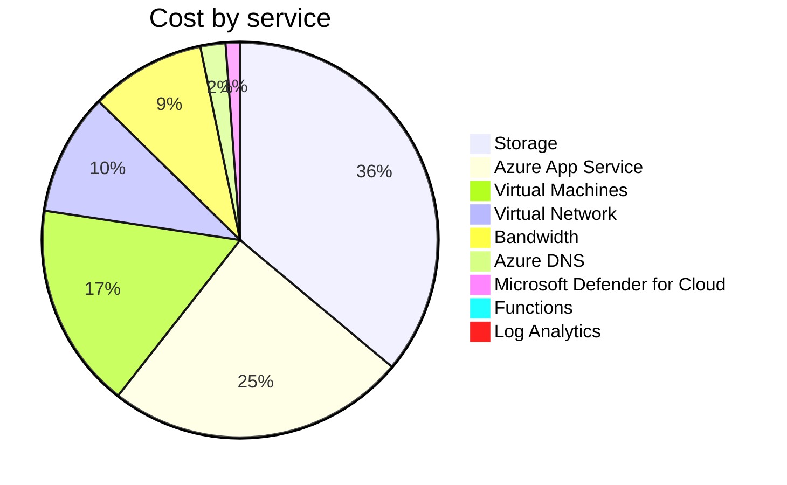

Fetching subscription details...
Fetching cost data...
Fetching forecasted cost data...
Fetching cost data by service name...
Fetching cost data by location...
Fetching cost data by resource group...
# Azure Cost Overview

> Accumulated cost for subscription id `JPF Pay-As-You-Go` from **12/01/2023** to **12/13/2023**

## Totals

|Period|Amount|
|---|---:|
|Today|0.11 USD|
|Yesterday|2.09 USD|
|Last 7 days|16.50 USD|
|Last 30 days|28.77 USD|

```mermaid
gantt
   title Accumulated cost
   dateFormat  X
   axisFormat %s
   section 01 Dec
   USD 2.41 :0, 241
   section 02 Dec
   USD 4.93 :0, 493
   section 03 Dec
   USD 7.79 :0, 779
   section 04 Dec
   USD 10.04 :0, 1004
   section 05 Dec
   USD 12.27 :0, 1227
   section 06 Dec
   USD 15.11 :0, 1511
   section 07 Dec
   USD 17.58 :0, 1758
   section 08 Dec
   USD 19.73 :0, 1973
   section 09 Dec
   USD 22.14 :0, 2214
   section 10 Dec
   USD 24.36 :0, 2436
   section 11 Dec
   USD 26.56 :0, 2656
   section 12 Dec
   USD 28.65 :0, 2865
   section 13 Dec
   USD 28.77 :0, 2877
   section 14 Dec
   USD 31.18 : done, 0, 3118
   section 15 Dec
   USD 33.60 : done, 0, 3360
   section 16 Dec
   USD 36.05 : done, 0, 3605
   section 17 Dec
   USD 38.38 : done, 0, 3838
   section 18 Dec
   USD 40.62 : done, 0, 4062
   section 19 Dec
   USD 43.15 : done, 0, 4315
   section 20 Dec
   USD 45.57 : done, 0, 4557
   section 21 Dec
   USD 47.96 : done, 0, 4796
   section 22 Dec
   USD 50.37 : done, 0, 5037
   section 23 Dec
   USD 52.80 : done, 0, 5280
   section 24 Dec
   USD 55.12 : done, 0, 5512
   section 25 Dec
   USD 57.34 : done, 0, 5734
   section 26 Dec
   USD 59.86 : done, 0, 5986
   section 27 Dec
   USD 62.26 : done, 0, 6226
   section 28 Dec
   USD 64.63 : done, 0, 6463
   section 29 Dec
   USD 67.02 : done, 0, 6702
   section 30 Dec
   USD 69.44 : done, 0, 6944
   section 31 Dec
   USD 71.74 : done, 0, 7174
```

## By Service Name

|Service|Amount|
|---|---:|
|Storage|10.38 USD|
|Azure App Service|7.05 USD|
|Virtual Machines|4.83 USD|
|Virtual Network|2.87 USD|
|Bandwidth|2.71 USD|
|Azure DNS|0.59 USD|
|Microsoft Defender for Cloud|0.34 USD|
|Functions|0.00 USD|
|Log Analytics|0.00 USD|

## By Location

|Location|Amount|
|---|---:|
|US North Central|20.65 USD|
|US Central|7.08 USD|
|Unknown|0.59 USD|
|Unassigned|0.34 USD|
|US East|0.12 USD|
|AP East|0.00 USD|
|EU West|0.00 USD|
|US East 2|0.00 USD|
|US West 2|0.00 USD|

## By Resource Group

|Resource Group|Amount|
|---|---:|
|personal-network|20.84 USD|
|personal-site|7.08 USD|
|personal-dns|0.39 USD|
||0.34 USD|
|cloud-shell-storage-eastus|0.12 USD|

Generated at 2023-12-13 11:35:31 for subscription with id `4913be3f-a345-4652-9bba-767418dd25e3`
