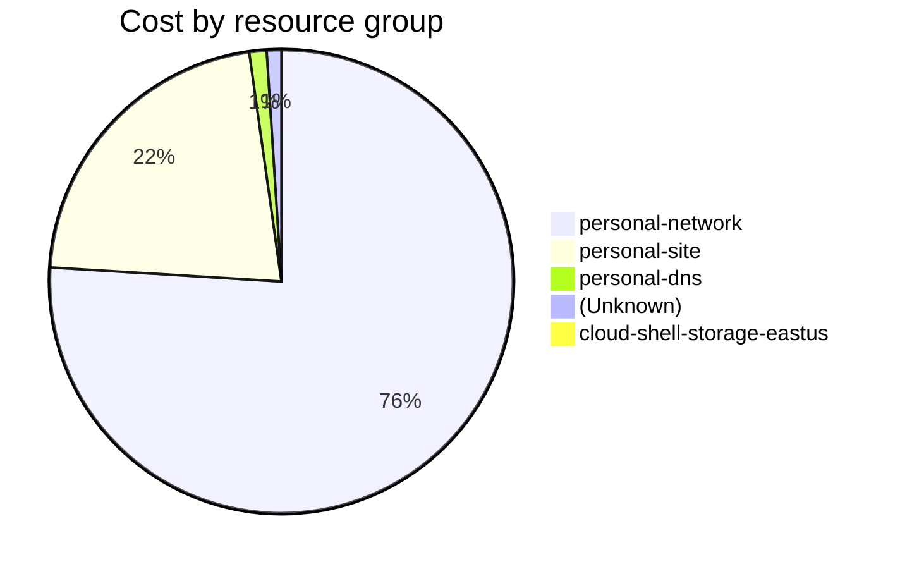

Fetching subscription details...
Fetching cost data...
Fetching forecasted cost data...
Fetching cost data by service name...
Fetching cost data by location...
Fetching cost data by resource group...
# Azure Cost Overview

> Accumulated cost for subscription id `JPF Pay-As-You-Go` from **10/01/2023** to **10/09/2023**

## Totals

|Period|Amount|
|---|---:|
|Today|0.10 USD|
|Yesterday|2.06 USD|
|Last 7 days|17.82 USD|
|Last 30 days|21.65 USD|

```mermaid
gantt
   title Accumulated cost
   dateFormat  X
   axisFormat %s
   section 01 Oct
   USD 3.82 :0, 382
   section 02 Oct
   USD 7.05 :0, 705
   section 03 Oct
   USD 9.55 :0, 955
   section 04 Oct
   USD 12.07 :0, 1207
   section 05 Oct
   USD 14.47 :0, 1447
   section 06 Oct
   USD 17.03 :0, 1703
   section 07 Oct
   USD 19.49 :0, 1949
   section 08 Oct
   USD 21.54 :0, 2154
   section 09 Oct
   USD 21.65 :0, 2165
   section 10 Oct
   USD 23.10 : done, 0, 2310
   section 11 Oct
   USD 23.10 : done, 0, 2310
   section 12 Oct
   USD 23.10 : done, 0, 2310
   section 13 Oct
   USD 23.10 : done, 0, 2310
   section 14 Oct
   USD 23.10 : done, 0, 2310
   section 15 Oct
   USD 23.10 : done, 0, 2310
   section 16 Oct
   USD 23.10 : done, 0, 2310
   section 17 Oct
   USD 23.10 : done, 0, 2310
   section 18 Oct
   USD 23.10 : done, 0, 2310
   section 19 Oct
   USD 23.10 : done, 0, 2310
   section 20 Oct
   USD 23.10 : done, 0, 2310
   section 21 Oct
   USD 23.10 : done, 0, 2310
   section 22 Oct
   USD 23.10 : done, 0, 2310
   section 23 Oct
   USD 23.10 : done, 0, 2310
   section 24 Oct
   USD 23.10 : done, 0, 2310
   section 25 Oct
   USD 23.10 : done, 0, 2310
   section 26 Oct
   USD 23.10 : done, 0, 2310
   section 27 Oct
   USD 23.10 : done, 0, 2310
   section 28 Oct
   USD 23.10 : done, 0, 2310
   section 29 Oct
   USD 23.10 : done, 0, 2310
   section 30 Oct
   USD 23.10 : done, 0, 2310
   section 31 Oct
   USD 23.10 : done, 0, 2310
```

## By Service Name

|Service|Amount|
|---|---:|
|Storage|8.87 USD|
|Azure App Service|4.68 USD|
|Virtual Machines|2.95 USD|
|Bandwidth|2.62 USD|
|Virtual Network|1.91 USD|
|Azure DNS|0.39 USD|
|Advanced Threat Protection|0.22 USD|
|Azure Active Directory for External Identities|0.00 USD|
|Functions|0.00 USD|
|Log Analytics|0.00 USD|

## By Location

|Location|Amount|
|---|---:|
|US North Central|16.25 USD|
|US Central|4.70 USD|
|Unknown|0.39 USD|
|Unassigned|0.22 USD|
|US East|0.08 USD|
|AP East|0.00 USD|
|EU West|0.00 USD|
|US East 2|0.00 USD|
|US West 2|0.00 USD|

## By Resource Group

|Resource Group|Amount|
|---|---:|
|personal-network|16.38 USD|
|personal-site|4.70 USD|
|personal-dns|0.26 USD|
||0.22 USD|
|cloud-shell-storage-eastus|0.08 USD|

Generated at 2023-10-09 11:33:35 for subscription with id `4913be3f-a345-4652-9bba-767418dd25e3`
