Fetching subscription details...
Fetching cost data...
Fetching forecasted cost data...
Fetching cost data by service name...
Fetching cost data by location...
Fetching cost data by resource group...
# Azure Cost Overview

> Accumulated cost for subscription id `JPF Pay-As-You-Go` from **10/01/2023** to **10/22/2023**

## Totals

|Period|Amount|
|---|---:|
|Today|0.12 USD|
|Yesterday|2.04 USD|
|Last 7 days|15.36 USD|
|Last 30 days|50.03 USD|

```mermaid
gantt
   title Accumulated cost
   dateFormat  X
   axisFormat %s
   section 01 Oct
   USD 3.83 :0, 383
   section 02 Oct
   USD 7.06 :0, 706
   section 03 Oct
   USD 9.56 :0, 956
   section 04 Oct
   USD 12.08 :0, 1208
   section 05 Oct
   USD 14.49 :0, 1449
   section 06 Oct
   USD 17.05 :0, 1705
   section 07 Oct
   USD 19.51 :0, 1951
   section 08 Oct
   USD 21.67 :0, 2167
   section 09 Oct
   USD 23.93 :0, 2393
   section 10 Oct
   USD 26.08 :0, 2608
   section 11 Oct
   USD 28.23 :0, 2823
   section 12 Oct
   USD 30.41 :0, 3041
   section 13 Oct
   USD 32.57 :0, 3257
   section 14 Oct
   USD 34.67 :0, 3467
   section 15 Oct
   USD 36.78 :0, 3678
   section 16 Oct
   USD 38.97 :0, 3897
   section 17 Oct
   USD 41.19 :0, 4119
   section 18 Oct
   USD 43.42 :0, 4342
   section 19 Oct
   USD 45.63 :0, 4563
   section 20 Oct
   USD 47.88 :0, 4788
   section 21 Oct
   USD 49.92 :0, 4992
   section 22 Oct
   USD 50.03 :0, 5003
   section 23 Oct
   USD 51.67 : done, 0, 5167
   section 24 Oct
   USD 52.85 : done, 0, 5285
   section 25 Oct
   USD 53.96 : done, 0, 5396
   section 26 Oct
   USD 54.92 : done, 0, 5492
   section 27 Oct
   USD 56.06 : done, 0, 5606
   section 28 Oct
   USD 57.63 : done, 0, 5763
   section 29 Oct
   USD 58.98 : done, 0, 5898
   section 30 Oct
   USD 60.06 : done, 0, 6006
   section 31 Oct
   USD 60.68 : done, 0, 6068
```

## By Service Name

|Service|Amount|
|---|---:|
|Storage|19.95 USD|
|Azure App Service|12.35 USD|
|Virtual Machines|7.60 USD|
|Virtual Network|5.02 USD|
|Bandwidth|3.53 USD|
|Azure DNS|1.02 USD|
|Advanced Threat Protection|0.55 USD|
|Azure Active Directory for External Identities|0.00 USD|
|Azure Monitor|0.00 USD|
|Others|0.00 USD|

## By Location

|Location|Amount|
|---|---:|
|US North Central|35.85 USD|
|US Central|12.40 USD|
|Unknown|1.02 USD|
|Unassigned|0.55 USD|
|US East|0.20 USD|
|AP East|0.00 USD|
|EU West|0.00 USD|
|US East 2|0.00 USD|
|US West 2|0.00 USD|

## By Resource Group

|Resource Group|Amount|
|---|---:|
|personal-network|36.19 USD|
|personal-site|12.40 USD|
|personal-dns|0.69 USD|
||0.55 USD|
|cloud-shell-storage-eastus|0.20 USD|
|azureapp-auto-alerts-873533-jpatrick_fulton_gmail_com|0.00 USD|

Generated at 2023-10-22 11:30:25 for subscription with id `4913be3f-a345-4652-9bba-767418dd25e3`
