Fetching subscription details...
Fetching cost data...
Fetching forecasted cost data...
Fetching cost data by service name...
Fetching cost data by location...
Fetching cost data by resource group...
# Azure Cost Overview

> Accumulated cost for subscription id `JPF Pay-As-You-Go` from **05/01/2024** to **05/10/2024**

## Totals

|Period|Amount|
|---|---:|
|Today|0.00 USD|
|Yesterday|0.58 USD|
|Last 7 days|4.43 USD|
|Last 30 days|6.34 USD|

```mermaid
gantt
   title Accumulated cost
   dateFormat  X
   axisFormat %s
   section 01 May
   USD 0.64 :0, 64
   section 02 May
   USD 1.27 :0, 127
   section 03 May
   USD 1.91 :0, 191
   section 04 May
   USD 2.55 :0, 255
   section 05 May
   USD 3.18 :0, 318
   section 06 May
   USD 3.82 :0, 382
   section 07 May
   USD 4.46 :0, 446
   section 08 May
   USD 5.09 :0, 509
   section 09 May
   USD 5.75 :0, 575
   section 10 May
   USD 6.34 :0, 634
   section 11 May
   USD 6.98 : done, 0, 698
   section 12 May
   USD 7.62 : done, 0, 762
   section 13 May
   USD 8.26 : done, 0, 826
   section 14 May
   USD 8.90 : done, 0, 890
   section 15 May
   USD 9.54 : done, 0, 954
   section 16 May
   USD 10.18 : done, 0, 1018
   section 17 May
   USD 10.82 : done, 0, 1082
   section 18 May
   USD 11.46 : done, 0, 1146
   section 19 May
   USD 12.10 : done, 0, 1210
   section 20 May
   USD 12.74 : done, 0, 1274
   section 21 May
   USD 13.38 : done, 0, 1338
   section 22 May
   USD 14.02 : done, 0, 1402
   section 23 May
   USD 14.66 : done, 0, 1466
   section 24 May
   USD 15.30 : done, 0, 1530
   section 25 May
   USD 15.95 : done, 0, 1595
   section 26 May
   USD 16.59 : done, 0, 1659
   section 27 May
   USD 17.23 : done, 0, 1723
   section 28 May
   USD 17.87 : done, 0, 1787
   section 29 May
   USD 18.51 : done, 0, 1851
   section 30 May
   USD 19.16 : done, 0, 1916
   section 31 May
   USD 19.80 : done, 0, 1980
```

## By Service Name

|Service|Amount|
|---|---:|
|Azure App Service|5.89 USD|
|Azure DNS|0.33 USD|
|Storage|0.12 USD|
|Bandwidth|0.00 USD|
|Functions|0.00 USD|
|Log Analytics|0.00 USD|

## By Location

|Location|Amount|
|---|---:|
|US Central|5.91 USD|
|Unknown|0.33 USD|
|US East|0.10 USD|
|AP East|0.00 USD|
|EU West|0.00 USD|
|US East 2|0.00 USD|
|US West 2|0.00 USD|

## By Resource Group

|Resource Group|Amount|
|---|---:|
|personal-site|5.91 USD|
|personal-dns|0.33 USD|
|cloud-shell-storage-eastus|0.10 USD|

Generated at 2024-05-11 11:23:34 for subscription with id `4913be3f-a345-4652-9bba-767418dd25e3`
