Fetching subscription details...
Fetching cost data...
Fetching forecasted cost data...
Fetching cost data by service name...
Fetching cost data by location...
Fetching cost data by resource group...
# Azure Cost Overview

> Accumulated cost for subscription id `JPF Pay-As-You-Go` from **10/01/2023** to **10/30/2023**

## Totals

|Period|Amount|
|---|---:|
|Today|0.09 USD|
|Yesterday|1.92 USD|
|Last 7 days|15.47 USD|
|Last 30 days|69.71 USD|

```mermaid
gantt
   title Accumulated cost
   dateFormat  X
   axisFormat %s
   section 01 Oct
   USD 3.83 :0, 383
   section 02 Oct
   USD 7.06 :0, 706
   section 03 Oct
   USD 9.56 :0, 956
   section 04 Oct
   USD 12.08 :0, 1208
   section 05 Oct
   USD 14.49 :0, 1449
   section 06 Oct
   USD 17.05 :0, 1705
   section 07 Oct
   USD 19.51 :0, 1951
   section 08 Oct
   USD 21.67 :0, 2167
   section 09 Oct
   USD 23.95 :0, 2395
   section 10 Oct
   USD 26.19 :0, 2619
   section 11 Oct
   USD 28.45 :0, 2845
   section 12 Oct
   USD 30.78 :0, 3078
   section 13 Oct
   USD 33.06 :0, 3306
   section 14 Oct
   USD 35.16 :0, 3516
   section 15 Oct
   USD 37.29 :0, 3729
   section 16 Oct
   USD 39.68 :0, 3968
   section 17 Oct
   USD 42.15 :0, 4215
   section 18 Oct
   USD 44.66 :0, 4466
   section 19 Oct
   USD 47.13 :0, 4713
   section 20 Oct
   USD 49.66 :0, 4966
   section 21 Oct
   USD 52.06 :0, 5206
   section 22 Oct
   USD 54.23 :0, 5423
   section 23 Oct
   USD 56.46 :0, 5646
   section 24 Oct
   USD 58.74 :0, 5874
   section 25 Oct
   USD 61.01 :0, 6101
   section 26 Oct
   USD 63.23 :0, 6323
   section 27 Oct
   USD 65.52 :0, 6552
   section 28 Oct
   USD 67.70 :0, 6770
   section 29 Oct
   USD 69.62 :0, 6962
   section 30 Oct
   USD 69.71 :0, 6971
   section 31 Oct
   USD 71.67 : done, 0, 7167
```

## By Service Name

|Service|Amount|
|---|---:|
|Storage|26.75 USD|
|Azure App Service|17.09 USD|
|Virtual Machines|10.42 USD|
|Virtual Network|6.93 USD|
|Bandwidth|6.30 USD|
|Azure DNS|1.41 USD|
|Microsoft Defender for Cloud|0.80 USD|
|Azure Active Directory for External Identities|0.00 USD|
|Azure Monitor|0.00 USD|
|Others|0.00 USD|

## By Location

|Location|Amount|
|---|---:|
|US North Central|25.25 USD|
|North Central US|24.81 USD|
|US Central|17.09 USD|
|global|1.41 USD|
|Unassigned|0.80 USD|
|East US|0.28 USD|
|Central US|0.07 USD|
|US East|0.00 USD|
|AP East|0.00 USD|
|Others|0.00 USD|

## By Resource Group

|Resource Group|Amount|
|---|---:|
|personal-network|50.52 USD|
|personal-site|17.16 USD|
|personal-dns|0.95 USD|
||0.80 USD|
|cloud-shell-storage-eastus|0.28 USD|
|azureapp-auto-alerts-873533-jpatrick_fulton_gmail_com|0.00 USD|

Generated at 2023-10-30 11:35:15 for subscription with id `4913be3f-a345-4652-9bba-767418dd25e3`
