Fetching subscription details...
Fetching cost data...
Fetching forecasted cost data...
Fetching cost data by service name...
Fetching cost data by location...
Fetching cost data by resource group...
# Azure Cost Overview

> Accumulated cost for subscription id `JPF Pay-As-You-Go` from **07/01/2024** to **07/26/2024**

## Totals

|Period|Amount|
|---|---:|
|Today|0.00 USD|
|Yesterday|0.58 USD|
|Last 7 days|4.40 USD|
|Last 30 days|16.74 USD|

```mermaid
gantt
   title Accumulated cost
   dateFormat  X
   axisFormat %s
   section 01 Jul
   USD 0.64 :0, 64
   section 02 Jul
   USD 1.27 :0, 127
   section 03 Jul
   USD 1.91 :0, 191
   section 04 Jul
   USD 2.55 :0, 255
   section 05 Jul
   USD 3.18 :0, 318
   section 06 Jul
   USD 3.82 :0, 382
   section 07 Jul
   USD 4.45 :0, 445
   section 08 Jul
   USD 5.09 :0, 509
   section 09 Jul
   USD 5.73 :0, 573
   section 10 Jul
   USD 6.36 :0, 636
   section 11 Jul
   USD 7.00 :0, 700
   section 12 Jul
   USD 7.64 :0, 764
   section 13 Jul
   USD 8.27 :0, 827
   section 14 Jul
   USD 8.91 :0, 891
   section 15 Jul
   USD 9.54 :0, 954
   section 16 Jul
   USD 10.18 :0, 1018
   section 17 Jul
   USD 10.81 :0, 1081
   section 18 Jul
   USD 11.60 :0, 1160
   section 19 Jul
   USD 12.33 :0, 1233
   section 20 Jul
   USD 12.97 :0, 1297
   section 21 Jul
   USD 13.61 :0, 1361
   section 22 Jul
   USD 14.24 :0, 1424
   section 23 Jul
   USD 14.88 :0, 1488
   section 24 Jul
   USD 15.52 :0, 1552
   section 25 Jul
   USD 16.15 :0, 1615
   section 26 Jul
   USD 16.74 :0, 1674
   section 27 Jul
   USD 17.40 : done, 0, 1740
   section 28 Jul
   USD 18.06 : done, 0, 1806
   section 29 Jul
   USD 18.72 : done, 0, 1872
   section 30 Jul
   USD 19.38 : done, 0, 1938
   section 31 Jul
   USD 20.04 : done, 0, 2004
```

## By Service Name

|Service|Amount|
|---|---:|
|Azure App Service|15.58 USD|
|Azure DNS|0.86 USD|
|Storage|0.30 USD|
|Bandwidth|0.00 USD|
|Functions|0.00 USD|
|Log Analytics|0.00 USD|

## By Location

|Location|Amount|
|---|---:|
|US Central|15.63 USD|
|Unknown|0.86 USD|
|US East|0.25 USD|
|AP East|0.00 USD|
|EU West|0.00 USD|
|US East 2|0.00 USD|
|US West 2|0.00 USD|

## By Resource Group

|Resource Group|Amount|
|---|---:|
|personal-site|15.63 USD|
|personal-dns|0.86 USD|
|cloud-shell-storage-eastus|0.25 USD|

Generated at 2024-07-27 11:23:07 for subscription with id `4913be3f-a345-4652-9bba-767418dd25e3`
