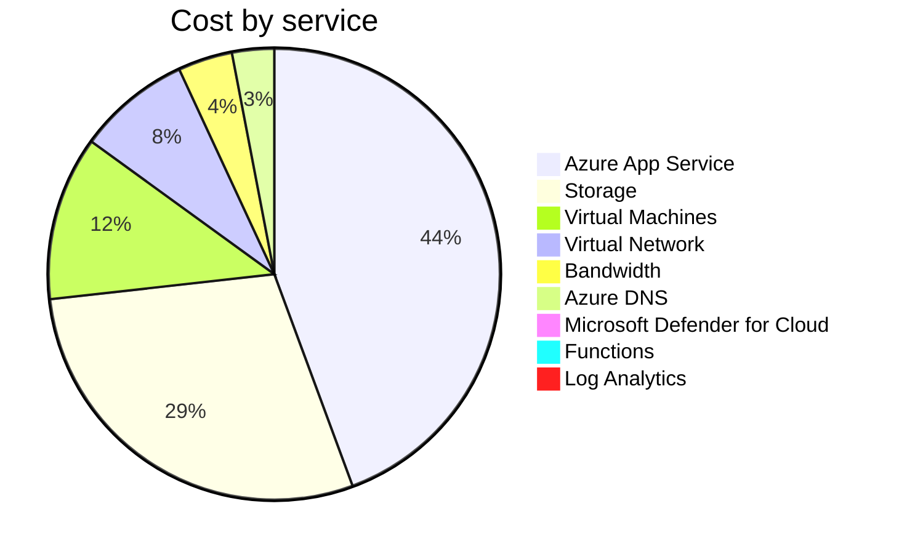
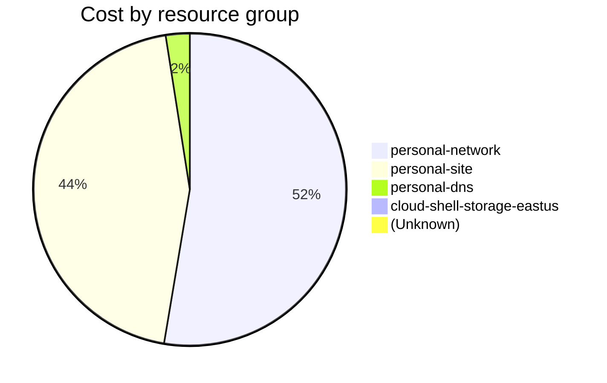

Fetching subscription details...
Fetching cost data...
Fetching forecasted cost data...
Fetching cost data by service name...
Fetching cost data by location...
Fetching cost data by resource group...
# Azure Cost Overview

> Accumulated cost for subscription id `JPF Pay-As-You-Go` from **03/01/2024** to **03/23/2024**

## Totals

|Period|Amount|
|---|---:|
|Today|0.00 USD|
|Yesterday|0.56 USD|
|Last 7 days|4.38 USD|
|Last 30 days|30.61 USD|

```mermaid
gantt
   title Accumulated cost
   dateFormat  X
   axisFormat %s
   section 01 Mar
   USD 3.32 :0, 332
   section 02 Mar
   USD 5.40 :0, 540
   section 03 Mar
   USD 7.48 :0, 748
   section 04 Mar
   USD 9.55 :0, 955
   section 05 Mar
   USD 11.63 :0, 1163
   section 06 Mar
   USD 13.71 :0, 1371
   section 07 Mar
   USD 15.80 :0, 1580
   section 08 Mar
   USD 17.88 :0, 1788
   section 09 Mar
   USD 19.96 :0, 1996
   section 10 Mar
   USD 22.04 :0, 2204
   section 11 Mar
   USD 23.05 :0, 2305
   section 12 Mar
   USD 23.68 :0, 2368
   section 13 Mar
   USD 24.32 :0, 2432
   section 14 Mar
   USD 24.96 :0, 2496
   section 15 Mar
   USD 25.59 :0, 2559
   section 16 Mar
   USD 26.23 :0, 2623
   section 17 Mar
   USD 26.87 :0, 2687
   section 18 Mar
   USD 27.50 :0, 2750
   section 19 Mar
   USD 28.14 :0, 2814
   section 20 Mar
   USD 28.78 :0, 2878
   section 21 Mar
   USD 29.41 :0, 2941
   section 22 Mar
   USD 30.05 :0, 3005
   section 23 Mar
   USD 30.61 :0, 3061
   section 24 Mar
   USD 31.25 : done, 0, 3125
   section 25 Mar
   USD 31.88 : done, 0, 3188
   section 26 Mar
   USD 32.52 : done, 0, 3252
   section 27 Mar
   USD 33.16 : done, 0, 3316
   section 28 Mar
   USD 33.79 : done, 0, 3379
   section 29 Mar
   USD 34.43 : done, 0, 3443
   section 30 Mar
   USD 35.06 : done, 0, 3506
   section 31 Mar
   USD 35.70 : done, 0, 3570
```

## By Service Name

|Service|Amount|
|---|---:|
|Azure App Service|13.54 USD|
|Storage|8.81 USD|
|Virtual Machines|3.59 USD|
|Virtual Network|2.47 USD|
|Bandwidth|1.19 USD|
|Azure DNS|0.92 USD|
|Microsoft Defender for Cloud|0.10 USD|
|Functions|0.00 USD|
|Log Analytics|0.00 USD|

## By Location

|Location|Amount|
|---|---:|
|US North Central|15.77 USD|
|US Central|13.59 USD|
|Unknown|0.92 USD|
|US East|0.22 USD|
|Unassigned|0.10 USD|
|AP East|0.00 USD|
|EU West|0.00 USD|
|US East 2|0.00 USD|
|US West 2|0.00 USD|

## By Resource Group

|Resource Group|Amount|
|---|---:|
|personal-network|15.94 USD|
|personal-site|13.59 USD|
|personal-dns|0.75 USD|
|cloud-shell-storage-eastus|0.22 USD|
||0.10 USD|

Generated at 2024-03-24 11:21:05 for subscription with id `4913be3f-a345-4652-9bba-767418dd25e3`
