Fetching subscription details...
Fetching cost data...
Fetching forecasted cost data...
Fetching cost data by service name...
Fetching cost data by location...
Fetching cost data by resource group...
# Azure Cost Overview

> Accumulated cost for subscription id `JPF Pay-As-You-Go` from **08/01/2024** to **08/26/2024**

## Totals

|Period|Amount|
|---|---:|
|Today|0.00 USD|
|Yesterday|0.40 USD|
|Last 7 days|4.22 USD|
|Last 30 days|16.30 USD|

```mermaid
gantt
   title Accumulated cost
   dateFormat  X
   axisFormat %s
   section 01 Aug
   USD 0.64 :0, 64
   section 02 Aug
   USD 1.27 :0, 127
   section 03 Aug
   USD 1.91 :0, 191
   section 04 Aug
   USD 2.54 :0, 254
   section 05 Aug
   USD 3.18 :0, 318
   section 06 Aug
   USD 3.82 :0, 382
   section 07 Aug
   USD 4.45 :0, 445
   section 08 Aug
   USD 5.09 :0, 509
   section 09 Aug
   USD 5.72 :0, 572
   section 10 Aug
   USD 6.36 :0, 636
   section 11 Aug
   USD 7.00 :0, 700
   section 12 Aug
   USD 7.63 :0, 763
   section 13 Aug
   USD 8.27 :0, 827
   section 14 Aug
   USD 8.90 :0, 890
   section 15 Aug
   USD 9.54 :0, 954
   section 16 Aug
   USD 10.18 :0, 1018
   section 17 Aug
   USD 10.81 :0, 1081
   section 18 Aug
   USD 11.45 :0, 1145
   section 19 Aug
   USD 12.09 :0, 1209
   section 20 Aug
   USD 12.72 :0, 1272
   section 21 Aug
   USD 13.36 :0, 1336
   section 22 Aug
   USD 13.99 :0, 1399
   section 23 Aug
   USD 14.63 :0, 1463
   section 24 Aug
   USD 15.27 :0, 1527
   section 25 Aug
   USD 15.90 :0, 1590
   section 26 Aug
   USD 16.30 :0, 1630
   section 27 Aug
   USD 16.94 : done, 0, 1694
   section 28 Aug
   USD 17.58 : done, 0, 1758
   section 29 Aug
   USD 18.21 : done, 0, 1821
   section 30 Aug
   USD 18.85 : done, 0, 1885
   section 31 Aug
   USD 19.48 : done, 0, 1948
```

## By Service Name

|Service|Amount|
|---|---:|
|Azure App Service|15.16 USD|
|Azure DNS|0.84 USD|
|Storage|0.29 USD|
|Bandwidth|0.00 USD|
|Functions|0.00 USD|
|Log Analytics|0.00 USD|

## By Location

|Location|Amount|
|---|---:|
|US Central|15.21 USD|
|Unknown|0.84 USD|
|US East|0.25 USD|
|AP East|0.00 USD|
|EU West|0.00 USD|
|US East 2|0.00 USD|
|US West 2|0.00 USD|

## By Resource Group

|Resource Group|Amount|
|---|---:|
|personal-site|15.21 USD|
|personal-dns|0.84 USD|
|cloud-shell-storage-eastus|0.25 USD|

Generated at 2024-08-27 11:22:17 for subscription with id `4913be3f-a345-4652-9bba-767418dd25e3`
