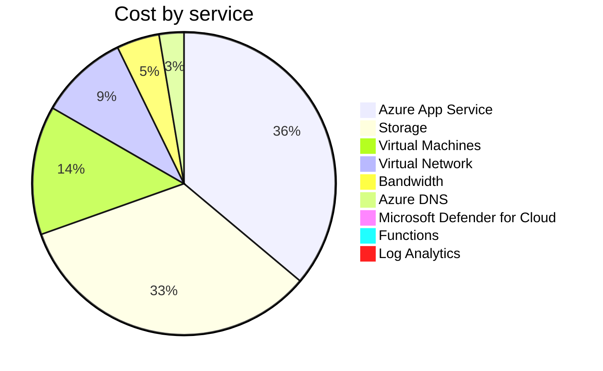
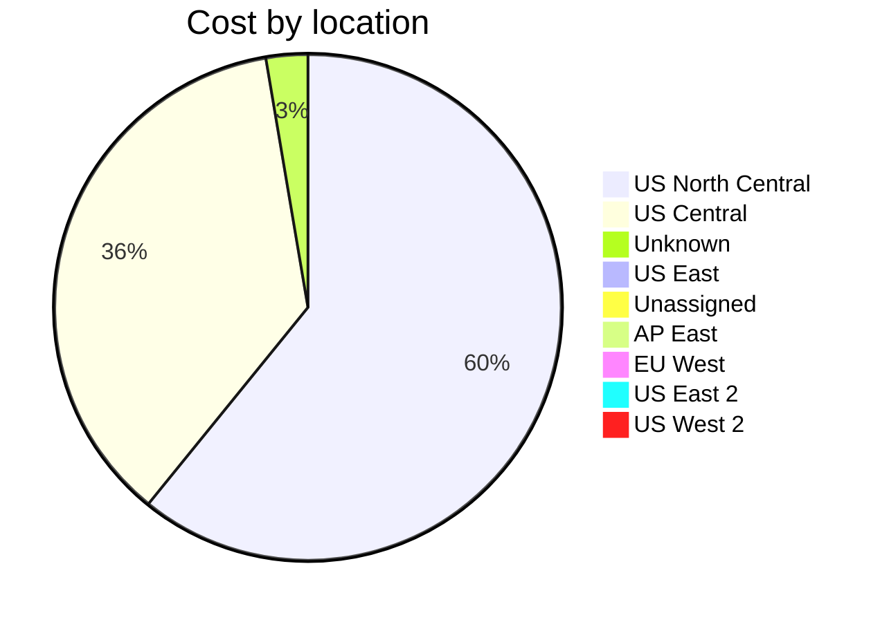
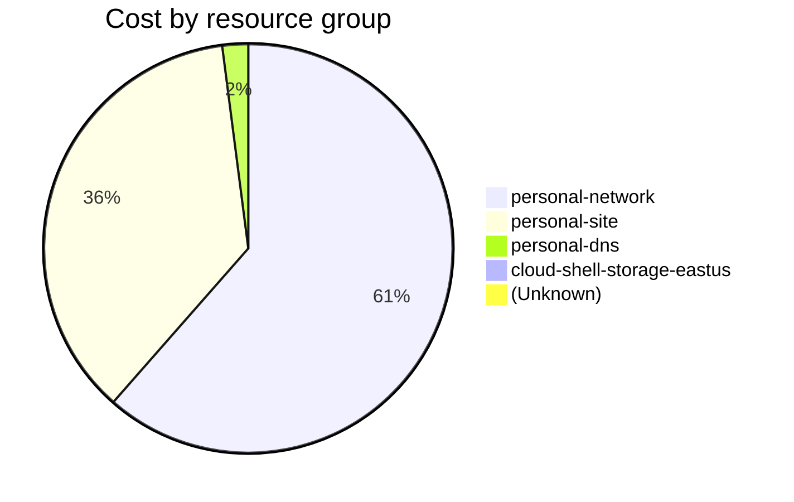

Fetching subscription details...
Fetching cost data...
Fetching forecasted cost data...
Fetching cost data by service name...
Fetching cost data by location...
Fetching cost data by resource group...
# Azure Cost Overview

> Accumulated cost for subscription id `JPF Pay-As-You-Go` from **03/01/2024** to **03/16/2024**

## Totals

|Period|Amount|
|---|---:|
|Today|0.00 USD|
|Yesterday|0.59 USD|
|Last 7 days|6.22 USD|
|Last 30 days|26.18 USD|

```mermaid
gantt
   title Accumulated cost
   dateFormat  X
   axisFormat %s
   section 01 Mar
   USD 3.32 :0, 332
   section 02 Mar
   USD 5.40 :0, 540
   section 03 Mar
   USD 7.48 :0, 748
   section 04 Mar
   USD 9.55 :0, 955
   section 05 Mar
   USD 11.63 :0, 1163
   section 06 Mar
   USD 13.71 :0, 1371
   section 07 Mar
   USD 15.80 :0, 1580
   section 08 Mar
   USD 17.88 :0, 1788
   section 09 Mar
   USD 19.96 :0, 1996
   section 10 Mar
   USD 22.04 :0, 2204
   section 11 Mar
   USD 23.05 :0, 2305
   section 12 Mar
   USD 23.68 :0, 2368
   section 13 Mar
   USD 24.32 :0, 2432
   section 14 Mar
   USD 24.96 :0, 2496
   section 15 Mar
   USD 25.59 :0, 2559
   section 16 Mar
   USD 26.18 :0, 2618
   section 17 Mar
   USD 27.39 : done, 0, 2739
   section 18 Mar
   USD 28.35 : done, 0, 2835
   section 19 Mar
   USD 29.25 : done, 0, 2925
   section 20 Mar
   USD 30.10 : done, 0, 3010
   section 21 Mar
   USD 30.92 : done, 0, 3092
   section 22 Mar
   USD 31.69 : done, 0, 3169
   section 23 Mar
   USD 32.47 : done, 0, 3247
   section 24 Mar
   USD 33.25 : done, 0, 3325
   section 25 Mar
   USD 33.79 : done, 0, 3379
   section 26 Mar
   USD 34.27 : done, 0, 3427
   section 27 Mar
   USD 34.70 : done, 0, 3470
   section 28 Mar
   USD 35.10 : done, 0, 3510
   section 29 Mar
   USD 35.44 : done, 0, 3544
   section 30 Mar
   USD 35.80 : done, 0, 3580
   section 31 Mar
   USD 36.16 : done, 0, 3616
```

## By Service Name

|Service|Amount|
|---|---:|
|Azure App Service|9.42 USD|
|Storage|8.72 USD|
|Virtual Machines|3.59 USD|
|Virtual Network|2.47 USD|
|Bandwidth|1.19 USD|
|Azure DNS|0.69 USD|
|Microsoft Defender for Cloud|0.10 USD|
|Functions|0.00 USD|
|Log Analytics|0.00 USD|

## By Location

|Location|Amount|
|---|---:|
|US North Central|15.77 USD|
|US Central|9.46 USD|
|Unknown|0.69 USD|
|US East|0.16 USD|
|Unassigned|0.10 USD|
|AP East|0.00 USD|
|EU West|0.00 USD|
|US East 2|0.00 USD|
|US West 2|0.00 USD|

## By Resource Group

|Resource Group|Amount|
|---|---:|
|personal-network|15.94 USD|
|personal-site|9.46 USD|
|personal-dns|0.53 USD|
|cloud-shell-storage-eastus|0.16 USD|
||0.10 USD|

Generated at 2024-03-17 11:23:15 for subscription with id `4913be3f-a345-4652-9bba-767418dd25e3`
