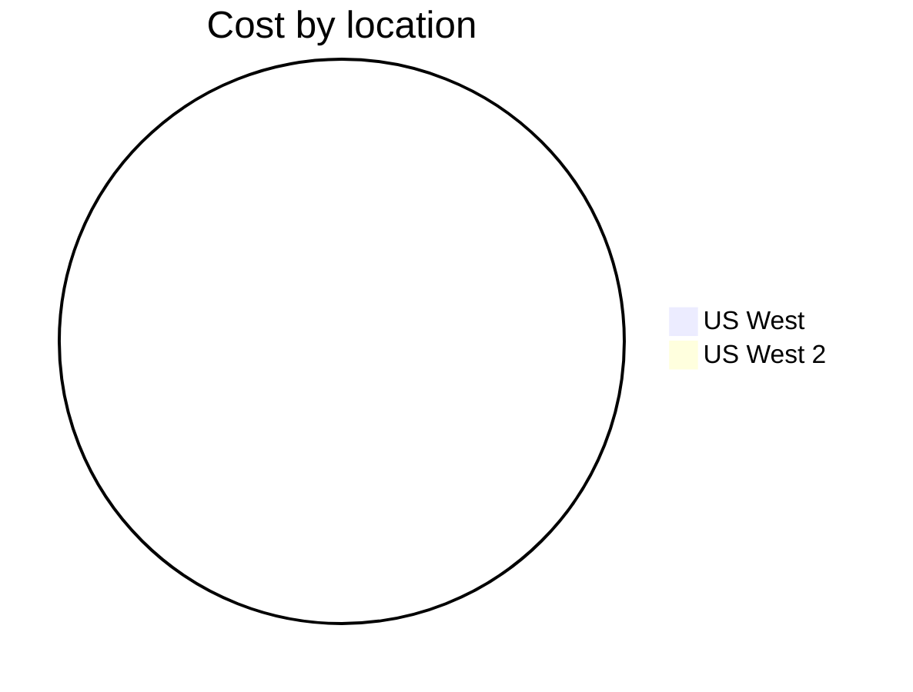

Fetching subscription details...
Fetching cost data...
Fetching forecasted cost data...
Fetching cost data by service name...
Fetching cost data by location...
Fetching cost data by resource group...
# Azure Cost Overview

> Accumulated cost for subscription id `JPF Pay-As-You-Go` from **09/05/2023** to **09/18/2023**

## Totals

|Period|Amount|
|---|---:|
|Today|0.00 USD|
|Yesterday|0.00 USD|
|Last 7 days|0.00 USD|
|Last 30 days|0.00 USD|

```mermaid
gantt
   title Accumulated cost
   dateFormat  X
   axisFormat %s
   section 05 Sep
   USD 0.00 :0, 0
   section 18 Sep
   USD 0.00 :0, 0
```



## By Service Name

|Service|Amount|
|---|---:|
|Azure Monitor|0.00 USD|

```mermaid
pie
   title Cost by service
   "Azure Monitor" : 0.00
```

## By Location

|Location|Amount|
|---|---:|
|US West|0.00 USD|
|US West 2|0.00 USD|



## By Resource Group

|Resource Group|Amount|
|---|---:|
|azureapp-auto-alerts-873533-jpatrick_fulton_gmail_com|0.00 USD|

```mermaid
pie
   title Cost by resource group
   "azureapp-auto-alerts-873533-jpatrick_fulton_gmail_com" : 0.00
```

<sup>Generated at 2023-09-25 11:05:23 for subscription with id `4913be3f-a345-4652-9bba-767418dd25e3`</sup>
