Fetching subscription details...
Fetching cost data...
Fetching forecasted cost data...
Fetching cost data by service name...
Fetching cost data by location...
Fetching cost data by resource group...
# Azure Cost Overview

> Accumulated cost for subscription id `JPF Pay-As-You-Go` from **03/01/2024** to **03/02/2024**

## Totals

|Period|Amount|
|---|---:|
|Today|0.00 USD|
|Yesterday|0.01 USD|
|Last 7 days|0.01 USD|
|Last 30 days|0.01 USD|

```mermaid
gantt
   title Accumulated cost
   dateFormat  X
   axisFormat %s
   section 01 Mar
   USD 0.01 :0, 1
   section 02 Mar
   USD 0.01 :0, 1
   section 03 Mar
   USD 0.03 : done, 0, 3
   section 04 Mar
   USD 0.04 : done, 0, 4
   section 05 Mar
   USD 0.05 : done, 0, 5
   section 06 Mar
   USD 0.06 : done, 0, 6
   section 07 Mar
   USD 0.07 : done, 0, 7
   section 08 Mar
   USD 0.08 : done, 0, 8
   section 09 Mar
   USD 0.09 : done, 0, 9
   section 10 Mar
   USD 0.10 : done, 0, 10
   section 11 Mar
   USD 0.11 : done, 0, 11
   section 12 Mar
   USD 0.12 : done, 0, 12
   section 13 Mar
   USD 0.13 : done, 0, 13
   section 14 Mar
   USD 0.14 : done, 0, 14
   section 15 Mar
   USD 0.15 : done, 0, 15
   section 16 Mar
   USD 0.16 : done, 0, 16
   section 17 Mar
   USD 0.17 : done, 0, 17
   section 18 Mar
   USD 0.18 : done, 0, 18
   section 19 Mar
   USD 0.19 : done, 0, 19
   section 20 Mar
   USD 0.20 : done, 0, 20
   section 21 Mar
   USD 0.21 : done, 0, 21
   section 22 Mar
   USD 0.22 : done, 0, 22
   section 23 Mar
   USD 0.23 : done, 0, 23
   section 24 Mar
   USD 0.24 : done, 0, 24
   section 25 Mar
   USD 0.25 : done, 0, 25
   section 26 Mar
   USD 0.26 : done, 0, 26
   section 27 Mar
   USD 0.27 : done, 0, 27
   section 28 Mar
   USD 0.28 : done, 0, 28
   section 29 Mar
   USD 0.29 : done, 0, 29
   section 30 Mar
   USD 0.30 : done, 0, 30
   section 31 Mar
   USD 0.31 : done, 0, 31
```

## By Service Name

|Service|Amount|
|---|---:|
|Storage|0.02 USD|

## By Location

|Location|Amount|
|---|---:|
|US East|0.02 USD|

## By Resource Group

|Resource Group|Amount|
|---|---:|
|cloud-shell-storage-eastus|0.01 USD|

Generated at 2024-03-03 11:07:02 for subscription with id `4913be3f-a345-4652-9bba-767418dd25e3`
