Fetching subscription details...
Fetching cost data...
Fetching forecasted cost data...
Fetching cost data by service name...
Fetching cost data by location...
Fetching cost data by resource group...
# Azure Cost Overview

> Accumulated cost for subscription id `JPF Pay-As-You-Go` from **04/01/2024** to **04/04/2024**

## Totals

|Period|Amount|
|---|---:|
|Today|0.00 USD|
|Yesterday|0.00 USD|
|Last 7 days|0.03 USD|
|Last 30 days|0.03 USD|

```mermaid
gantt
   title Accumulated cost
   dateFormat  X
   axisFormat %s
   section 01 Apr
   USD 0.01 :0, 1
   section 02 Apr
   USD 0.02 :0, 2
   section 03 Apr
   USD 0.03 :0, 3
   section 04 Apr
   USD 0.03 :0, 3
```

## By Service Name

|Service|Amount|
|---|---:|
|Storage|0.03 USD|

## By Location

|Location|Amount|
|---|---:|
|US East|0.03 USD|

## By Resource Group

|Resource Group|Amount|
|---|---:|
|cloud-shell-storage-eastus|0.03 USD|

Generated at 2024-04-08 11:06:45 for subscription with id `4913be3f-a345-4652-9bba-767418dd25e3`
