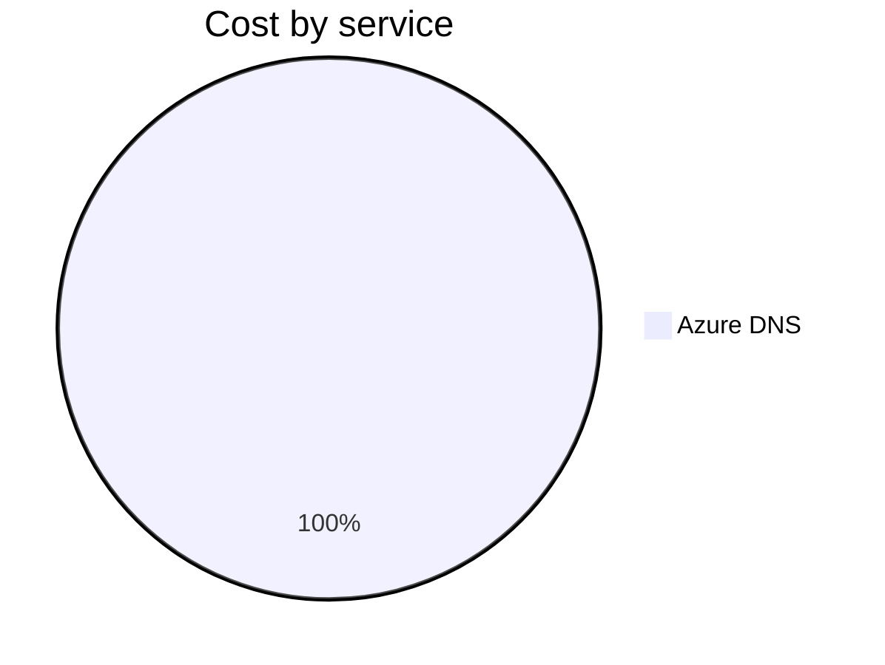
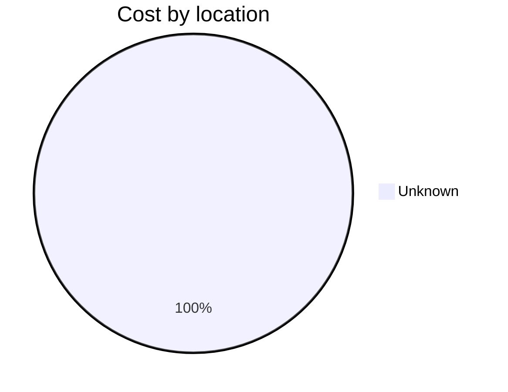
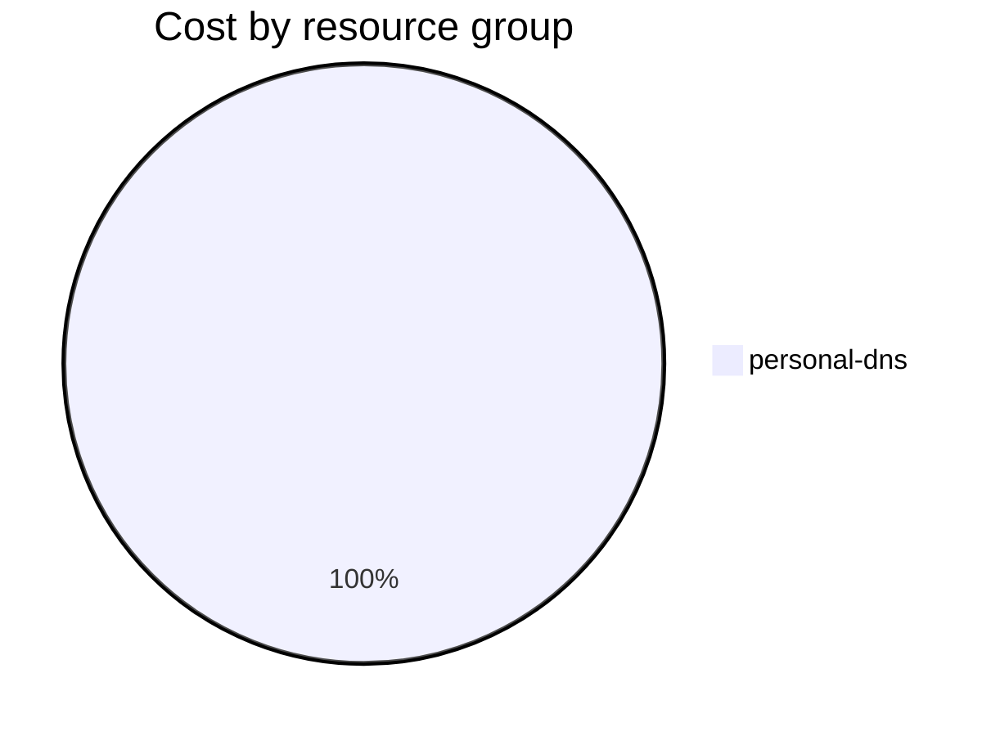

Fetching subscription details...
Fetching cost data...
Fetching forecasted cost data...
Fetching cost data by service name...
Fetching cost data by location...
Fetching cost data by resource group...
# Azure Cost Overview

> Accumulated cost for subscription id `JPF Pay-As-You-Go` from **01/01/2024** to **01/13/2024**

## Totals

|Period|Amount|
|---|---:|
|Today|0.00 USD|
|Yesterday|0.03 USD|
|Last 7 days|0.23 USD|
|Last 30 days|0.43 USD|

```mermaid
gantt
   title Accumulated cost
   dateFormat  X
   axisFormat %s
   section 01 Jan
   USD 0.03 :0, 3
   section 02 Jan
   USD 0.07 :0, 7
   section 03 Jan
   USD 0.10 :0, 10
   section 04 Jan
   USD 0.13 :0, 13
   section 05 Jan
   USD 0.16 :0, 16
   section 06 Jan
   USD 0.20 :0, 20
   section 07 Jan
   USD 0.23 :0, 23
   section 08 Jan
   USD 0.26 :0, 26
   section 09 Jan
   USD 0.30 :0, 30
   section 10 Jan
   USD 0.33 :0, 33
   section 11 Jan
   USD 0.36 :0, 36
   section 12 Jan
   USD 0.40 :0, 40
   section 13 Jan
   USD 0.43 :0, 43
```

## By Service Name

|Service|Amount|
|---|---:|
|Azure DNS|0.43 USD|

## By Location

|Location|Amount|
|---|---:|
|Unknown|0.43 USD|

## By Resource Group

|Resource Group|Amount|
|---|---:|
|personal-dns|0.43 USD|

Generated at 2024-01-14 11:09:47 for subscription with id `4913be3f-a345-4652-9bba-767418dd25e3`
