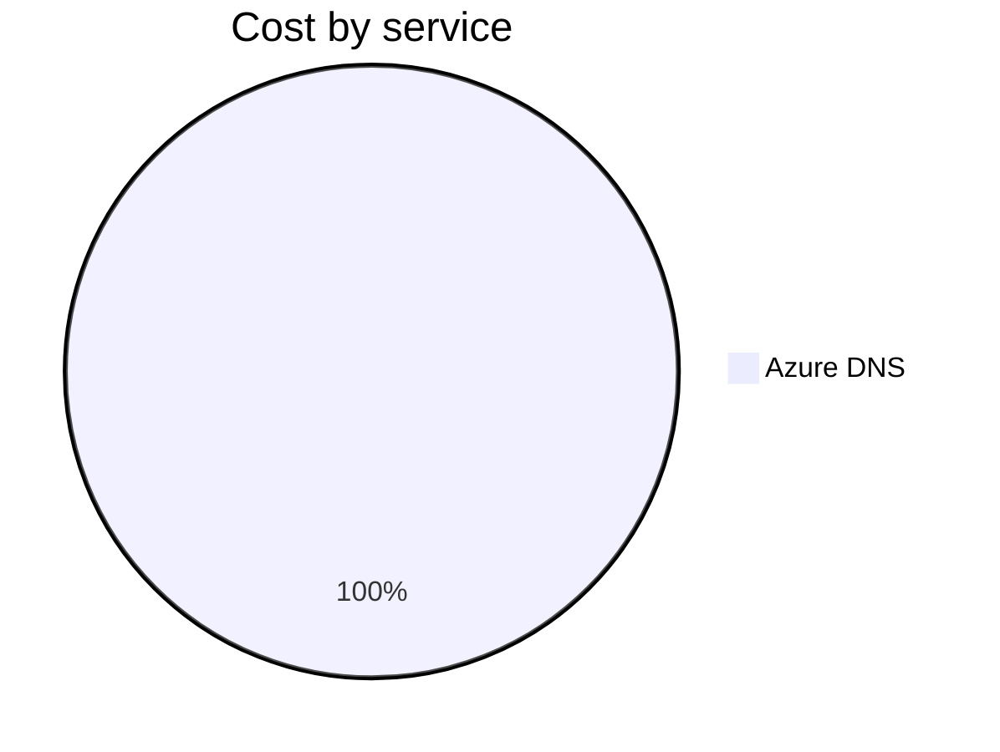
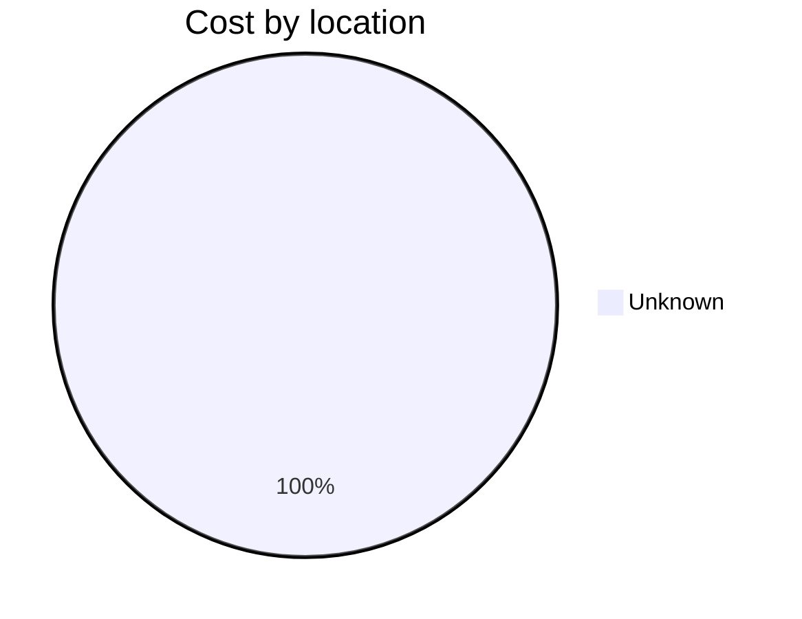
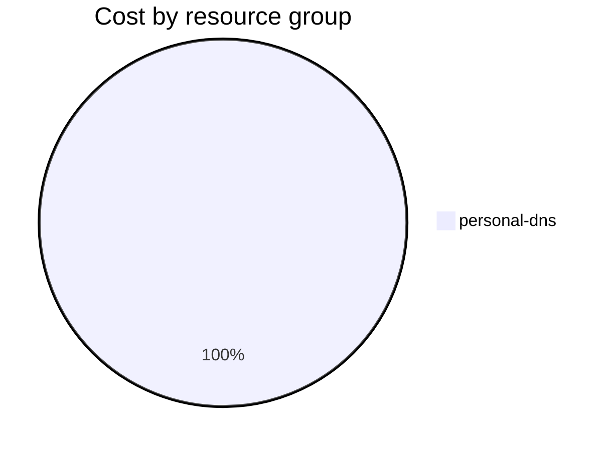

Fetching subscription details...
Fetching cost data...
Fetching forecasted cost data...
Fetching cost data by service name...
Fetching cost data by location...
Fetching cost data by resource group...
# Azure Cost Overview

> Accumulated cost for subscription id `JPF Pay-As-You-Go` from **08/01/2024** to **08/01/2024**

## Totals

|Period|Amount|
|---|---:|
|Today|0.00 USD|
|Yesterday|0.02 USD|
|Last 7 days|0.02 USD|
|Last 30 days|0.02 USD|

```mermaid
gantt
   title Accumulated cost
   dateFormat  X
   axisFormat %s
   section 01 Aug
   USD 0.02 :0, 2
   section 02 Aug
   USD 0.06 : done, 0, 6
   section 03 Aug
   USD 0.09 : done, 0, 9
   section 04 Aug
   USD 0.12 : done, 0, 12
   section 05 Aug
   USD 0.16 : done, 0, 16
   section 06 Aug
   USD 0.19 : done, 0, 19
   section 07 Aug
   USD 0.22 : done, 0, 22
   section 08 Aug
   USD 0.26 : done, 0, 26
   section 09 Aug
   USD 0.29 : done, 0, 29
   section 10 Aug
   USD 0.32 : done, 0, 32
   section 11 Aug
   USD 0.35 : done, 0, 35
   section 12 Aug
   USD 0.39 : done, 0, 39
   section 13 Aug
   USD 0.42 : done, 0, 42
   section 14 Aug
   USD 0.45 : done, 0, 45
   section 15 Aug
   USD 0.49 : done, 0, 49
   section 16 Aug
   USD 0.52 : done, 0, 52
   section 17 Aug
   USD 0.55 : done, 0, 55
   section 18 Aug
   USD 0.59 : done, 0, 59
   section 19 Aug
   USD 0.62 : done, 0, 62
   section 20 Aug
   USD 0.65 : done, 0, 65
   section 21 Aug
   USD 0.68 : done, 0, 68
   section 22 Aug
   USD 0.72 : done, 0, 72
   section 23 Aug
   USD 0.75 : done, 0, 75
   section 24 Aug
   USD 0.78 : done, 0, 78
   section 25 Aug
   USD 0.82 : done, 0, 82
   section 26 Aug
   USD 0.85 : done, 0, 85
   section 27 Aug
   USD 0.88 : done, 0, 88
   section 28 Aug
   USD 0.91 : done, 0, 91
   section 29 Aug
   USD 0.95 : done, 0, 95
   section 30 Aug
   USD 0.98 : done, 0, 98
   section 31 Aug
   USD 1.01 : done, 0, 101
```

## By Service Name

|Service|Amount|
|---|---:|
|Azure DNS|0.02 USD|

## By Location

|Location|Amount|
|---|---:|
|Unknown|0.02 USD|

## By Resource Group

|Resource Group|Amount|
|---|---:|
|personal-dns|0.02 USD|

Generated at 2024-08-02 11:05:53 for subscription with id `4913be3f-a345-4652-9bba-767418dd25e3`
