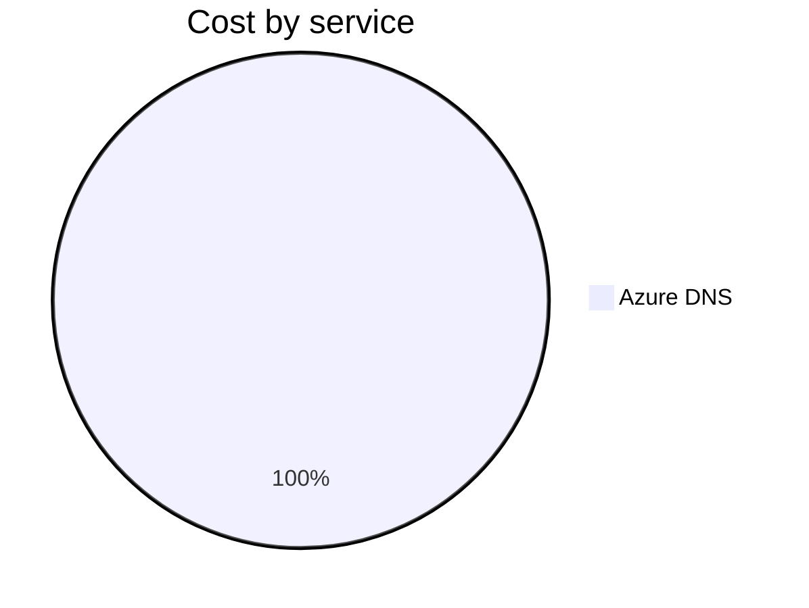
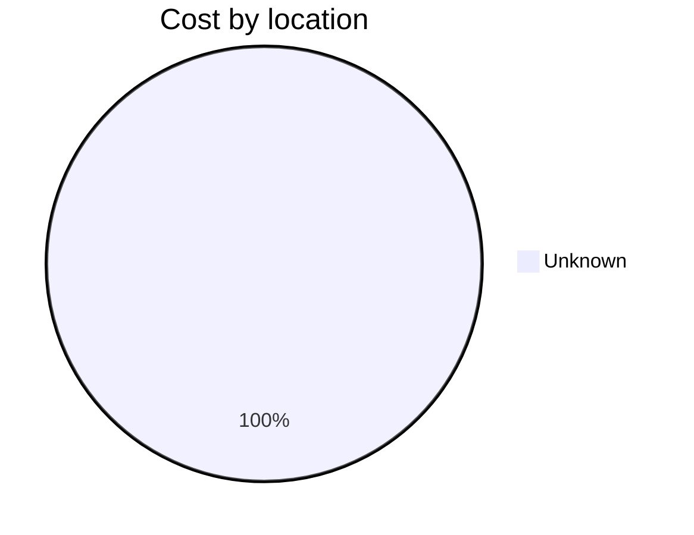
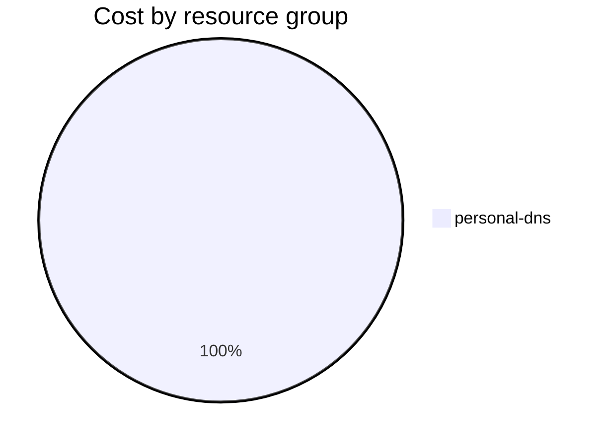

Fetching subscription details...
Fetching cost data...
Fetching forecasted cost data...
Fetching cost data by service name...
Fetching cost data by location...
Fetching cost data by resource group...
# Azure Cost Overview

> Accumulated cost for subscription id `JPF Pay-As-You-Go` from **03/01/2024** to **03/14/2024**

## Totals

|Period|Amount|
|---|---:|
|Today|0.00 USD|
|Yesterday|0.03 USD|
|Last 7 days|0.21 USD|
|Last 30 days|0.45 USD|

```mermaid
gantt
   title Accumulated cost
   dateFormat  X
   axisFormat %s
   section 01 Mar
   USD 0.03 :0, 3
   section 02 Mar
   USD 0.07 :0, 7
   section 03 Mar
   USD 0.10 :0, 10
   section 04 Mar
   USD 0.13 :0, 13
   section 05 Mar
   USD 0.17 :0, 17
   section 06 Mar
   USD 0.20 :0, 20
   section 07 Mar
   USD 0.23 :0, 23
   section 08 Mar
   USD 0.26 :0, 26
   section 09 Mar
   USD 0.30 :0, 30
   section 10 Mar
   USD 0.33 :0, 33
   section 11 Mar
   USD 0.35 :0, 35
   section 12 Mar
   USD 0.38 :0, 38
   section 13 Mar
   USD 0.41 :0, 41
   section 14 Mar
   USD 0.45 :0, 45
   section 15 Mar
   USD 0.48 : done, 0, 48
   section 16 Mar
   USD 0.51 : done, 0, 51
   section 17 Mar
   USD 0.54 : done, 0, 54
   section 18 Mar
   USD 0.57 : done, 0, 57
   section 19 Mar
   USD 0.60 : done, 0, 60
   section 20 Mar
   USD 0.63 : done, 0, 63
   section 21 Mar
   USD 0.66 : done, 0, 66
   section 22 Mar
   USD 0.69 : done, 0, 69
   section 23 Mar
   USD 0.72 : done, 0, 72
   section 24 Mar
   USD 0.75 : done, 0, 75
   section 25 Mar
   USD 0.78 : done, 0, 78
   section 26 Mar
   USD 0.81 : done, 0, 81
   section 27 Mar
   USD 0.84 : done, 0, 84
   section 28 Mar
   USD 0.87 : done, 0, 87
   section 29 Mar
   USD 0.90 : done, 0, 90
   section 30 Mar
   USD 0.93 : done, 0, 93
   section 31 Mar
   USD 0.96 : done, 0, 96
```

## By Service Name

|Service|Amount|
|---|---:|
|Azure DNS|0.45 USD|

## By Location

|Location|Amount|
|---|---:|
|Unknown|0.45 USD|

## By Resource Group

|Resource Group|Amount|
|---|---:|
|personal-dns|0.45 USD|

Generated at 2024-03-15 11:04:46 for subscription with id `4913be3f-a345-4652-9bba-767418dd25e3`
