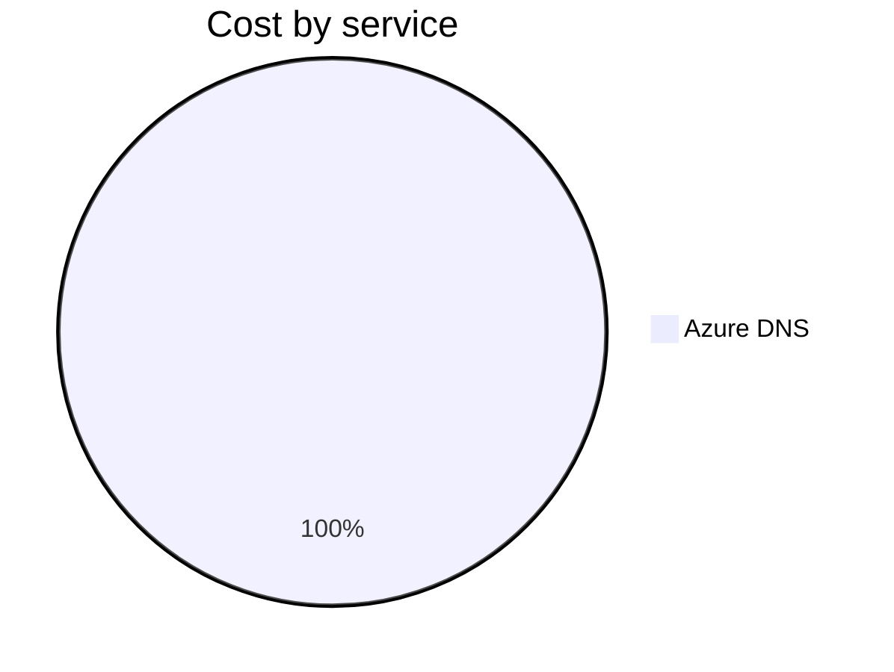
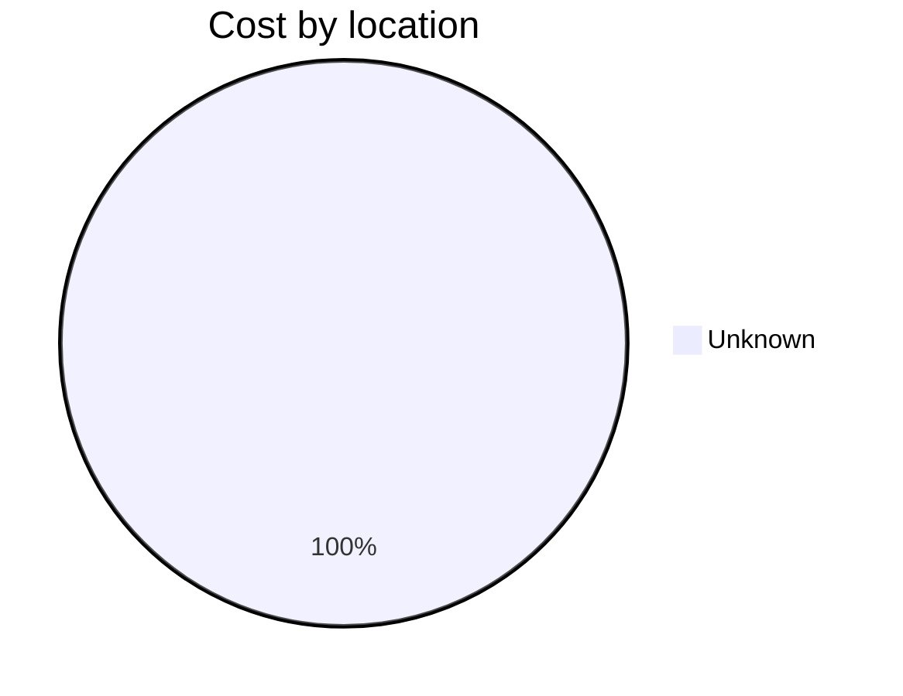
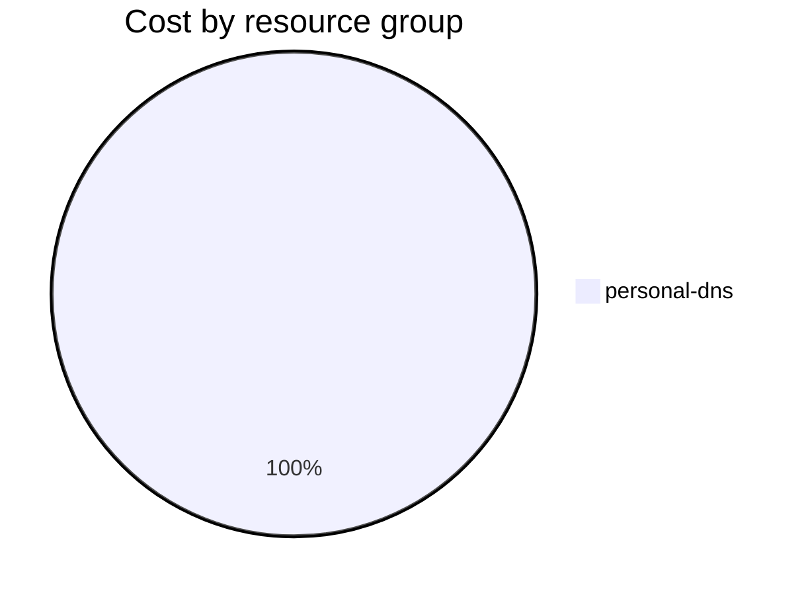

Fetching subscription details...
Fetching cost data...
Fetching forecasted cost data...
Fetching cost data by service name...
Fetching cost data by location...
Fetching cost data by resource group...
# Azure Cost Overview

> Accumulated cost for subscription id `JPF Pay-As-You-Go` from **10/01/2023** to **10/01/2023**

## Totals

|Period|Amount|
|---|---:|
|Today|0.00 USD|
|Yesterday|0.01 USD|
|Last 7 days|0.01 USD|
|Last 30 days|0.01 USD|

```mermaid
gantt
   title Accumulated cost
   dateFormat  X
   axisFormat %s
   section 01 Oct
   USD 0.01 :0, 1
```

## By Service Name

|Service|Amount|
|---|---:|
|Azure DNS|0.01 USD|

## By Location

|Location|Amount|
|---|---:|
|Unknown|0.01 USD|

## By Resource Group

|Resource Group|Amount|
|---|---:|
|personal-dns|0.01 USD|

Generated at 2023-10-02 11:10:17 for subscription with id `4913be3f-a345-4652-9bba-767418dd25e3`
