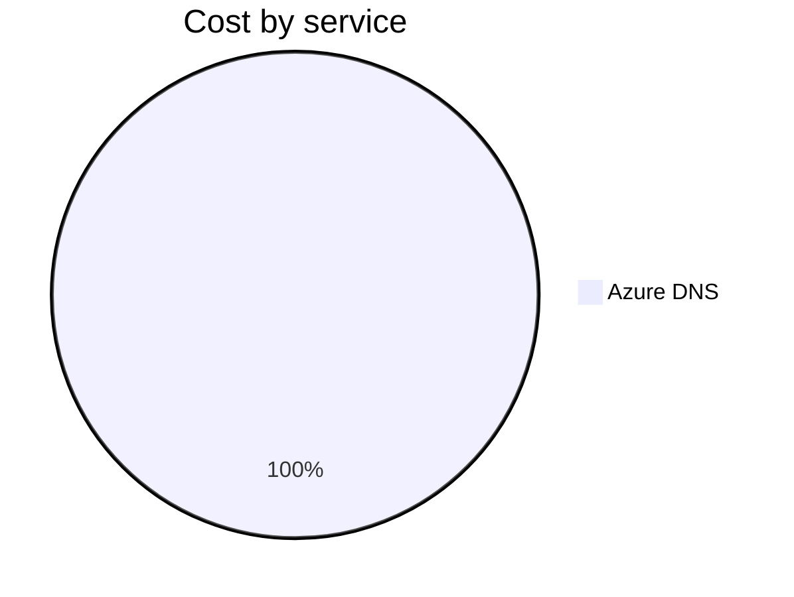
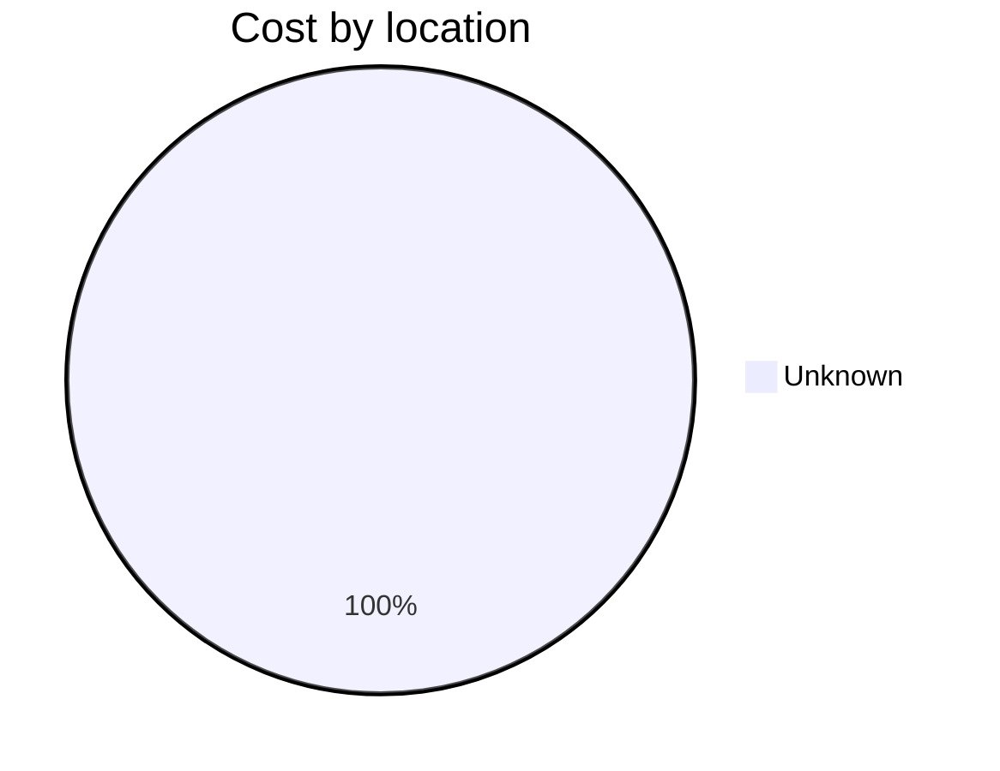
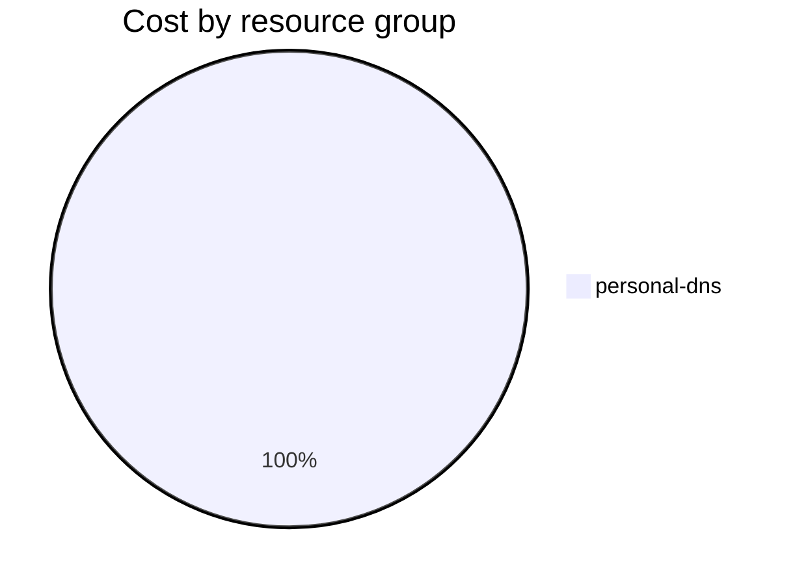

Fetching subscription details...
Fetching cost data...
Fetching forecasted cost data...
Fetching cost data by service name...
Fetching cost data by location...
Fetching cost data by resource group...
# Azure Cost Overview

> Accumulated cost for subscription id `JPF Pay-As-You-Go` from **02/01/2024** to **02/05/2024**

## Totals

|Period|Amount|
|---|---:|
|Today|0.00 USD|
|Yesterday|0.01 USD|
|Last 7 days|0.08 USD|
|Last 30 days|0.08 USD|

```mermaid
gantt
   title Accumulated cost
   dateFormat  X
   axisFormat %s
   section 01 Feb
   USD 0.02 :0, 2
   section 02 Feb
   USD 0.03 :0, 3
   section 03 Feb
   USD 0.05 :0, 5
   section 04 Feb
   USD 0.07 :0, 7
   section 05 Feb
   USD 0.08 :0, 8
```

## By Service Name

|Service|Amount|
|---|---:|
|Azure DNS|0.08 USD|

## By Location

|Location|Amount|
|---|---:|
|Unknown|0.08 USD|

## By Resource Group

|Resource Group|Amount|
|---|---:|
|personal-dns|0.08 USD|

Generated at 2024-02-06 11:16:38 for subscription with id `4913be3f-a345-4652-9bba-767418dd25e3`
