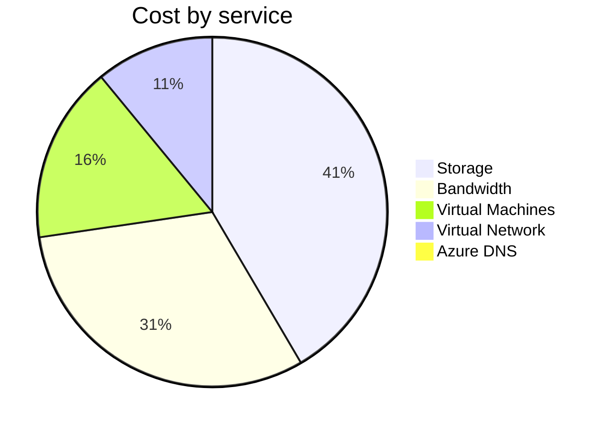
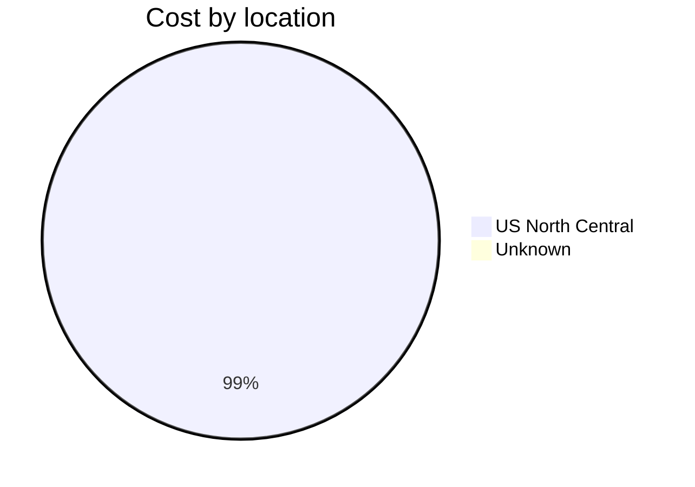
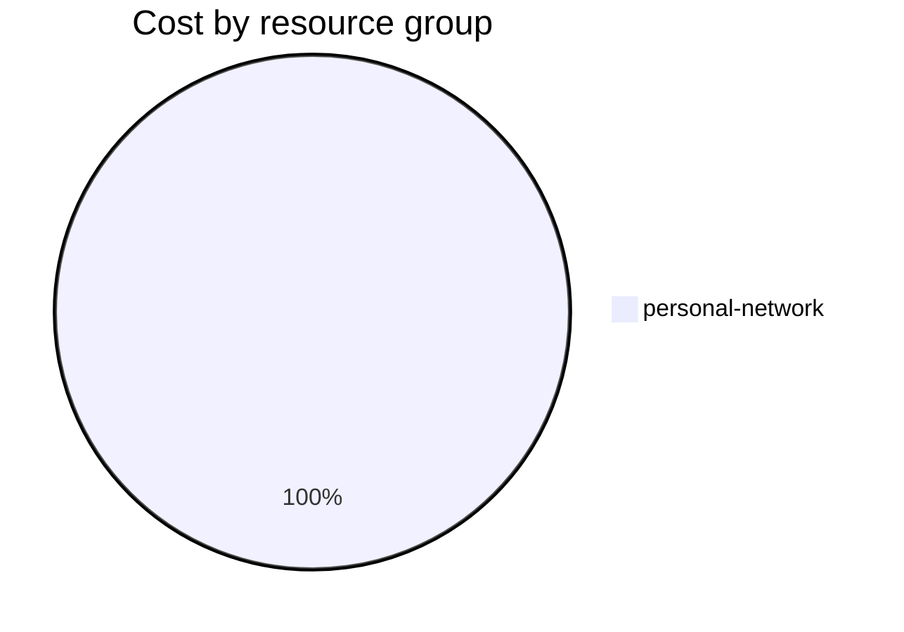

Fetching subscription details...
Fetching cost data...
Fetching forecasted cost data...
Fetching cost data by service name...
Fetching cost data by location...
Fetching cost data by resource group...
# Azure Cost Overview

> Accumulated cost for subscription id `JPF Pay-As-You-Go` from **02/01/2024** to **02/13/2024**

## Totals

|Period|Amount|
|---|---:|
|Today|0.09 USD|
|Yesterday|1.44 USD|
|Last 7 days|13.82 USD|
|Last 30 days|26.41 USD|

```mermaid
gantt
   title Accumulated cost
   dateFormat  X
   axisFormat %s
   section 01 Feb
   USD 2.32 :0, 232
   section 02 Feb
   USD 5.35 :0, 535
   section 03 Feb
   USD 7.82 :0, 782
   section 04 Feb
   USD 10.18 :0, 1018
   section 05 Feb
   USD 12.59 :0, 1259
   section 06 Feb
   USD 14.76 :0, 1476
   section 07 Feb
   USD 17.01 :0, 1701
   section 08 Feb
   USD 19.77 :0, 1977
   section 09 Feb
   USD 21.86 :0, 2186
   section 10 Feb
   USD 23.39 :0, 2339
   section 11 Feb
   USD 24.88 :0, 2488
   section 12 Feb
   USD 26.32 :0, 2632
   section 13 Feb
   USD 26.41 :0, 2641
```

## By Service Name

|Service|Amount|
|---|---:|
|Storage|10.89 USD|
|Bandwidth|8.16 USD|
|Virtual Machines|4.29 USD|
|Virtual Network|2.87 USD|
|Azure DNS|0.19 USD|

## By Location

|Location|Amount|
|---|---:|
|US North Central|26.21 USD|
|Unknown|0.19 USD|

## By Resource Group

|Resource Group|Amount|
|---|---:|
|personal-network|26.41 USD|

Generated at 2024-02-13 11:10:09 for subscription with id `4913be3f-a345-4652-9bba-767418dd25e3`
