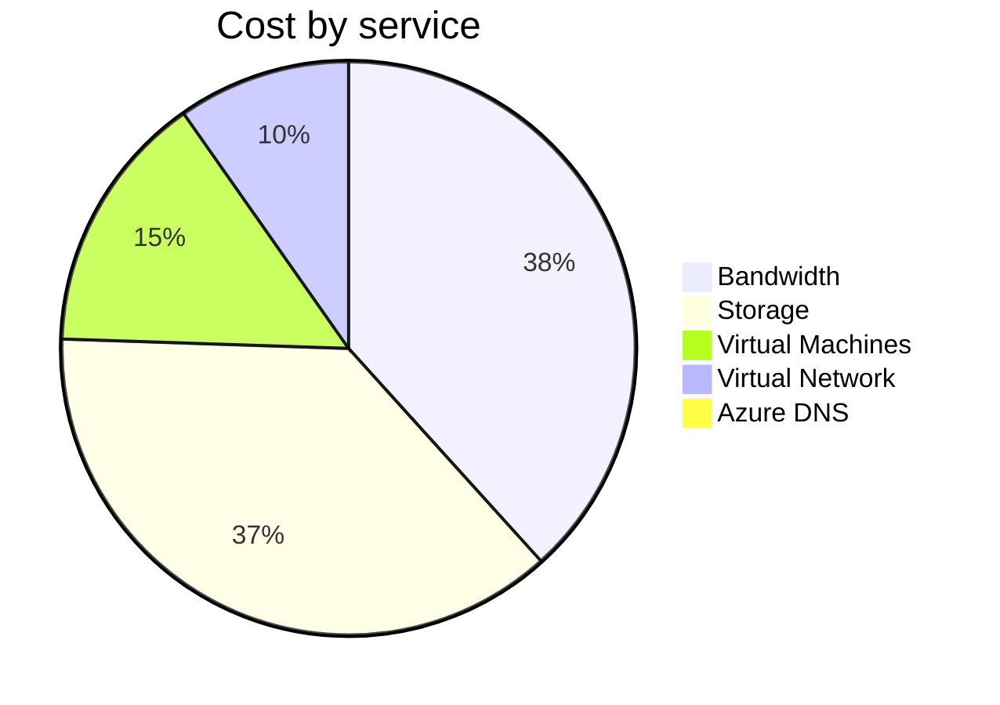
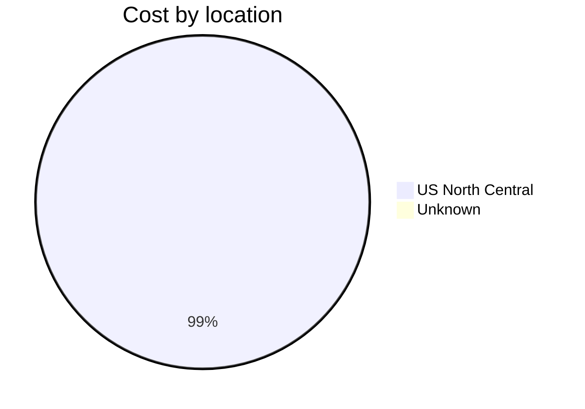
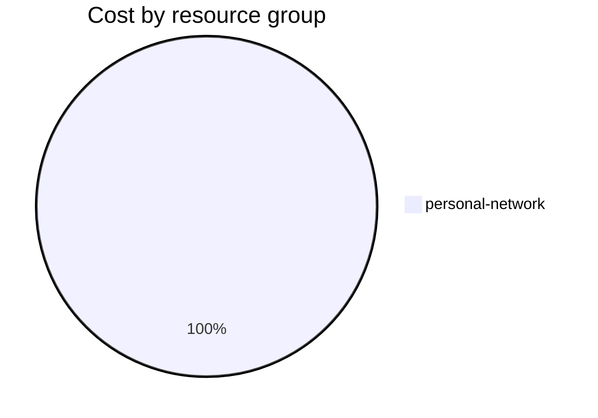

Fetching subscription details...
Fetching cost data...
Fetching forecasted cost data...
Fetching cost data by service name...
Fetching cost data by location...
Fetching cost data by resource group...
# Azure Cost Overview

> Accumulated cost for subscription id `JPF Pay-As-You-Go` from **02/01/2024** to **02/09/2024**

## Totals

|Period|Amount|
|---|---:|
|Today|0.09 USD|
|Yesterday|2.70 USD|
|Last 7 days|17.42 USD|
|Last 30 days|19.74 USD|

```mermaid
gantt
   title Accumulated cost
   dateFormat  X
   axisFormat %s
   section 01 Feb
   USD 2.32 :0, 232
   section 02 Feb
   USD 5.32 :0, 532
   section 03 Feb
   USD 7.79 :0, 779
   section 04 Feb
   USD 10.14 :0, 1014
   section 05 Feb
   USD 12.54 :0, 1254
   section 06 Feb
   USD 14.70 :0, 1470
   section 07 Feb
   USD 16.95 :0, 1695
   section 08 Feb
   USD 19.65 :0, 1965
   section 09 Feb
   USD 19.74 :0, 1974
   section 10 Feb
   USD 22.78 : done, 0, 2278
   section 11 Feb
   USD 25.22 : done, 0, 2522
   section 12 Feb
   USD 27.45 : done, 0, 2745
   section 13 Feb
   USD 29.90 : done, 0, 2990
   section 14 Feb
   USD 32.04 : done, 0, 3204
   section 15 Feb
   USD 34.45 : done, 0, 3445
   section 16 Feb
   USD 37.13 : done, 0, 3713
   section 17 Feb
   USD 40.24 : done, 0, 4024
   section 18 Feb
   USD 42.76 : done, 0, 4276
   section 19 Feb
   USD 45.06 : done, 0, 4506
   section 20 Feb
   USD 47.58 : done, 0, 4758
   section 21 Feb
   USD 49.79 : done, 0, 4979
   section 22 Feb
   USD 52.28 : done, 0, 5228
   section 23 Feb
   USD 55.02 : done, 0, 5502
   section 24 Feb
   USD 58.21 : done, 0, 5821
   section 25 Feb
   USD 60.80 : done, 0, 6080
   section 26 Feb
   USD 63.18 : done, 0, 6318
   section 27 Feb
   USD 65.76 : done, 0, 6576
   section 28 Feb
   USD 68.05 : done, 0, 6805
   section 29 Feb
   USD 70.61 : done, 0, 7061
```

## By Service Name

|Service|Amount|
|---|---:|
|Bandwidth|7.51 USD|
|Storage|7.30 USD|
|Virtual Machines|2.89 USD|
|Virtual Network|1.91 USD|
|Azure DNS|0.13 USD|

## By Location

|Location|Amount|
|---|---:|
|US North Central|19.61 USD|
|Unknown|0.13 USD|

## By Resource Group

|Resource Group|Amount|
|---|---:|
|personal-network|19.74 USD|

Generated at 2024-02-09 11:07:12 for subscription with id `4913be3f-a345-4652-9bba-767418dd25e3`
