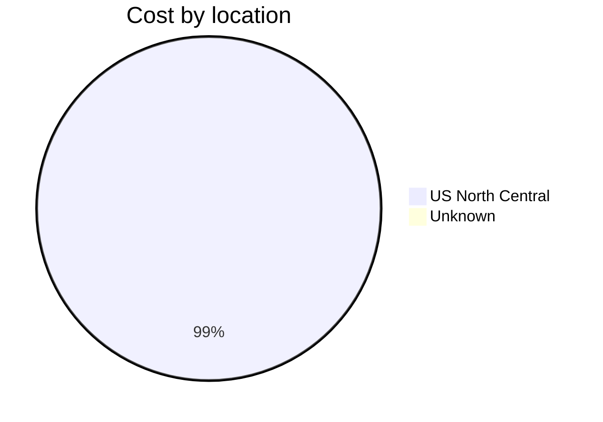
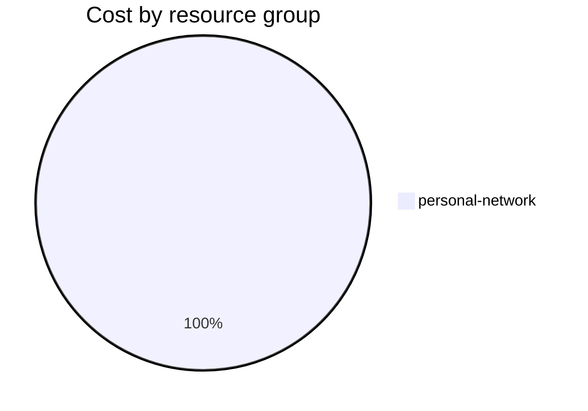

Fetching subscription details...
Fetching cost data...
Fetching forecasted cost data...
Fetching cost data by service name...
Fetching cost data by location...
Fetching cost data by resource group...
# Azure Cost Overview

> Accumulated cost for subscription id `JPF Pay-As-You-Go` from **12/01/2023** to **12/08/2023**

## Totals

|Period|Amount|
|---|---:|
|Today|0.10 USD|
|Yesterday|1.75 USD|
|Last 7 days|12.94 USD|
|Last 30 days|12.94 USD|

## By Service Name

|Service|Amount|
|---|---:|
|Storage|5.90 USD|
|Virtual Machines|2.85 USD|
|Bandwidth|2.40 USD|
|Virtual Network|1.68 USD|
|Azure DNS|0.11 USD|

## By Location

|Location|Amount|
|---|---:|
|US North Central|12.83 USD|
|Unknown|0.11 USD|

## By Resource Group

|Resource Group|Amount|
|---|---:|
|personal-network|12.94 USD|

Generated at 2023-12-08 11:05:24 for subscription with id `4913be3f-a345-4652-9bba-767418dd25e3`
