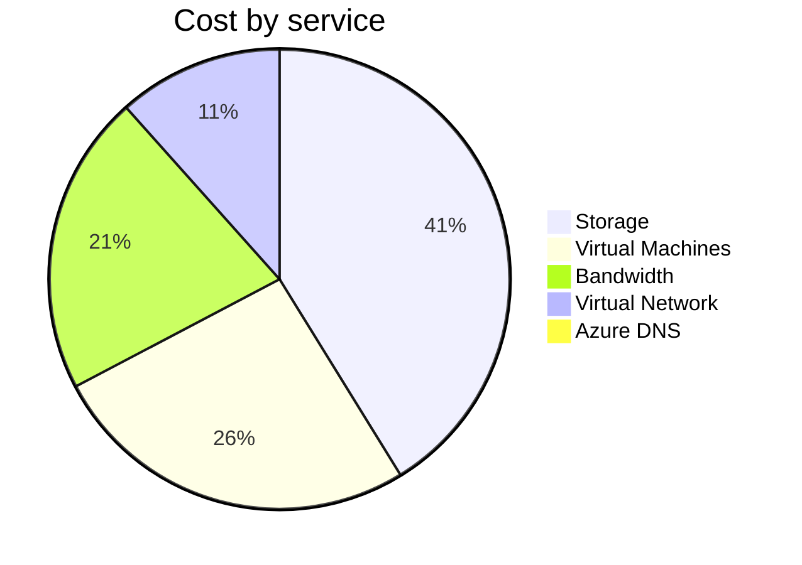
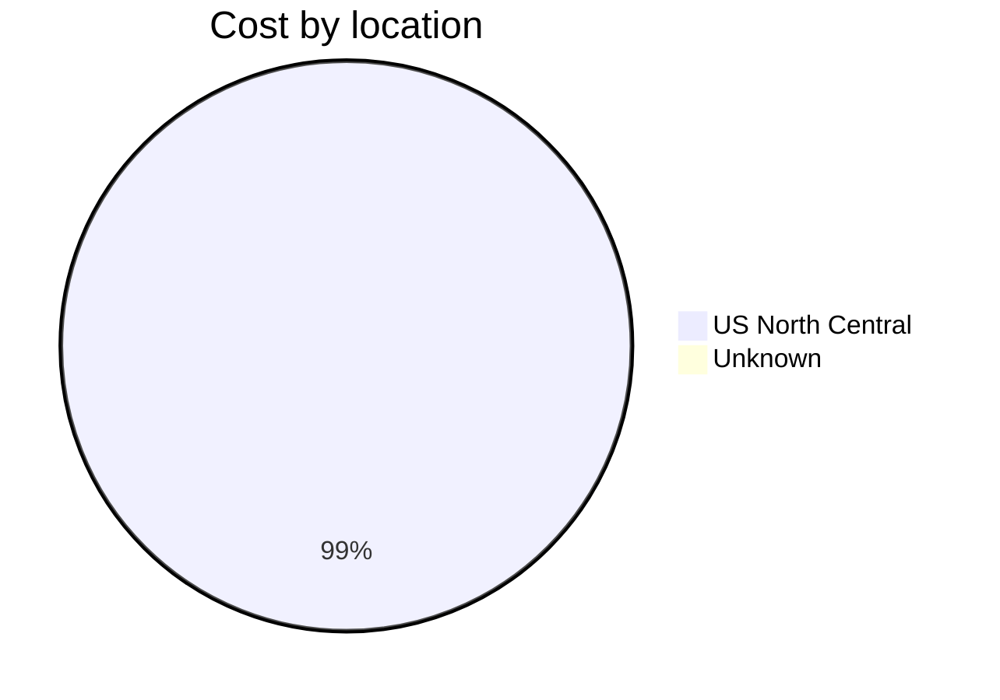
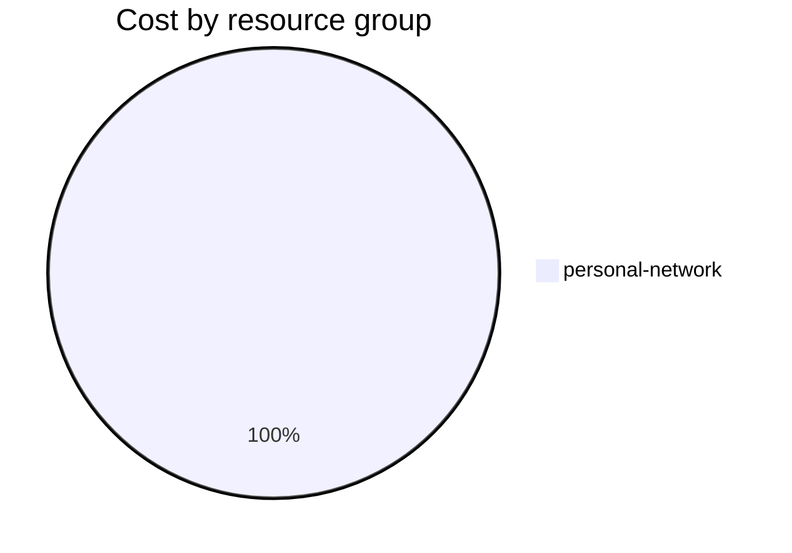

Fetching subscription details...
Fetching cost data...
Fetching forecasted cost data...
Fetching cost data by service name...
Fetching cost data by location...
Fetching cost data by resource group...
# Azure Cost Overview

> Accumulated cost for subscription id `JPF Pay-As-You-Go` from **12/01/2023** to **12/04/2023**

## Totals

|Period|Amount|
|---|---:|
|Today|0.08 USD|
|Yesterday|1.29 USD|
|Last 7 days|4.87 USD|
|Last 30 days|4.87 USD|

```mermaid
gantt
   title Accumulated cost
   dateFormat  X
   axisFormat %s
   section 01 Dec
   USD 1.70 :0, 170
   section 02 Dec
   USD 3.49 :0, 349
   section 03 Dec
   USD 4.78 :0, 478
   section 04 Dec
   USD 4.87 :0, 487
   section 05 Dec
   USD 6.72 : done, 0, 672
   section 06 Dec
   USD 8.40 : done, 0, 840
   section 07 Dec
   USD 10.10 : done, 0, 1010
   section 08 Dec
   USD 11.78 : done, 0, 1178
   section 09 Dec
   USD 13.51 : done, 0, 1351
   section 10 Dec
   USD 15.15 : done, 0, 1515
   section 11 Dec
   USD 16.89 : done, 0, 1689
   section 12 Dec
   USD 18.74 : done, 0, 1874
   section 13 Dec
   USD 20.41 : done, 0, 2041
   section 14 Dec
   USD 22.09 : done, 0, 2209
   section 15 Dec
   USD 23.75 : done, 0, 2375
   section 16 Dec
   USD 25.47 : done, 0, 2547
   section 17 Dec
   USD 27.10 : done, 0, 2710
   section 18 Dec
   USD 28.83 : done, 0, 2883
   section 19 Dec
   USD 30.66 : done, 0, 3066
   section 20 Dec
   USD 32.32 : done, 0, 3232
   section 21 Dec
   USD 33.98 : done, 0, 3398
   section 22 Dec
   USD 35.64 : done, 0, 3564
   section 23 Dec
   USD 37.34 : done, 0, 3734
   section 24 Dec
   USD 38.96 : done, 0, 3896
   section 25 Dec
   USD 40.67 : done, 0, 4067
   section 26 Dec
   USD 42.49 : done, 0, 4249
   section 27 Dec
   USD 44.13 : done, 0, 4413
   section 28 Dec
   USD 45.78 : done, 0, 4578
   section 29 Dec
   USD 47.42 : done, 0, 4742
   section 30 Dec
   USD 49.11 : done, 0, 4911
   section 31 Dec
   USD 50.72 : done, 0, 5072
```

## By Service Name

|Service|Amount|
|---|---:|
|Storage|1.99 USD|
|Virtual Machines|1.26 USD|
|Bandwidth|1.02 USD|
|Virtual Network|0.56 USD|
|Azure DNS|0.04 USD|

## By Location

|Location|Amount|
|---|---:|
|US North Central|4.83 USD|
|Unknown|0.04 USD|

## By Resource Group

|Resource Group|Amount|
|---|---:|
|personal-network|4.87 USD|

Generated at 2023-12-04 11:06:15 for subscription with id `4913be3f-a345-4652-9bba-767418dd25e3`
