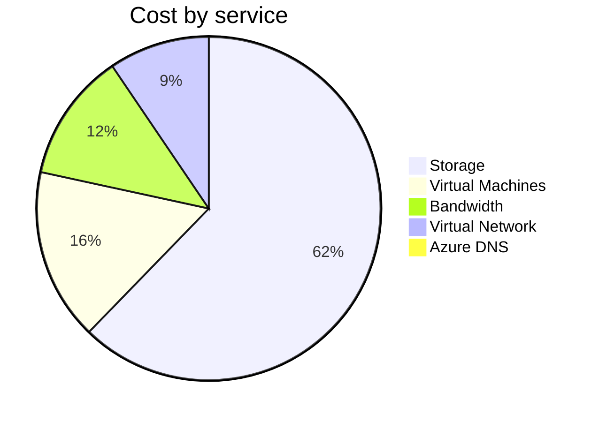
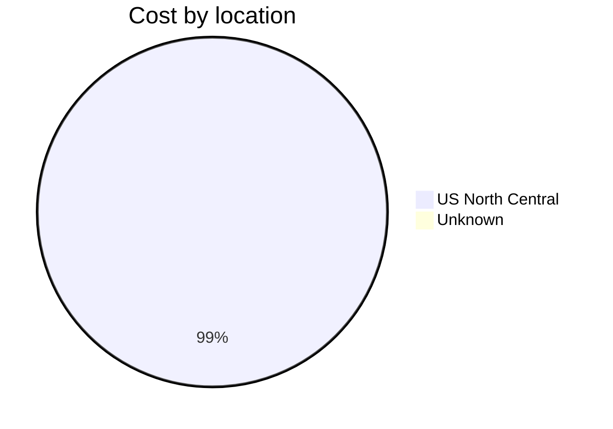
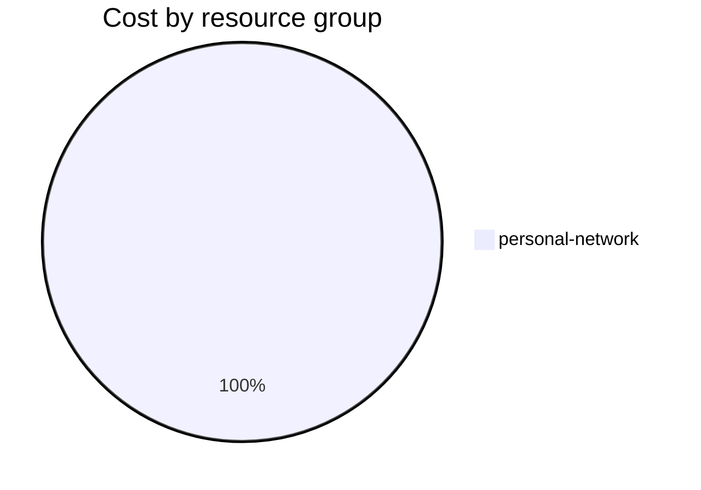

Fetching subscription details...
Fetching cost data...
Fetching forecasted cost data...
Fetching cost data by service name...
Fetching cost data by location...
Fetching cost data by resource group...
# Azure Cost Overview

> Accumulated cost for subscription id `JPF Pay-As-You-Go` from **10/01/2023** to **10/04/2023**

## Totals

|Period|Amount|
|---|---:|
|Today|0.09 USD|
|Yesterday|1.51 USD|
|Last 7 days|7.22 USD|
|Last 30 days|7.22 USD|

```mermaid
gantt
   title Accumulated cost
   dateFormat  X
   axisFormat %s
   section 01 Oct
   USD 3.11 :0, 311
   section 02 Oct
   USD 5.62 :0, 562
   section 03 Oct
   USD 7.13 :0, 713
   section 04 Oct
   USD 7.22 :0, 722
   section 05 Oct
   USD 12.17 : done, 0, 1217
   section 06 Oct
   USD 17.19 : done, 0, 1719
   section 07 Oct
   USD 21.54 : done, 0, 2154
   section 08 Oct
   USD 25.77 : done, 0, 2577
   section 09 Oct
   USD 29.84 : done, 0, 2984
   section 10 Oct
   USD 38.62 : done, 0, 3862
   section 11 Oct
   USD 42.49 : done, 0, 4249
   section 12 Oct
   USD 46.41 : done, 0, 4641
   section 13 Oct
   USD 50.40 : done, 0, 5040
   section 14 Oct
   USD 53.72 : done, 0, 5372
   section 15 Oct
   USD 56.92 : done, 0, 5692
   section 16 Oct
   USD 59.97 : done, 0, 5997
   section 17 Oct
   USD 67.72 : done, 0, 6772
   section 18 Oct
   USD 70.56 : done, 0, 7056
   section 19 Oct
   USD 73.45 : done, 0, 7345
   section 20 Oct
   USD 76.41 : done, 0, 7641
   section 21 Oct
   USD 78.69 : done, 0, 7869
   section 22 Oct
   USD 80.87 : done, 0, 8087
   section 23 Oct
   USD 82.88 : done, 0, 8288
   section 24 Oct
   USD 89.60 : done, 0, 8960
   section 25 Oct
   USD 91.41 : done, 0, 9141
   section 26 Oct
   USD 93.28 : done, 0, 9328
   section 27 Oct
   USD 95.21 : done, 0, 9521
   section 28 Oct
   USD 96.46 : done, 0, 9646
   section 29 Oct
   USD 97.61 : done, 0, 9761
   section 30 Oct
   USD 98.59 : done, 0, 9859
   section 31 Oct
   USD 104.28 : done, 0, 10428
```

## By Service Name

|Service|Amount|
|---|---:|
|Storage|4.47 USD|
|Virtual Machines|1.16 USD|
|Bandwidth|0.87 USD|
|Virtual Network|0.68 USD|
|Azure DNS|0.05 USD|

## By Location

|Location|Amount|
|---|---:|
|US North Central|7.17 USD|
|Unknown|0.05 USD|

## By Resource Group

|Resource Group|Amount|
|---|---:|
|personal-network|7.22 USD|

Generated at 2023-10-04 11:06:26 for subscription with id `4913be3f-a345-4652-9bba-767418dd25e3`
