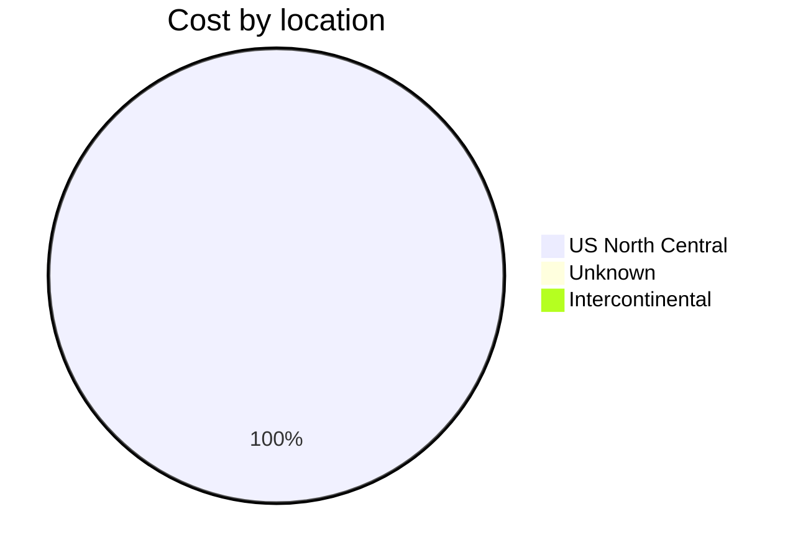
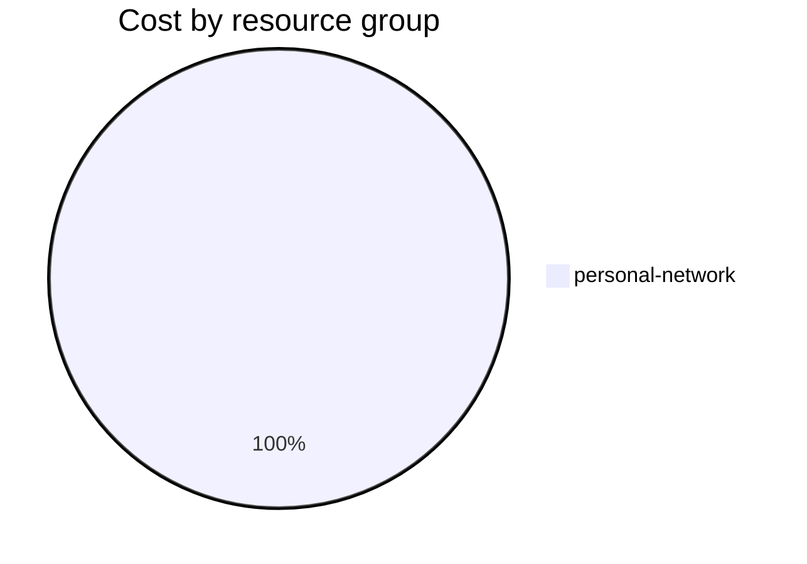

Fetching subscription details...
Fetching cost data...
Fetching forecasted cost data...
Fetching cost data by service name...
Fetching cost data by location...
Fetching cost data by resource group...
# Azure Cost Overview

> Accumulated cost for subscription id `JPF Pay-As-You-Go` from **09/01/2023** to **09/16/2023**

## Totals

|Period|Amount|
|---|---:|
|Today|0.03 USD|
|Yesterday|5.18 USD|
|Last 7 days|106.78 USD|
|Last 30 days|131.49 USD|

```mermaid
gantt
   title Accumulated cost
   dateFormat  X
   axisFormat %s
   section 01 Sep
   USD 3.20 :0, 320
   section 02 Sep
   USD 6.19 :0, 619
   section 03 Sep
   USD 9.27 :0, 927
   section 04 Sep
   USD 12.30 :0, 1230
   section 05 Sep
   USD 15.47 :0, 1547
   section 06 Sep
   USD 18.50 :0, 1850
   section 07 Sep
   USD 21.60 :0, 2160
   section 08 Sep
   USD 24.70 :0, 2470
   section 09 Sep
   USD 27.69 :0, 2769
   section 10 Sep
   USD 30.45 :0, 3045
   section 11 Sep
   USD 33.22 :0, 3322
   section 12 Sep
   USD 45.74 :0, 4574
   section 13 Sep
   USD 91.87 :0, 9187
   section 14 Sep
   USD 126.28 :0, 12628
   section 15 Sep
   USD 131.46 :0, 13146
   section 16 Sep
   USD 131.49 :0, 13149
```

## By Service Name

|Service|Amount|
|---|---:|
|Storage|113.48 USD|
|Virtual Machines|5.71 USD|
|Virtual Network|5.66 USD|
|Security Center|3.70 USD|
|Bandwidth|2.69 USD|
|Azure DNS|0.24 USD|
|Advanced Threat Protection|0.00 USD|

## By Location

|Location|Amount|
|---|---:|
|US North Central|131.25 USD|
|Unknown|0.24 USD|
|Intercontinental|0.00 USD|

## By Resource Group

|Resource Group|Amount|
|---|---:|
|personal-network|131.49 USD|

Generated at 2023-09-16 11:05:13 for subscription with id `4913be3f-a345-4652-9bba-767418dd25e3`
