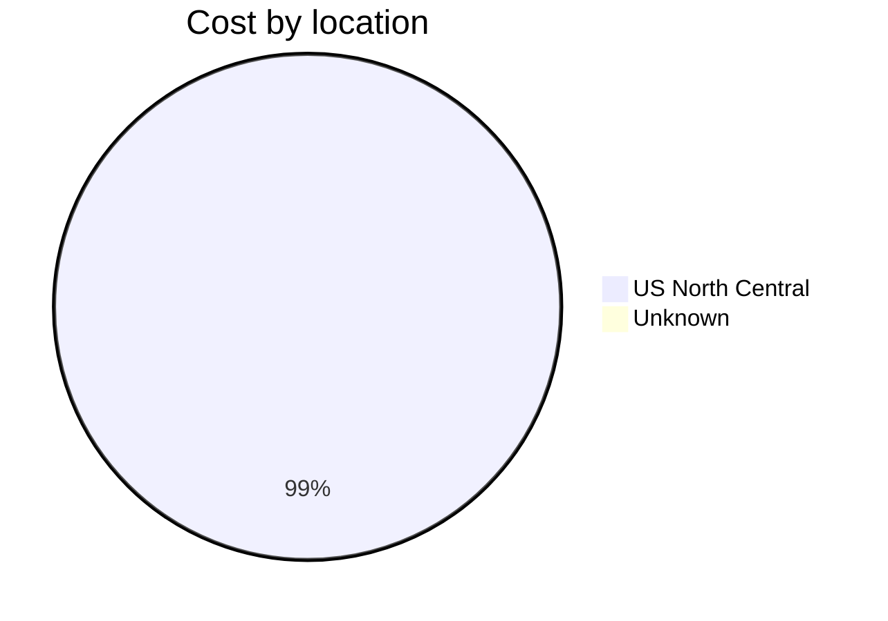
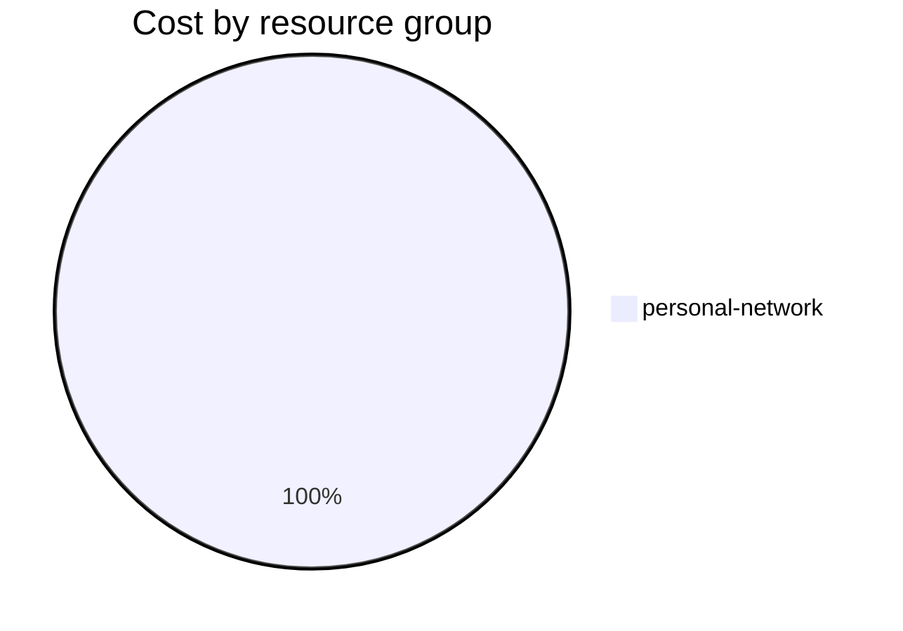

Fetching subscription details...
Fetching cost data...
Fetching forecasted cost data...
Fetching cost data by service name...
Fetching cost data by location...
Fetching cost data by resource group...
# Azure Cost Overview

> Accumulated cost for subscription id `JPF Pay-As-You-Go` from **01/01/2024** to **01/18/2024**

## Totals

|Period|Amount|
|---|---:|
|Today|0.10 USD|
|Yesterday|1.49 USD|
|Last 7 days|10.71 USD|
|Last 30 days|30.69 USD|

```mermaid
gantt
   title Accumulated cost
   dateFormat  X
   axisFormat %s
   section 01 Jan
   USD 2.01 :0, 201
   section 02 Jan
   USD 4.48 :0, 448
   section 03 Jan
   USD 6.29 :0, 629
   section 04 Jan
   USD 8.20 :0, 820
   section 05 Jan
   USD 10.14 :0, 1014
   section 06 Jan
   USD 12.40 :0, 1240
   section 07 Jan
   USD 14.14 :0, 1414
   section 08 Jan
   USD 16.56 :0, 1656
   section 09 Jan
   USD 18.46 :0, 1846
   section 10 Jan
   USD 19.98 :0, 1998
   section 11 Jan
   USD 21.50 :0, 2150
   section 12 Jan
   USD 23.01 :0, 2301
   section 13 Jan
   USD 24.54 :0, 2454
   section 14 Jan
   USD 26.04 :0, 2604
   section 15 Jan
   USD 27.55 :0, 2755
   section 16 Jan
   USD 29.10 :0, 2910
   section 17 Jan
   USD 30.59 :0, 3059
   section 18 Jan
   USD 30.69 :0, 3069
   section 19 Jan
   USD 32.46 : done, 0, 3246
   section 20 Jan
   USD 34.36 : done, 0, 3436
   section 21 Jan
   USD 35.99 : done, 0, 3599
   section 22 Jan
   USD 37.75 : done, 0, 3775
   section 23 Jan
   USD 39.66 : done, 0, 3966
   section 24 Jan
   USD 41.23 : done, 0, 4123
   section 25 Jan
   USD 42.80 : done, 0, 4280
   section 26 Jan
   USD 44.55 : done, 0, 4455
   section 27 Jan
   USD 46.44 : done, 0, 4644
   section 28 Jan
   USD 48.06 : done, 0, 4806
   section 29 Jan
   USD 49.81 : done, 0, 4981
   section 30 Jan
   USD 51.70 : done, 0, 5170
   section 31 Jan
   USD 53.26 : done, 0, 5326
```

## By Service Name

|Service|Amount|
|---|---:|
|Storage|14.55 USD|
|Virtual Machines|7.11 USD|
|Bandwidth|4.68 USD|
|Virtual Network|4.07 USD|
|Azure DNS|0.27 USD|

## By Location

|Location|Amount|
|---|---:|
|US North Central|30.42 USD|
|Unknown|0.27 USD|

## By Resource Group

|Resource Group|Amount|
|---|---:|
|personal-network|30.69 USD|

Generated at 2024-01-18 11:07:33 for subscription with id `4913be3f-a345-4652-9bba-767418dd25e3`
