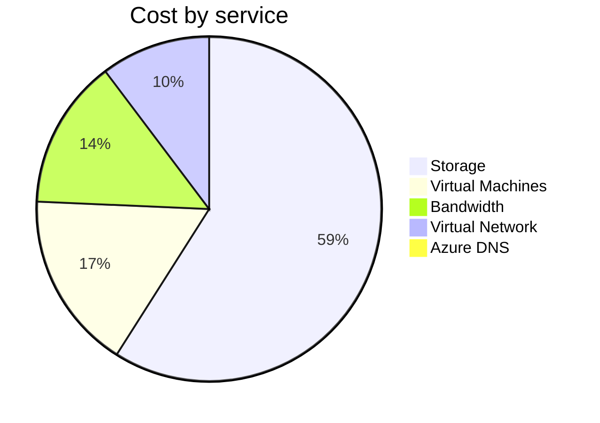
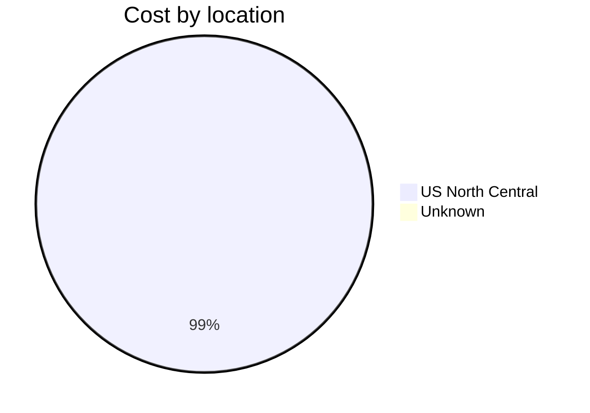
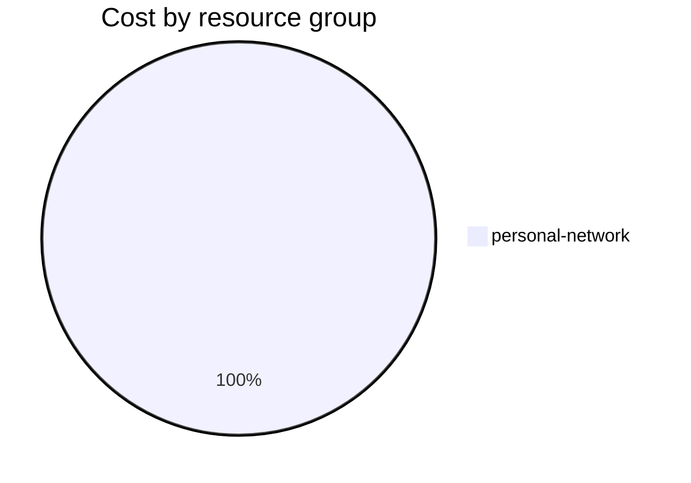

Fetching subscription details...
Fetching cost data...
Fetching forecasted cost data...
Fetching cost data by service name...
Fetching cost data by location...
Fetching cost data by resource group...
# Azure Cost Overview

> Accumulated cost for subscription id `JPF Pay-As-You-Go` from **10/01/2023** to **10/05/2023**

## Totals

|Period|Amount|
|---|---:|
|Today|0.09 USD|
|Yesterday|1.59 USD|
|Last 7 days|9.12 USD|
|Last 30 days|9.12 USD|

```mermaid
gantt
   title Accumulated cost
   dateFormat  X
   axisFormat %s
   section 01 Oct
   USD 3.12 :0, 312
   section 02 Oct
   USD 5.64 :0, 564
   section 03 Oct
   USD 7.44 :0, 744
   section 04 Oct
   USD 9.03 :0, 903
   section 05 Oct
   USD 9.12 :0, 912
   section 06 Oct
   USD 12.57 : done, 0, 1257
   section 07 Oct
   USD 15.19 : done, 0, 1519
   section 08 Oct
   USD 17.53 : done, 0, 1753
   section 09 Oct
   USD 19.61 : done, 0, 1961
   section 10 Oct
   USD 21.45 : done, 0, 2145
   section 11 Oct
   USD 23.00 : done, 0, 2300
   section 12 Oct
   USD 24.45 : done, 0, 2445
   section 13 Oct
   USD 25.83 : done, 0, 2583
   section 14 Oct
   USD 26.36 : done, 0, 2636
   section 15 Oct
   USD 26.62 : done, 0, 2662
   section 16 Oct
   USD 26.62 : done, 0, 2662
   section 17 Oct
   USD 26.62 : done, 0, 2662
   section 18 Oct
   USD 26.62 : done, 0, 2662
   section 19 Oct
   USD 26.62 : done, 0, 2662
   section 20 Oct
   USD 26.62 : done, 0, 2662
   section 21 Oct
   USD 26.62 : done, 0, 2662
   section 22 Oct
   USD 26.62 : done, 0, 2662
   section 23 Oct
   USD 26.62 : done, 0, 2662
   section 24 Oct
   USD 26.62 : done, 0, 2662
   section 25 Oct
   USD 26.62 : done, 0, 2662
   section 26 Oct
   USD 26.62 : done, 0, 2662
   section 27 Oct
   USD 26.62 : done, 0, 2662
   section 28 Oct
   USD 26.62 : done, 0, 2662
   section 29 Oct
   USD 26.62 : done, 0, 2662
   section 30 Oct
   USD 26.62 : done, 0, 2662
   section 31 Oct
   USD 26.62 : done, 0, 2662
```

## By Service Name

|Service|Amount|
|---|---:|
|Storage|5.34 USD|
|Virtual Machines|1.51 USD|
|Bandwidth|1.27 USD|
|Virtual Network|0.93 USD|
|Azure DNS|0.06 USD|

## By Location

|Location|Amount|
|---|---:|
|US North Central|9.05 USD|
|Unknown|0.06 USD|

## By Resource Group

|Resource Group|Amount|
|---|---:|
|personal-network|9.12 USD|

Generated at 2023-10-05 11:06:13 for subscription with id `4913be3f-a345-4652-9bba-767418dd25e3`
