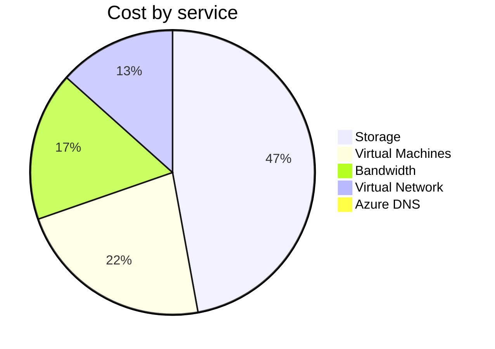
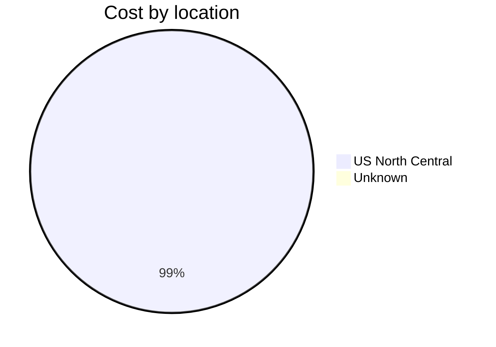
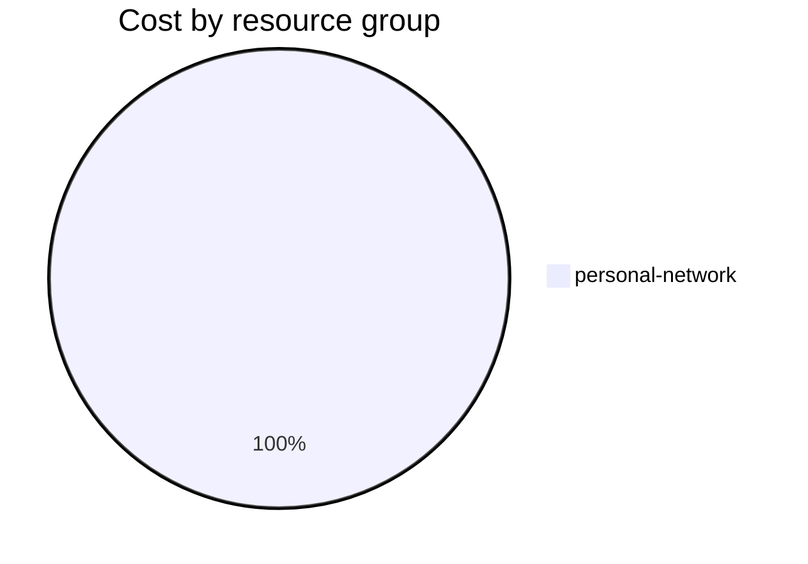

Fetching subscription details...
Fetching cost data...
Fetching forecasted cost data...
Fetching cost data by service name...
Fetching cost data by location...
Fetching cost data by resource group...
# Azure Cost Overview

> Accumulated cost for subscription id `JPF Pay-As-You-Go` from **12/01/2023** to **12/09/2023**

## Totals

|Period|Amount|
|---|---:|
|Today|0.08 USD|
|Yesterday|1.44 USD|
|Last 7 days|12.67 USD|
|Last 30 days|14.41 USD|

```mermaid
gantt
   title Accumulated cost
   dateFormat  X
   axisFormat %s
   section 01 Dec
   USD 1.74 :0, 174
   section 02 Dec
   USD 3.59 :0, 359
   section 03 Dec
   USD 5.77 :0, 577
   section 04 Dec
   USD 7.37 :0, 737
   section 05 Dec
   USD 8.94 :0, 894
   section 06 Dec
   USD 11.10 :0, 1110
   section 07 Dec
   USD 12.88 :0, 1288
   section 08 Dec
   USD 14.33 :0, 1433
   section 09 Dec
   USD 14.41 :0, 1441
   section 10 Dec
   USD 16.24 : done, 0, 1624
   section 11 Dec
   USD 18.03 : done, 0, 1803
   section 12 Dec
   USD 19.98 : done, 0, 1998
   section 13 Dec
   USD 21.82 : done, 0, 2182
   section 14 Dec
   USD 23.68 : done, 0, 2368
   section 15 Dec
   USD 25.52 : done, 0, 2552
   section 16 Dec
   USD 27.37 : done, 0, 2737
   section 17 Dec
   USD 29.23 : done, 0, 2923
   section 18 Dec
   USD 31.03 : done, 0, 3103
   section 19 Dec
   USD 32.99 : done, 0, 3299
   section 20 Dec
   USD 34.85 : done, 0, 3485
   section 21 Dec
   USD 36.73 : done, 0, 3673
   section 22 Dec
   USD 38.59 : done, 0, 3859
   section 23 Dec
   USD 40.46 : done, 0, 4046
   section 24 Dec
   USD 42.33 : done, 0, 4233
   section 25 Dec
   USD 44.15 : done, 0, 4415
   section 26 Dec
   USD 46.13 : done, 0, 4613
   section 27 Dec
   USD 48.01 : done, 0, 4801
   section 28 Dec
   USD 49.90 : done, 0, 4990
   section 29 Dec
   USD 51.77 : done, 0, 5177
   section 30 Dec
   USD 53.66 : done, 0, 5366
   section 31 Dec
   USD 55.55 : done, 0, 5555
```

## By Service Name

|Service|Amount|
|---|---:|
|Storage|6.73 USD|
|Virtual Machines|3.22 USD|
|Bandwidth|2.42 USD|
|Virtual Network|1.91 USD|
|Azure DNS|0.13 USD|

## By Location

|Location|Amount|
|---|---:|
|US North Central|14.28 USD|
|Unknown|0.13 USD|

## By Resource Group

|Resource Group|Amount|
|---|---:|
|personal-network|14.41 USD|

Generated at 2023-12-09 11:06:48 for subscription with id `4913be3f-a345-4652-9bba-767418dd25e3`
